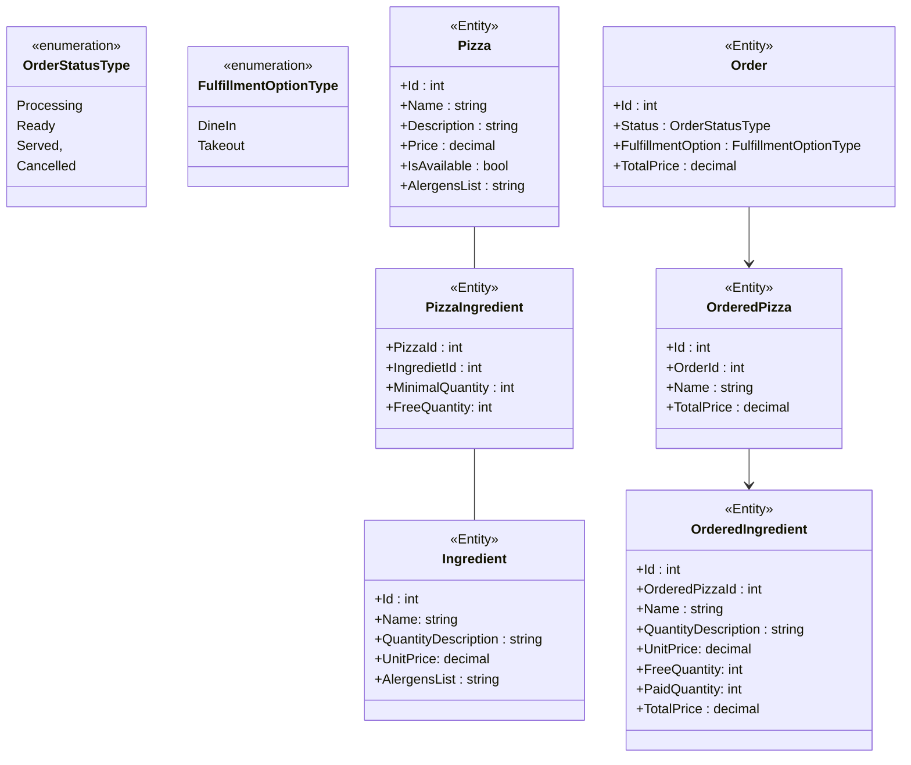
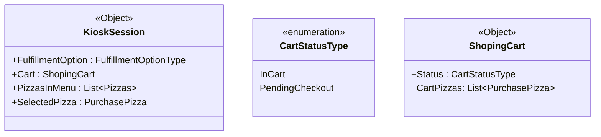

=== ./cviceni/AvaloniaAplikace/AvaloniaAplikace/App.axaml ===
<Application xmlns="https://github.com/avaloniaui"
             xmlns:x="http://schemas.microsoft.com/winfx/2006/xaml"
             x:Class="AvaloniaAplikace.App"
             RequestedThemeVariant="Dark">
             <!-- "Default" ThemeVariant follows system theme variant. "Dark" or "Light" are other available options. -->

    <Application.Styles>
        <FluentTheme />
    </Application.Styles>
</Application>
=== End of ./cviceni/AvaloniaAplikace/AvaloniaAplikace/App.axaml ===

=== ./cviceni/AvaloniaAplikace/AvaloniaAplikace/App.axaml.cs ===
using Avalonia;
using Avalonia.Controls.ApplicationLifetimes;
using Avalonia.Markup.Xaml;

namespace AvaloniaAplikace
{
    public partial class App : Application
    {
        public override void Initialize()
        {
            AvaloniaXamlLoader.Load(this);
        }

        public override void OnFrameworkInitializationCompleted()
        {
            if (ApplicationLifetime is IClassicDesktopStyleApplicationLifetime desktop)
            {
                desktop.MainWindow = new MojeOkno();
            }

            base.OnFrameworkInitializationCompleted();
        }
    }
}
=== End of ./cviceni/AvaloniaAplikace/AvaloniaAplikace/App.axaml.cs ===

=== ./cviceni/AvaloniaAplikace/AvaloniaAplikace/AvaloniaAplikace.csproj ===
<Project Sdk="Microsoft.NET.Sdk">
  <PropertyGroup>
    <OutputType>WinExe</OutputType>
    <TargetFramework>net7.0</TargetFramework>
    <Nullable>enable</Nullable>
    <BuiltInComInteropSupport>true</BuiltInComInteropSupport>
    <ApplicationManifest>app.manifest</ApplicationManifest>
    <AvaloniaUseCompiledBindingsByDefault>true</AvaloniaUseCompiledBindingsByDefault>
  </PropertyGroup>


  <ItemGroup>
    <PackageReference Include="Avalonia" Version="11.0.5" />
    <PackageReference Include="Avalonia.Desktop" Version="11.0.5" />
    <PackageReference Include="Avalonia.Themes.Fluent" Version="11.0.5" />
    <PackageReference Include="Avalonia.Fonts.Inter" Version="11.0.5" />
    <!--Condition below is needed to remove Avalonia.Diagnostics package from build output in Release configuration.-->
    <PackageReference Condition="'$(Configuration)' == 'Debug'" Include="Avalonia.Diagnostics" Version="11.0.5" />
  </ItemGroup>
</Project>

=== End of ./cviceni/AvaloniaAplikace/AvaloniaAplikace/AvaloniaAplikace.csproj ===

=== ./cviceni/AvaloniaAplikace/AvaloniaAplikace/MojeOkno.cs ===
using Avalonia;
using Avalonia.Controls;
using Avalonia.Media;
using Avalonia.Layout;

namespace AvaloniaAplikace
{
    public class MojeOkno : Window
    {
        int count = 0;
    
        public MojeOkno()
        {
    
            TextBlock textBlockPopis = new TextBlock()
            {
                FontSize = 18.0,
                HorizontalAlignment = HorizontalAlignment.Center,
                Margin = new Thickness(5, 0),
                Text = "Alignment, Margin and Padding Sample"
            };
            Button button = new Button() 
            { 
                HorizontalAlignment = HorizontalAlignment.Stretch,
                Margin = new Thickness(20),
                Content = "Tlacitko" ,
                HorizontalContentAlignment = HorizontalAlignment.Center
            };
    
            TextBlock textBlock = new TextBlock() 
            {
                FontSize = 28.0,
                HorizontalAlignment = HorizontalAlignment.Center,
                Margin = new Thickness(20),
                Text = count.ToString() 
            };
    
            button.Click += (sender, e) =>
            {
                ++count;
                textBlock.Text = count.ToString();
                textBlock.FontSize += 1.0;
    
            };
    
            StackPanel stackPanel = new StackPanel()
            {
                Background = Brushes.White,
                HorizontalAlignment = HorizontalAlignment.Center,
                VerticalAlignment = VerticalAlignment.Top
            };
    
            stackPanel.Children.Add(textBlockPopis);
            stackPanel.Children.Add(button);
            stackPanel.Children.Add(textBlock);
    
            Border border = new Border()
            {
                Background = Brushes.LightBlue,
                BorderBrush = Brushes.Black,
                BorderThickness = new Thickness(2),
                Padding = new Thickness(15),
                Child = stackPanel
            };
    
            Content = border;
        }
    }
}


=== End of ./cviceni/AvaloniaAplikace/AvaloniaAplikace/MojeOkno.cs ===

=== ./cviceni/AvaloniaAplikace/AvaloniaAplikace/Program.cs ===
using Avalonia;
using System;

namespace AvaloniaAplikace
{
    internal class Program
    {
        // Initialization code. Don't use any Avalonia, third-party APIs or any
        // SynchronizationContext-reliant code before AppMain is called: things aren't initialized
        // yet and stuff might break.
        [STAThread]
        public static void Main(string[] args) => BuildAvaloniaApp()
            .StartWithClassicDesktopLifetime(args);

        // Avalonia configuration, don't remove; also used by visual designer.
        public static AppBuilder BuildAvaloniaApp()
            => AppBuilder.Configure<App>()
                .UsePlatformDetect()
                .WithInterFont()
                .LogToTrace();
    }
}
=== End of ./cviceni/AvaloniaAplikace/AvaloniaAplikace/Program.cs ===

=== ./cviceni/AvaloniaAplikace/readme.md ===
# Úkol na cvičení: Avalonia Alignment, Margin and Padding

Seznamte se se příkladem na tvorbu UI ve frameworku Avalonia.

=== End of ./cviceni/AvaloniaAplikace/readme.md ===

=== ./cviceni/AvaloniaListBox/App.axaml ===
<Application xmlns="https://github.com/avaloniaui"
             xmlns:x="http://schemas.microsoft.com/winfx/2006/xaml"
             x:Class="AvaloniaApplication3.App"
             RequestedThemeVariant="Default">
             <!-- "Default" ThemeVariant follows system theme variant. "Dark" or "Light" are other available options. -->

    <Application.Styles>
        <FluentTheme />
    </Application.Styles>
</Application>
=== End of ./cviceni/AvaloniaListBox/App.axaml ===

=== ./cviceni/AvaloniaListBox/App.axaml.cs ===
using Avalonia;
using Avalonia.Controls.ApplicationLifetimes;
using Avalonia.Markup.Xaml;

namespace AvaloniaApplication3
{
    public partial class App : Application
    {
        public override void Initialize()
        {
            AvaloniaXamlLoader.Load(this);
        }

        public override void OnFrameworkInitializationCompleted()
        {
            if (ApplicationLifetime is IClassicDesktopStyleApplicationLifetime desktop)
            {
                desktop.MainWindow = new MojeOkno();
            }

            base.OnFrameworkInitializationCompleted();
        }
    }
}
=== End of ./cviceni/AvaloniaListBox/App.axaml.cs ===

=== ./cviceni/AvaloniaListBox/AvaloniaListbox.csproj ===
<Project Sdk="Microsoft.NET.Sdk">
  <PropertyGroup>
    <OutputType>WinExe</OutputType>
    <TargetFramework>net7.0</TargetFramework>
    <Nullable>enable</Nullable>
    <BuiltInComInteropSupport>true</BuiltInComInteropSupport>
    <ApplicationManifest>app.manifest</ApplicationManifest>
    <AvaloniaUseCompiledBindingsByDefault>true</AvaloniaUseCompiledBindingsByDefault>
  </PropertyGroup>


  <ItemGroup>
    <PackageReference Include="Avalonia" Version="11.0.5" />
    <PackageReference Include="Avalonia.Desktop" Version="11.0.5" />
    <PackageReference Include="Avalonia.Themes.Fluent" Version="11.0.5" />
    <PackageReference Include="Avalonia.Fonts.Inter" Version="11.0.5" />
    <!--Condition below is needed to remove Avalonia.Diagnostics package from build output in Release configuration.-->
    <PackageReference Condition="'$(Configuration)' == 'Debug'" Include="Avalonia.Diagnostics" Version="11.0.5" />
  </ItemGroup>
</Project>

=== End of ./cviceni/AvaloniaListBox/AvaloniaListbox.csproj ===

=== ./cviceni/AvaloniaListBox/MojeOkno.cs ===
using Avalonia.Controls;
using System.Collections.Generic;
using System;
using System.Collections.ObjectModel;
using System.ComponentModel;
using System.Runtime.CompilerServices;
using Avalonia.Data;
using Avalonia;
using Avalonia.Controls.Templates;

namespace AvaloniaApplication3
{
    public class ViewModelBase : INotifyPropertyChanged
    {
        public event PropertyChangedEventHandler? PropertyChanged;

        protected void OnPropertyChanged(string name)
        {
            PropertyChanged?.Invoke(this, new PropertyChangedEventArgs(name));
        }

        protected bool SetProperty<T>(ref T field, T newValue, [CallerMemberName] string? name = null)
        {
            ArgumentException.ThrowIfNullOrEmpty(name);

            if (EqualityComparer<T>.Default.Equals(field, newValue)) return false;

            field = newValue;
            OnPropertyChanged(name);

            return true;
        }
    }

    class Vozidlo
    {
        public required string Nazev { get; set; }
        public required decimal Cena { get; set; }
    }


    class KatalogVozidel : ViewModelBase
    {
        private Vozidlo? vybraneVozidlo = null;

        public ObservableCollection<Vozidlo> Vozidla { get; set; }
        public Vozidlo? VybraneVozidlo { get => vybraneVozidlo; set => SetProperty(ref vybraneVozidlo, value); }
        public KatalogVozidel()
        {
            Vozidla = new ObservableCollection<Vozidlo>()
            {
                new Vozidlo() { Nazev = "Cybertruck", Cena = 1300000.0m},
                new Vozidlo() { Nazev = "Oktavia RS", Cena = 1100000.0m},
                new Vozidlo() { Nazev = "Audi RS5", Cena = 2700000.0m}
            };
        }

        public void Pridej()
        {
            Vozidlo nove = new Vozidlo() { Nazev = "Mazda MX5", Cena = 831000.0m };
            Vozidla.Add(nove);
        }
    }

    public class MojeOkno : Window
    {
        public MojeOkno()
        {
            DataContext = new KatalogVozidel();

            ListBox listBox = new ListBox();
            listBox.Bind(ListBox.ItemsSourceProperty, new Binding("Vozidla"));
            listBox.Bind(ListBox.SelectedItemProperty, new Binding("VybraneVozidlo"));

            listBox.ItemTemplate = new FuncDataTemplate<Vozidlo>((vozidlo, scope) =>
            {
                TextBlock textBlockNazev = new TextBlock()
                {
                    Text = vozidlo.Nazev
                };

                TextBlock textBlockCena = new TextBlock()
                {
                    Text = vozidlo.Cena.ToString()
                };

                StackPanel stackPanel = new StackPanel()
                {
                    Children = { textBlockNazev, textBlockCena }
                };

                return stackPanel;

            });

            Button buttonNoveVozidlo = new Button()
            {
                Content = "Pridej nove vozidlo"
            };

            buttonNoveVozidlo.Bind(Button.CommandProperty, new Binding("Pridej"));

            TextBlock textBlockNazevVybraneho = new TextBlock();
            textBlockNazevVybraneho.Bind(TextBlock.TextProperty, new Binding("VybraneVozidlo.Nazev"));

            StackPanel panel = new StackPanel()
            {
                Children = { buttonNoveVozidlo, listBox, textBlockNazevVybraneho }
            };

            Content = panel;
            
        }
    }
}

=== End of ./cviceni/AvaloniaListBox/MojeOkno.cs ===

=== ./cviceni/AvaloniaListBox/Program.cs ===
using Avalonia;
using System;

namespace AvaloniaApplication3
{
    internal class Program
    {
        // Initialization code. Don't use any Avalonia, third-party APIs or any
        // SynchronizationContext-reliant code before AppMain is called: things aren't initialized
        // yet and stuff might break.
        [STAThread]
        public static void Main(string[] args) => BuildAvaloniaApp()
            .StartWithClassicDesktopLifetime(args);

        // Avalonia configuration, don't remove; also used by visual designer.
        public static AppBuilder BuildAvaloniaApp()
            => AppBuilder.Configure<App>()
                .UsePlatformDetect()
                .WithInterFont()
                .LogToTrace();
    }
}
=== End of ./cviceni/AvaloniaListBox/Program.cs ===

=== ./cviceni/AvaloniaListBox/readme.md ===
# Úkol na cvičení: Avalonia ListBox

Pomocí bindování a ListBoxu zobrazte katalog vozidel.
=== End of ./cviceni/AvaloniaListBox/readme.md ===

=== ./cviceni/DatabazeJidel/Menza/Menza.AvaloniaClient/App.axaml ===
<Application xmlns="https://github.com/avaloniaui"
             xmlns:x="http://schemas.microsoft.com/winfx/2006/xaml"
             x:Class="Menza.AvaloniaClient.App"
             RequestedThemeVariant="Dark">
             <!-- "Default" ThemeVariant follows system theme variant. "Dark" or "Light" are other available options. -->

    <Application.Styles>
        <FluentTheme />
    </Application.Styles>
</Application>
=== End of ./cviceni/DatabazeJidel/Menza/Menza.AvaloniaClient/App.axaml ===

=== ./cviceni/DatabazeJidel/Menza/Menza.AvaloniaClient/App.axaml.cs ===
using Avalonia;
using Avalonia.Controls.ApplicationLifetimes;
using Avalonia.Markup.Xaml;
using Microsoft.Extensions.DependencyInjection;
using System.Net.Http;

namespace Menza.AvaloniaClient
{
    public partial class App : Application
    {
        public override void Initialize()
        {
            AvaloniaXamlLoader.Load(this);
        }

        public override void OnFrameworkInitializationCompleted()
        {

            ServiceCollection serviceCollection = new ServiceCollection();
            serviceCollection.AddSingleton(p => new HttpClient() { BaseAddress = new System.Uri("https://localhost:7007/") });
            serviceCollection.AddSingleton<IMenzaService, MenzaService>();
            serviceCollection.AddTransient<MainWindow>();
            ServiceProvider serviceProvider = serviceCollection.BuildServiceProvider();
            
            
            if (ApplicationLifetime is IClassicDesktopStyleApplicationLifetime desktop)
            {
                desktop.MainWindow = serviceProvider.GetRequiredService<MainWindow>();
            }

            base.OnFrameworkInitializationCompleted();
        }
    }
}
=== End of ./cviceni/DatabazeJidel/Menza/Menza.AvaloniaClient/App.axaml.cs ===

=== ./cviceni/DatabazeJidel/Menza/Menza.AvaloniaClient/IMenzaService.cs ===
using Menza.Models;
using System;
using System.Collections.Generic;
using System.Threading.Tasks;

namespace Menza.AvaloniaClient
{
    public interface IMenzaService
    {
        Task<IReadOnlyList<Jidlo>> GetJidlaAsync();
    }
}

=== End of ./cviceni/DatabazeJidel/Menza/Menza.AvaloniaClient/IMenzaService.cs ===

=== ./cviceni/DatabazeJidel/Menza/Menza.AvaloniaClient/MainWindow.cs ===
using Avalonia.Controls;
using Avalonia.Controls.Templates;
using Menza.Models;
using Avalonia.Media;
using Avalonia.Layout;
using System.Collections.Generic;
using Avalonia;
using Avalonia.Styling;

namespace Menza.AvaloniaClient
{
    class MainWindow : Window
    {
        readonly ListBox listBox;
        private readonly IMenzaService menzaService;

        public MainWindow(IMenzaService menzaService)
        {

            listBox = new ListBox()
            {
              
                HorizontalAlignment = HorizontalAlignment.Stretch,
                ItemsPanel = new FuncTemplate<Panel?>(() =>
                    new WrapPanel()
                    {
                        HorizontalAlignment = HorizontalAlignment.Stretch,
                        Orientation = Orientation.Horizontal,
                    }),
                ItemTemplate = new FuncDataTemplate<Jidlo>((jidlo, scope) =>
                    new Border()
                    {
                        Width = 120,
                        Height = 120,
                        Background = Brushes.Red,
                        BorderBrush = Brushes.Black,
                        BorderThickness = new Thickness(2.0),
                        CornerRadius = new CornerRadius(2.0),
                        Padding = new Thickness(4.0),
                        Child = new StackPanel()
                        {
                            HorizontalAlignment = HorizontalAlignment.Center,
                            VerticalAlignment = VerticalAlignment.Center,
                            Children =
                            {
                                new TextBlock()
                                {
                                    HorizontalAlignment = HorizontalAlignment.Center,
                                    VerticalAlignment = VerticalAlignment.Center,
                                    Text = jidlo.Nazev
                                },
                                new TextBlock()
                                {
                                    HorizontalAlignment = HorizontalAlignment.Center,
                                    VerticalAlignment = VerticalAlignment.Center,
                                    Text = jidlo.Cena.ToString()
                                },
                            }
                        }
                    })
            };

            
           
            Title = "Menza";
            Content = listBox;
            this.menzaService = menzaService;
        }

        protected override async void OnInitialized()
        {
            base.OnInitialized();

            IReadOnlyList<Jidlo> jidla = await menzaService.GetJidlaAsync();

            listBox.ItemsSource = jidla;

        }
    }
}
=== End of ./cviceni/DatabazeJidel/Menza/Menza.AvaloniaClient/MainWindow.cs ===

=== ./cviceni/DatabazeJidel/Menza/Menza.AvaloniaClient/Menza.AvaloniaClient.csproj ===
<Project Sdk="Microsoft.NET.Sdk">
  <PropertyGroup>
    <OutputType>WinExe</OutputType>
    <TargetFramework>net7.0</TargetFramework>
    <Nullable>enable</Nullable>
    <BuiltInComInteropSupport>true</BuiltInComInteropSupport>
    <ApplicationManifest>app.manifest</ApplicationManifest>
    <AvaloniaUseCompiledBindingsByDefault>true</AvaloniaUseCompiledBindingsByDefault>
  </PropertyGroup>


  <ItemGroup>
    <PackageReference Include="Avalonia" Version="11.0.5" />
    <PackageReference Include="Avalonia.Desktop" Version="11.0.5" />
    <PackageReference Include="Avalonia.Themes.Fluent" Version="11.0.5" />
    <PackageReference Include="Avalonia.Fonts.Inter" Version="11.0.5" />
    <!--Condition below is needed to remove Avalonia.Diagnostics package from build output in Release configuration.-->
    <PackageReference Condition="'$(Configuration)' == 'Debug'" Include="Avalonia.Diagnostics" Version="11.0.5" />
    <PackageReference Include="Microsoft.Extensions.DependencyInjection" Version="7.0.0" />
  </ItemGroup>


  <ItemGroup>
    <ProjectReference Include="..\Menza.Models\Menza.Models.csproj" />
  </ItemGroup>
</Project>

=== End of ./cviceni/DatabazeJidel/Menza/Menza.AvaloniaClient/Menza.AvaloniaClient.csproj ===

=== ./cviceni/DatabazeJidel/Menza/Menza.AvaloniaClient/MenzaService.cs ===
using Avalonia.Controls;
using Menza.Models;
using System;
using System.Collections.Generic;
using System.Linq;
using System.Net.Http;
using System.Net.Http.Json;
using System.Text;
using System.Threading.Tasks;

namespace Menza.AvaloniaClient
{
    internal class MenzaService : IMenzaService
    {
        private readonly HttpClient httpClient;

        public MenzaService(HttpClient httpClient)
        {
            this.httpClient = httpClient;
        }
        public async Task<IReadOnlyList<Jidlo>> GetJidlaAsync()
        {

            IReadOnlyList<Jidlo>? jidla = await httpClient.GetFromJsonAsync<IReadOnlyList<Jidlo>>("jidla");

            return jidla;
        }
    }
}

=== End of ./cviceni/DatabazeJidel/Menza/Menza.AvaloniaClient/MenzaService.cs ===

=== ./cviceni/DatabazeJidel/Menza/Menza.AvaloniaClient/MenzaServiceMock.cs ===
using Menza.Models;
using System.Collections.Generic;
using System.Threading.Tasks;

namespace Menza.AvaloniaClient
{
    internal class MenzaServiceMock : IMenzaService
    {

        public Task<IReadOnlyList<Jidlo>> GetJidlaAsync()
        {

            IReadOnlyList<Jidlo> jidla = new List<Jidlo>
            {
                new Jidlo() { Id = 1, Nazev = "Šunkofleky", Cena = 84.1},
                new Jidlo() { Id = 1, Nazev = "Jelitový a jitrnicový prejt", Cena = 92.3},
                new Jidlo() { Id = 1, Nazev = "Cuketové medailonky", Cena = 76.4}
            };

            Task<IReadOnlyList<Jidlo>> result = Task.FromResult(jidla);

            return result;
        }
    }
}

=== End of ./cviceni/DatabazeJidel/Menza/Menza.AvaloniaClient/MenzaServiceMock.cs ===

=== ./cviceni/DatabazeJidel/Menza/Menza.AvaloniaClient/Program.cs ===
using Avalonia;
using System;

namespace Menza.AvaloniaClient
{
    internal class Program
    {
        // Initialization code. Don't use any Avalonia, third-party APIs or any
        // SynchronizationContext-reliant code before AppMain is called: things aren't initialized
        // yet and stuff might break.
        [STAThread]
        public static void Main(string[] args) => BuildAvaloniaApp()
            .StartWithClassicDesktopLifetime(args);

        // Avalonia configuration, don't remove; also used by visual designer.
        public static AppBuilder BuildAvaloniaApp()
            => AppBuilder.Configure<App>()
                .UsePlatformDetect()
                .WithInterFont()
                .LogToTrace();
    }
}
=== End of ./cviceni/DatabazeJidel/Menza/Menza.AvaloniaClient/Program.cs ===

=== ./cviceni/DatabazeJidel/Menza/Menza.ConsoleClient/Menza.ConsoleClient.csproj ===
<Project Sdk="Microsoft.NET.Sdk">

  <PropertyGroup>
    <OutputType>Exe</OutputType>
    <TargetFramework>net7.0</TargetFramework>
    <ImplicitUsings>enable</ImplicitUsings>
    <Nullable>enable</Nullable>
  </PropertyGroup>

  <ItemGroup>
    <ProjectReference Include="..\Menza.Models\Menza.Models.csproj" />
  </ItemGroup>

</Project>

=== End of ./cviceni/DatabazeJidel/Menza/Menza.ConsoleClient/Menza.ConsoleClient.csproj ===

=== ./cviceni/DatabazeJidel/Menza/Menza.ConsoleClient/Program.cs ===
using Menza.Models;
using System;
using System.Net.Http.Json;

namespace Menza.ConsoleClient 
{
    internal class Program
    {
        static readonly HttpClient client = new();

        static async Task Main(string[] args)
        {
            Jidlo[]? jidla = await client.GetFromJsonAsync<Jidlo[]>("https://localhost:7007/jidla");

            if(jidla is not null)
            {
                foreach (Jidlo jidlo in jidla)
                {
                    await Console.Out.WriteLineAsync($"{jidlo.Id} {jidlo.Nazev} {jidlo.Cena}");
                }
            }

            // 🍌 
            // Uzivatel zada na konzoli id
            // A pomoci http clienta provedte dotaz a vypiste jidlo dle id
            
            Console.WriteLine("Zadej id pizzy");
            
            string? retezec = Console.ReadLine();

            if (retezec is not null)
            {
                if (int.TryParse(retezec, out int id))
                {
                    Console.WriteLine($"Zadane id: {id}");

                    HttpResponseMessage response = await client.GetAsync($"https://localhost:7007/jidla/{id}");

                    if(response.IsSuccessStatusCode)
                    {
                        Jidlo? jidlo = await response.Content.ReadFromJsonAsync<Jidlo>();

                        if (jidlo is not null)
                        {
                            Console.WriteLine(jidlo.Nazev);
                            Console.ReadKey();
                        }
                    }
                }
            }
        }

      
    }
}
=== End of ./cviceni/DatabazeJidel/Menza/Menza.ConsoleClient/Program.cs ===

=== ./cviceni/DatabazeJidel/Menza/Menza.Data/Menza.Data.csproj ===
<Project Sdk="Microsoft.NET.Sdk">

  <PropertyGroup>
    <TargetFramework>net7.0</TargetFramework>
    <ImplicitUsings>enable</ImplicitUsings>
    <Nullable>enable</Nullable>
  </PropertyGroup>

  <ItemGroup>
    <PackageReference Include="Microsoft.EntityFrameworkCore.Sqlite" Version="7.0.13" />
  </ItemGroup>

  <ItemGroup>
    <ProjectReference Include="..\Menza.Models\Menza.Models.csproj" />
  </ItemGroup>

</Project>

=== End of ./cviceni/DatabazeJidel/Menza/Menza.Data/Menza.Data.csproj ===

=== ./cviceni/DatabazeJidel/Menza/Menza.Data/MenzaContext.cs ===
using Menza.Models;
using Microsoft.Data.Sqlite;
using Microsoft.EntityFrameworkCore;

namespace Menza.Data
{
    public class MenzaContext : DbContext
    {
        public DbSet<Jidlo> Jidla { get; set; }
        

        public MenzaContext()
        {

        }

        public MenzaContext(DbContextOptions<MenzaContext> options) : base(options)
        {

        }
        protected override void OnConfiguring(DbContextOptionsBuilder optionsBuilder)
        {
            if (optionsBuilder.IsConfigured)
            {
                return;
            }

            var folder = Environment.SpecialFolder.MyDocuments;
            var folderPath = Environment.GetFolderPath(folder);
            string filePath = Path.Join(folderPath, "Menza.db");

            SqliteConnectionStringBuilder stringBuilder = new()
            {
                DataSource = filePath
            };

            optionsBuilder.UseSqlite(stringBuilder.ConnectionString);
        }
    }
}
=== End of ./cviceni/DatabazeJidel/Menza/Menza.Data/MenzaContext.cs ===

=== ./cviceni/DatabazeJidel/Menza/Menza.DataSeeder/Menza.DataSeeder.csproj ===
<Project Sdk="Microsoft.NET.Sdk">

  <PropertyGroup>
    <OutputType>Exe</OutputType>
    <TargetFramework>net7.0</TargetFramework>
    <ImplicitUsings>enable</ImplicitUsings>
    <Nullable>enable</Nullable>
  </PropertyGroup>

  <ItemGroup>
    <ProjectReference Include="..\Menza.Data\Menza.Data.csproj" />
  </ItemGroup>

</Project>

=== End of ./cviceni/DatabazeJidel/Menza/Menza.DataSeeder/Menza.DataSeeder.csproj ===

=== ./cviceni/DatabazeJidel/Menza/Menza.DataSeeder/Program.cs ===
using Menza.Data;
using Menza.Models;

using var context = new MenzaContext();

context.Database.EnsureDeleted();
context.Database.EnsureCreated();

context.Jidla.AddRange(
    new Jidlo() { Id = 1, Nazev = "Pizza", Cena = 90.0},
    new Jidlo() { Id = 2, Nazev = "Kureci platek", Cena = 88.9},
    new Jidlo() { Id = 3, Nazev = "Losos", Cena = 117.0}
);
context.SaveChanges();
=== End of ./cviceni/DatabazeJidel/Menza/Menza.DataSeeder/Program.cs ===

=== ./cviceni/DatabazeJidel/Menza/Menza.Models/Jidlo.cs ===
namespace Menza.Models
{
    public class Jidlo
    {
        public required int Id {get; init;}
        public required string Nazev { get; init; }
        public required double Cena { get; init; }
    }
}
=== End of ./cviceni/DatabazeJidel/Menza/Menza.Models/Jidlo.cs ===

=== ./cviceni/DatabazeJidel/Menza/Menza.Models/Menza.Models.csproj ===
<Project Sdk="Microsoft.NET.Sdk">

  <PropertyGroup>
    <TargetFramework>net7.0</TargetFramework>
    <ImplicitUsings>enable</ImplicitUsings>
    <Nullable>enable</Nullable>
  </PropertyGroup>

</Project>

=== End of ./cviceni/DatabazeJidel/Menza/Menza.Models/Menza.Models.csproj ===

=== ./cviceni/DatabazeJidel/Menza/Menza.WebApi/Menza.WebApi.csproj ===
<Project Sdk="Microsoft.NET.Sdk.Web">

  <PropertyGroup>
    <TargetFramework>net7.0</TargetFramework>
    <Nullable>enable</Nullable>
    <ImplicitUsings>enable</ImplicitUsings>
  </PropertyGroup>

  <ItemGroup>
    <ProjectReference Include="..\Menza.Data\Menza.Data.csproj" />
  </ItemGroup>

</Project>

=== End of ./cviceni/DatabazeJidel/Menza/Menza.WebApi/Menza.WebApi.csproj ===

=== ./cviceni/DatabazeJidel/Menza/Menza.WebApi/Program.cs ===
using Menza.Data;
using Menza.Models;
using Microsoft.AspNetCore.Http.HttpResults;
using Microsoft.EntityFrameworkCore;

var builder = WebApplication.CreateBuilder(args);

builder.Services.AddDbContext<MenzaContext>();

var app = builder.Build();

app.MapMenzaApi();

app.Run();

public static class MenzaApi
{
    public static IEndpointRouteBuilder MapMenzaApi(this IEndpointRouteBuilder app)
    {
        app.MapGet("/jidla", (MenzaContext context) => context.Jidla);
        app.MapGet("/jidla/{id:int}", MenzaApi.GetJidloById);

        return app;
    }

    public static async Task<Ok<IEnumerable<Jidlo>>> GetAllJidla(MenzaContext context)
    {
        List<Jidlo> jidla = await context.Jidla.ToListAsync();

        return TypedResults.Ok(jidla.AsEnumerable());
    }

    public static async Task<Results<Ok<Jidlo>, NotFound, BadRequest>> GetJidloById(int id, MenzaContext context)
    {
        if(id <= 0)
        {
            return TypedResults.BadRequest();
        }

        Jidlo? jidlo = await context.Jidla.FindAsync(id);

        if(jidlo is null)
        {
            return TypedResults.NotFound();
        }

        return TypedResults.Ok(jidlo);

    }

}
=== End of ./cviceni/DatabazeJidel/Menza/Menza.WebApi/Program.cs ===

=== ./cviceni/DatabazeJidel/readme.md ===
# Úkol: Databáze jídel v menze

- [Tutorial: Create a minimal API with ASP.NET Core](https://learn.microsoft.com/en-us/aspnet/core/tutorials/min-web-api?view=aspnetcore-7.0&tabs=visual-studio).
- [How to create responses in Minimal API apps](https://learn.microsoft.com/en-us/aspnet/core/fundamentals/minimal-apis/responses?view=aspnetcore-8.0#typedresults-vs-results).
- [Make HTTP requests with the HttpClient class](https://learn.microsoft.com/en-us/dotnet/fundamentals/networking/http/httpclient).
  
Vytvořte databází jídel v menze.

Solution bude obsahovat projekty

1. Class Library: **Menza.Models**

    - Bude obsahovat třídu Jidlo s Id, názvem a cenou.
   
3. Class Library: **Menza.Data**
  
   - Bude obsahovat třídu `MenzaContext` pro EntityFramework.
   - Použijte Entity Framework providera pro Sqlite.
   - Reference na projekt Menza.Models.
   
6. Console Application: **Menza.DataSeeder**

   - Konzolová aplikace pro vytvoření a naplnění databáze.
   - Reference na projekt Menza.Data.
   
8. ASP.NET Core Empty: **Menza.WebApi**
  
    - Webová služba, která vrátí:
        -  seznam jídel,
        -  **jedno jídlo podle Id**.
    - Reference na projekt Menza.Data.
      
11. Console Application: **Menza.ConsoleClient**

    - Pomocí http clienta načte a zobrazí:
        -  seznam jídel,
        -  **jedno jídlo v menze pomocí Id**.
    - Reference na projekt Menza.Models.
   
12. Avalonia .NET App: **Menza.DesktopClient**

    - Pomocí http clienta načte a zobrazí:
        -  **jedno jídlo v menze pomocí Id**.
    - Reference na projekt Menza.Models.

=== End of ./cviceni/DatabazeJidel/readme.md ===

=== ./cviceni/ModelPizzyMigrace/readme.md ===
# Model pizzy a migrace

Podle [návodu v přípravě](https://github.com/ekral/FAI/blob/master/AF/Priprava/01_EF_zaklady.md) proveďte následující úkoly.

1) Nadefinujte třídu Pizza z projektu [Pizza.Kiosk](https://github.com/ekral/FAI/tree/master/AF/src/Utb.PizzaKiosk) a pomoci Entity Frameworku a migrací vytvořte Sqlite databázi. Do databáze vložte tři pizzy jako výchozí data při vytvoření databáze.

   - Definujte třídu Pizza.

   - Definujte potomka třídy DbContext a DbSet pro tabulku Pizza.

   - Definujte metodu OnConfiguring a nakonfigurujte Sqlite.

   - Definujte metodu OnCreating a přidejte výchozí pizzy.

   - Vytvořte a proveďte migraci (vytvořte databázi).

3) Vytvořte kód který vypíše všechny pizzy z databáze.

4) Vytvořte kód, který vypíše pouze pizzy levnější než 150.

5) Vytvořte kód, který vloží do databáze novou pizzu.

=== End of ./cviceni/ModelPizzyMigrace/readme.md ===

=== ./cviceni/ModelUtbKiosk/readme.md ===
# Úkol na cvičení: Model Utb.Kiosk

Podle [návodu v přípravě](https://github.com/ekral/FAI/blob/master/AF/Priprava/01_EF_zaklady.md) proveďte následující úkoly.

Zpracujte model databáze s pomocí code first v Entity frameworku pro [Utb.PizzaKiosk](https://github.com/ekral/FAI/tree/master/AF/src/Utb.PizzaKiosk).

Vyjděte z toho co znáte z předmětů:

- Analýza a modelování systémů.
- Databázové systémy.

---
Tutoriály

- [Getting Started with EF Core](https://learn.microsoft.com/en-us/ef/core/get-started/overview/first-app?tabs=netcore-cli).

=== End of ./cviceni/ModelUtbKiosk/readme.md ===

=== ./cviceni/ModelUtbKioskTesty/readme.md ===
# Úkol na cvičení: Testy pro Model Utb.Kiosk

Otestujte funkčnost modelu pro Utb.PizzaKiosk.

Aplikujte znalosti z předmětu:

- Nástroje pro vývoj softwarových projektů.

---
Tutoriály a materiály k vypracování

- [Příprava: Entity framework základy](https://github.com/ekral/FAI/blob/master/AF/Priprava/01_EF_zaklady.md)
- [Vzorové řešení Utb.Studenti](https://github.com/ekral/FAI/tree/master/AF/src/Utb.Studenti).
- [Getting Started with EF Core](https://learn.microsoft.com/en-us/ef/core/get-started/overview/first-app?tabs=netcore-cli).
- [Testing against your production database system](https://learn.microsoft.com/en-us/ef/core/testing/testing-with-the-database).
- [Utb.PizzaKiosk](https://github.com/ekral/FAI/tree/master/AF/src/Utb.PizzaKiosk).
---
  

Cílem je otestovat, zda je databáze správně vytvořená a zda jsou správně nastavené relace. Tedy to, co jste předtím vytvářeli v konzolové aplikaci a jen jste se podívali na výstup na konzoli. Tento postup chceme zautomatizovat v testech.

1) Vytvořte nový projekt typu **class library** ve verzi minimálně .NET 7.
  - Název projektu: *Utb.PizzaKiosk.Models*.
  - Název solution: *Utb.PizzaKiosk*.
   - Přidejte do projektu *Utb.PizzaKiosk.Models* modely pro Pizza Kiosk a DbContext a vytvořte a aplikujte migraci. Minimálně stačí jedna entita **Pizza** v tabulce **Pizzas**.
2) Do solution přidejte nový projekt typu **xUnit test** s názvem *Utb.PizzaKiosk.Tests*.
3) Do projektu *Utb.PizzaKiosk.Tests* přidejte referenci na projekt *Utb.PizzaKiosk.Models*.
4) Vytvořte testy dle následujícího textu.

## Poznámky k implementaci

Database context je upravený tak, aby bylo možné pro test zadávat jiný název souboru. Existuje více řešení, například pomocí dědičnosti, nebo parametrického konstruktoru. Ale pro tento případ jsem zvolil jen název souboru. Pro potřeby migrací musí být ve třídě i konstruktor bez parametru.

```csharp
public class StudentContext : DbContext
{
    public DbSet<Student> Studenti { get; set; }
    public DbSet<Skupina> Skupiny { get; set; }

    private string dbPath = "studenti.db";

    public StudentContext()
    {

    }

    public StudentContext(string dbPath)
    {
        this.dbPath = dbPath;
    }

    protected override void OnConfiguring(DbContextOptionsBuilder optionsBuilder)
    {
        var folder = Environment.SpecialFolder.MyDocuments;
        string folderPath = Environment.GetFolderPath(folder);
        string filePath = Path.Join(folderPath, dbPath);

        SqliteConnectionStringBuilder csb = new SqliteConnectionStringBuilder
        {
            DataSource = filePath
        };

        optionsBuilder.UseSqlite(csb.ConnectionString);
    }

}
```

Pro xUnit testy můžeme vytvořit DatabaseFixture protože chceme aby se databáze vytvořila jenom jednou a byla bezpečně vytvořená i v rámci testů spuštěných ve více vláknech, k tomu nám slouží ```CollectionDefinition```.

```csharp
[CollectionDefinition("Database collection")]
public class DatabaseCollection : ICollectionFixture<TestDatabaseFixture>
{
    // This class has no code, and is never created. Its purpose is simply
    // to be the place to apply [CollectionDefinition] and all the
    // ICollectionFixture<> interfaces.
}

public class TestDatabaseFixture
{
    private static readonly object _lock = new();
    private static bool _databaseInitialized;

    public TestDatabaseFixture()
    {
        lock (_lock)
        {
            if (!_databaseInitialized)
            {
                using (var context = CreateContext())
                {
                    context.Database.EnsureDeleted();
                    context.Database.EnsureCreated();

                    // add test only data
                }

                _databaseInitialized = true;
            }
        }
    }

    public StudentContext CreateContext() => new StudentContext("test.db");
}
```

V testech potom použiji `TestDatabaseFixture` a `Collection` "Database collection".

```csharp
[Collection("Database collection")]
public class StudentContextTest : IClassFixture<TestDatabaseFixture>
{
    public StudentContextTest(TestDatabaseFixture fixture) => Fixture = fixture;

    public TestDatabaseFixture Fixture { get; }

    [Fact]
    public void StudentJeBohumil()
    {
        using StudentContext context = Fixture.CreateContext();

        Student student = context.Studenti.Single(s => s.Id == 1);

        Assert.Equal("Bohumil", student.Jmeno);
    }

    [Fact]
    public void BohumilMaTelocvik()
    {
        using StudentContext context = Fixture.CreateContext();

        Student student = context.Studenti.First(s => s.Id == 1 && s.Predmety.Any(p => p.Nazev == "Telocvik"));

        Assert.Equal("Bohumil", student.Jmeno);
    }
}
```

Kolekci můžete v xUnit otestovat následující způsobem. Pro každý prvek kolekce můžeme použít lambda výraz, `s1` je v tomto případě první student v kolekci, `s2` je druhý student v kolekci. Předpokládám tedy, že v kolekci budou dva prvky.

```csharp
Assert.Collection(studenti, 
s1 =>
{
    Assert.Equal(1, s1.Id);
    Assert.Equal("Bohumil", s1.Jmeno);
}, 
s2 =>
{
    Assert.Equal(2, s2.Id);
    Assert.Equal("Stefan", s2.Jmeno);
});
```


=== End of ./cviceni/ModelUtbKioskTesty/readme.md ===

=== ./cviceni/Serializace/readme.md ===
# Cvičení: Serializace a deserializace Studenta

Máte třídu Student:
```csharp
class Student
{
    public int Id { get; set; }     
    public required string Jmeno { get; set; }
}
```

V **konzolové aplikaci** s využitím [JsonSerializer](https://learn.microsoft.com/en-us/dotnet/standard/serialization/system-text-json/overview) z namespace `System.Text.Json`:

1) Vytvořte kód, který serializuje instanci třídy Student (objekt v paměti) do řetězce ve formátu JSON a vypište řezetec na konzoli.
2) Zadejte v kódu JSON řetězec reprezentující studenta s využitím [Raw string literals](https://learn.microsoft.com/en-us/dotnet/csharp/programming-guide/strings/#raw-string-literals) a deserializujte řetězec na instanci třídy Student (objekt v paměti).

   ```csharp
   string json = """
   {
       "Id" : 1,
       "Jmeno" : "Jan Novak"
   }
   """;
   ```

=== End of ./cviceni/Serializace/readme.md ===

=== ./cviceni/Serializace/reseni/main.cs ===
using System.Text.Json;

Student student = new Student()
{
    Id = 1,
    Jmeno = "Jan Novak"
};

string jsonString = JsonSerializer.Serialize(student);

Console.WriteLine($"JSON retezec: {jsonString}");

string jsonStringStudent = """ {"Id":1,"Jmeno":"Jan Novak"} """;

Student? deserializedStudent = JsonSerializer.Deserialize<Student>(jsonStringStudent);

if (deserializedStudent is not null)
{
    Console.WriteLine($"Deserializovanz student Id: {deserializedStudent.Id}, Jmeno: {deserializedStudent.Jmeno}");
}

class Student
{
    public int Id { get; set; }
    public required string Jmeno { get; set; }
}
=== End of ./cviceni/Serializace/reseni/main.cs ===

=== ./cviceni/WebApiUtbKioskCreateOrder/readme.md ===
# Úkol na cvičení: Vytvoření objednávky (metoda CreateOrder)

Aktualizujte si repozitář (proveďte pull nebo si naklonujte repozitář znovu).

[https://github.com/ekral/FAI.git](https://github.com/ekral/FAI.git)

V solution [Utb.PizzaKiosk.sln](https://github.com/ekral/FAI/blob/master/AF/src/Utb.PizzaKiosk) a projektu [Utb.PizzaKiosk.WebApi](https://github.com/ekral/FAI/blob/master/AF/src/Utb.PizzaKiosk/Utb.PizzaKosk.WebApi):

- Vyzkoušejte soubor [app.http](https://github.com/ekral/FAI/blob/master/AF/src/Utb.PizzaKiosk/Utb.PizzaKosk.WebApi/app.http) (Jen nové Visual Studio). Pokud nepoužíváte Visual Studio, tak můžete pro dotazy použít například aplikaci [Postman](https://www.postman.com).
- Spusťte jako první konzolovou aplikaci **DataSeeder**, která vytvoří databází (a předtím odstraní případně jejích předchozí verzi) a naplní databázi výchozími daty.
- Doprogramujte metodu [CreateOrder](https://github.com/ekral/FAI/blob/master/AF/src/Utb.PizzaKiosk/Utb.PizzaKosk.WebApi/Program.cs#L75).

Metoda CreateOrder používá DTO (Data Transfer Objects) pro přednání informací o nové objednávce. V těle metody zatím vkládá jen testovací data. Doplňte vytvoření objednávky dle parametů funkce. Všimněte si, že pro zadání OrderedPizza a OrderedIngredient se v metodě používá navigační property místo cizího klíče. Díky tomu Entity Framework doplní automaticky hodnoty cizích klíčů aniž bychom je předem znali.

=== End of ./cviceni/WebApiUtbKioskCreateOrder/readme.md ===

=== ./cviceni/WebApiUtbKioskTesty/readme.md ===
# Úkol na cvičení: Minimal WebApi a jejich testy pro Model Utb.Kiosk

## Minimal WebApi

Do projektu [Utb.Kiosk](https://github.com/ekral/FAI/tree/master/AF/src/Utb.PizzaKiosk) přidejte projekt Minimal Web Api a vytvořet metodu, která vrátí všechny pizzy v pizzerii. Využijte model vytvořený v minulém projektu.

1) Pomocí migrací vytvořte databázi. Před vytvořením databáze ověřte, zda databáze se stejnou cestou a názvem už existuje a pokud ano, tak ji odstraňte.
2) Přidejte do Solution nový projekt *Asp.net core Empty* s názvem *Utb.PizzaKiosk.WebApi*.
3) Do projektu *Utb.PizzaKiosk.WebApi* přidejte referenci na projekt obsahující DbContext, například *Utb.PizzaKiosk.Models*.
4) Zaregistrujte `PizzaContext` do IoC kontejneru dle vzoru v následující kódu.

```csharp
var builder = WebApplication.CreateBuilder(args);

builder.Services.AddDbContext<PizzaContext>();

var app = builder.Build();
```

5) Přidejte parametr typu PizzaContext do metody obsluhující dotaz *GET*:

```csharp
app.MapGet("/", (PizzaContext context) => context.Pizzas);
```

## Unit Testy pro WebApi

Otestujte Unit Testu pomocí frameworku xUnit.

1) Pro potřeby testování a dokumentace je vhodné si definovat přesný typ návratové hodnoty a kvůli přehlednosti a možnosti testování v unit testu můžeme použít statickou metodu místo lambdy.

```csharp
app.MapGet("/", WebApiV1.GetAllPizzas);

public static class WebApiV1
{
    public static async Task<Ok<Pizza[]>> GetAllPizzas(PizzaContext context)
    {
        Pizza[] pizzas = await context.Pizzas.ToArrayAsync();

        return TypedResults.Ok(pizzas);
    }
}
```
2) Do projektu *Utb.PizzaKiosk.Test* přidejte referenci na projekt *Utb.PizzaKiosk.WebApi*.
3) Do projektu *Utb.PizzaKiosk.Test* přidejte novou testovací třídu `UnitTestPizzaWebApi`:

```csharp
using Microsoft.AspNetCore.Http.HttpResults;
using Utb.PizzaKiosk.Models;

[Collection("Database collection")]
public class UnitTestPizzaWebApi
{
    private DatabaseFixture Fixture { get; }

    public UnitTestPizzaWebApi(DatabaseFixture fixture)
    {
        Fixture = fixture;
    }

    [Fact]
    public async Task ThereShouldBeThreePizzas()
    {
        using PizzaContext context = Fixture.CreateContext();

        Ok<Pizza[]> result = await WebApiV1.GetAllPizzas(context);

        Assert.NotNull(result.Value);

        Pizza[] pizzas = result.Value;

        Assert.Equal(3, pizzas.Length);
    }
```

---
Tutoriály a materiály k vypracování

- [Tutorial: Create a minimal API with ASP.NET Core](https://learn.microsoft.com/en-us/aspnet/core/tutorials/min-web-api?view=aspnetcore-7.0&tabs=visual-studio)
- [Příprava: Entity framework základy](https://github.com/ekral/FAI/blob/master/AF/Priprava/01_EF_zaklady.md)
- [Vzorové řešení Utb.Studenti](https://github.com/ekral/FAI/tree/master/AF/src/Utb.Studenti).
- [Getting Started with EF Core](https://learn.microsoft.com/en-us/ef/core/get-started/overview/first-app?tabs=netcore-cli).
- [Testing against your production database system](https://learn.microsoft.com/en-us/ef/core/testing/testing-with-the-database).
- [Utb.PizzaKiosk](https://github.com/ekral/FAI/tree/master/AF/src/Utb.PizzaKiosk).
---
  

=== End of ./cviceni/WebApiUtbKioskTesty/readme.md ===

=== ./Priprava/01_EF_zaklady.md ===
# Entity framework

Návod pro Entity Framework: [Getting Started with EF Core](https://learn.microsoft.com/en-us/ef/core/get-started/overview/first-app?tabs=netcore-cli). 

Poznámka: Zvolte minimálně **.NET 7**.

Budeme používat následující příkazy pro příkazovou řádku*:
- Příkaz ```dotnet add packgage``` stáhne nuget balíček z repozitáře nuget.org a přidá ho do projektu.
- Příkaz ```dotnet tool install```, který instaluje nové příkazy pro příkazovou řádku.
- Příkaz ```dotnet ef``` pomocí kterého vytváříme například nové migrace nebo aktualizujeme databázi.

*Příkazy musíme spouštět v Terminálu a v adresáři, kde je uložený *.csproj.

## Příklad

V následujícím příkladu definujteme třídu Student a pomocí migrací vytvoříme Sqlite databázi.

### 1. Definice třídy Student

Ve třídě nechceme mít parametrický konstruktor, což by nám mohlo komplikovat práci s Entity Frameworkem. Property představují sloupce tabulky a ```Id``` je dle jmenných konvencí primární klíč.

```csharp
public class Student
{
    public int Id { get; set; } // Primární klíč dle jmenných konvencí
    public required string Jmeno { get; set; }     
    public required string Prijmeni { get; set; }     
}
```

Použiváme proto klíčové slovo ```required```, které říká, že ```Jmeno``` a ```Prijmeni``` musi mit přiřazenou hodnotu nejpozději v Object Initializeru jak je ukázané v následujícím kódu.

```csharp
Student student = new()
{
    Jmeno = "Andrea",
    Prijmeni = "Nova"
};
```
## 2. DbContext a Entity Framework Provider

Pokud chceme používat konkrétní databázi s Entity Frameworkem, tak musím do projektu přidat providera pro tuto databázi. Provider je většinou knihovna distriovaná jako nuget balíček. Následující příkaz nainstaluje nuget balíček, konrétně EF database provider pro databázi Sqlite.

Příkaz musíte spustit v adresáři, kde se nachází projekt, tedy soubor s příponou *.csproj.

```powershell
dotnet add package Microsoft.EntityFrameworkCore.Sqlite
```

Dále definujeme potomka třídy ```DbContext``` a kolekce ```DbSet``` potom definuje tabulku v databázi.

```csharp
using Microsoft.EntityFrameworkCore;

public class StudentContext : DbContext
{
    public DbSet<Student> Students { get; set; }
}
```

Pomocí přetížené metody OnConfiguring potom nakonfigurujeme databázi, konrétně zadáme connection string. 

Jednoduchý zápis:

```csharp
public class StudentContext : DbContext
{
    public DbSet<Student> Students { get; set; }

    protected override void OnConfiguring(DbContextOptionsBuilder optionsBuilder)
    {
        optionsBuilder.UseSqlite("Data Source=studenti.db");
    }
}
```

Zápis, který ukládá databázi do dokumentů uživatele a používá connection string builder aby nedošlo k chybnému zápisu.

```csharp
public class StudentContext : DbContext
{
    public DbSet<Student> Students { get; set; }

    protected override void OnConfiguring(DbContextOptionsBuilder optionsBuilder)
    {
        var folder = Environment.SpecialFolder.MyDocuments;
        string folderPath = Environment.GetFolderPath(folder);
        string filePath = Path.Join(folderPath, "studenti3.db");

        SqliteConnectionStringBuilder csb = new SqliteConnectionStringBuilder
        {
            DataSource = filePath
        };

        optionsBuilder.UseSqlite(csb.ConnectionString);
    }
}
```

Dále přidáme metodu ```OnModelCreating```, kde můžeme zadat výchozí data v databází, ale také přesněji specifikovat primární klíče, cizí klíče a další.

```csharp
public class StudentContext : DbContext
{
    public DbSet<Student> Students { get; set; }

    protected override void OnConfiguring(DbContextOptionsBuilder optionsBuilder)
    {
        var folder = Environment.SpecialFolder.MyDocuments;
        string folderPath = Environment.GetFolderPath(folder);
        string filePath = Path.Join(folderPath, "studenti3.db");

        SqliteConnectionStringBuilder csb = new SqliteConnectionStringBuilder
        {
            DataSource = filePath
        };

        optionsBuilder.UseSqlite(csb.ConnectionString);
    }
    
    protected override void OnModelCreating(ModelBuilder modelBuilder)
    {
        modelBuilder.Entity<Student>().HasData(
            new Student() { Id = 1, Jmeno = "Andrea", Prijmeni = "Nova"},
            new Student() { Id = 2, Jmeno = "Jiri", Prijmeni = "Novotny"},
            new Student() { Id = 3, Jmeno = "Karel", Prijmeni = "Vesely"}
        );
    }
}
```

## Migrace

Pomocí migrací můžeme vytvářet a aktualizovat databázi pomocí příkazů pro příkazovou řádku. Příkazy opět pouštějte v adresáři, kde se nachází projekt, tedy soubor s příponou *.csproj a před spuštěním nezapomeňte uložit všechny soubory.

### Příprava potřebných závislostí 

Proto, abychom mohli vytvářet nové migrace a aktualizovat databázi, tak musíme nainstalovat:
- nástroj **dotnet ef**. 
- Nuget balíček podporující vytváření migrací **Microsoft.EntityFrameworkCore.Design**

Následující příkaz nainstaluje příkaz **dotnet ef** globálně pro všechny projekty.

```powershell
dotnet tool install --global dotnet-ef
```

A následující příkaz přídá do projektu nuget balíček **Microsoft.EntityFrameworkCore.Design**.

```powershell
dotnet add package Microsoft.EntityFrameworkCore.Design
```

## Vytváření a spuštění migrací

Migrace představuje kód v jazyce C# který umí například vytvářet nebo aktualizovat tabulky v databázi a případně i vložit výchozí data pro model. 

Následující příkaz **dotnet ef** vytvoří novou migraci s názvem *VychoziMigrace*. 

```powershell
dotnet ef migrations add VychoziMigrace
```

A následující příkaz migraci aplikuje a vytvoří novou databází, nebo zaktualizuje stávající.

```powershell
dotnet ef database update
```

Poznámka: bez použití migrací můžeme vytvořit databází pomocí metody *EnsureCreated() nebo EnsureCreatedAsync()*.

```csharp
await using SkolaContext db = new SkolaContext();
bool created = await db.Database.EnsureCreatedAsync();
```

=== End of ./Priprava/01_EF_zaklady.md ===

=== ./Priprava/02_EF_relace.md ===
# Relace v Entity Frameworku

[Introduction to relationships](https://learn.microsoft.com/en-us/ef/core/modeling/relationships)

```csharp
public class Student
{
    public int Id { get; set; }
    public required string Jmeno { get; set; }
    public int SkupinaId { get; set; } // Cizi klic
    public Skupina? Skupina { get; set; } // Navigation property, pouze pro praci s objekty v pameti
}
```

```csharp
public class Skupina
{
    public int Id { get; set; }
    public required string Nazev { get; set; }

    public ICollection<Student>? Studenti { get; set; } // Navigation property, jen pro program ne pro db
}
```

=== End of ./Priprava/02_EF_relace.md ===

=== ./Priprava/Test1_MVVM.md ===
# Základní pojmy MVVM

- **View** představuje to co vidí uživatel na obrazovce. Obsahuje elementy uživatelského rozhraní jako například ```TextBlock``` nebo ```Button```.
- **ViewModel** obsahuje property, Commandy (zatím jsme neprobrali) a metody na které binduje View. Pokud se ve ViewModelu změní hodnota nějaké property, tak o této změně ViewModel informuje informuje View pomocí eventu ```PropertyChanged```. ViewModel představuje prostředníka mezi View a Modelem, připravuje data pro zobrazení a reaguje na akce uživatele, ale nepoužívá elementy uživatelského rozhraní.
- **Model** představuje aplikační logiku aplikace. Například složitý výpočet parametrů životního pojištění. Model pracuje z hlediska logiky aplikace a vůbec s nezajímá o uživatelské rozhraní.
- Event **PropertyChanged** používá ViewModel k tomu aby infomoval (notifikoval) View o změnách ve svých propertách. Je součástí rozhraní ```INotifyPropertyChanged```.

Použití MVVM je ve frameworku Avalonia, ale i dalších dobrovolné a nemusíme jej používat. Cílem je mít modulární návrh aplikace, tak abychom mohli jednoduše měnit ViewModel například za testovací verzi a také vyvíjet uživatelské rozhran nezávisle na vývoji ViewModelu.

=== End of ./Priprava/Test1_MVVM.md ===

=== ./Priprava/Test2_ADO_NET.md ===
# Přáce s databází pomocí ADO.NET

Následující příklady používají provider *Microsoft.Data.Sqlite* pro souborovou databázi *Sqlite*, návod na instalaci najdete například v dokumentaci Microsoftu [Microsoft.Data.Sqlite overview](https://learn.microsoft.com/en-us/dotnet/standard/data/sqlite/?tabs=netcore-cli).

V následujícíh příkladech budeme používat třídu Model:

```csharp
public class Model
{
    public int Id { get; set; }
    public double LoanAmount { get; set; }
    public double InterestRate { get; set; }
    public int LoanTerm { get; set; }
}
```
## Připojení k databázi

K databázi se připojíme pomocí následujícího príkazu. Pokud Sqlite databáze již neexistuje, tak se vytvoří nová. Třída *SqliteConnection* implemetuje rozhraní *IDispose* a proto se nám připojení uzavře automaticky s využití Dispose patternu a nemusíme jej už ručně uzavírat.

```csharp
await using SqliteConnection connection = new SqliteConnection(connectionString);
await connection.OpenAsync();
```

Poté si můžeme vytvořit proměnnou command pro provádění SQL příkazů:

```csharp
SqliteCommand command = connection.CreateCommand();
```

## ExecuteNonQuery

Pro vytvoření databáze, vložení nového řádku, nebo aktualizaci hodnot sloupců, tedy příkazy, které neprovádějí dotaz a nevrací hodnoty používáme metodu ```command.ExecuteNonQueryAsync()```. 

V následujícím kódu vytvoříme databází:

```csharp
command.CommandText =
@"
    CREATE TABLE Mortgage 
    (
        Id INTEGER PRIMARY KEY, 
        LoanAmount DOUBLE,
        InterestRate DOUBLE,
        LoanTerm INTEGER
    )
";

await command.ExecuteNonQueryAsync();
```

A v následujícím příkladu do vytvořené databáze vložíme nový řádek. Proměnná ```count``` bude obsahovat počet změněných řádků tabulky.

```csharp
Model model = new Model()
{
    LoanAmount = 6000000.0,
    InterestRate = 6.0,
    LoanTerm = 30
};

command.CommandText =
@$"
    INSERT INTO Mortgage (LoanAmount, InterestRate, LoanTerm)
    VALUES (@LoanAmount, @InterestRate, @LoanTerm)
";

command.Parameters.Add("@LoanAmount", SqliteType.Real).Value = model.LoanAmount;
command.Parameters.Add("@InterestRate", SqliteType.Real).Value = model.InterestRate;
command.Parameters.Add("@LoanTerm", SqliteType.Integer).Value = model.LoanTerm;

int count = await command.ExecuteNonQueryAsync();
```

V předchozím příkladu jsme použili parametry Commandu. Parametry můžeme zadávat buď s generickými SQL typy nebo s konkrétními typy pro danou databází s metodou, kterou poskytuje konkrétní provider. 

Použití parametrů proskytuje kontrolu typu a validaci zadané hodnoty parametru a pomáhá zabránit útoku technikou SQL Injection. Použití parametrů nezpomaluje provedení dotazu, spíše nám může pomoct dotaz lépe sestavit dle konkrétního typu a díky tomu by provedení dotazu by mohlo být v některých případech efektivnější.


## ExecuteReader

Pokud chceme provést dotaz na data tabulky a načíst jednotlivé řádky a sloupce, tak použijeme reader jak je uvedeno v následujícím kódu. 

```csharp
List<Model> models = new List<Model>();

SqliteDataReader reader = await command.ExecuteReaderAsync();

command.CommandText = "SELECT Id, LoanAmount, InterestRate, LoanTerm FROM Mortgage";

if(reader.HasRows)
{
    while(await reader.ReadAsync())
    {
        Model model = new Model();

        model.Id = reader.GetInt32(reader.GetOrdinal("Id"));
        model.LoanAmount = reader.GetDouble(reader.GetOrdinal("LoanAmount"));
        model.InterestRate = reader.GetDouble(reader.GetOrdinal("InterestRate"));
        model.LoanTerm = reader.GetInt32(reader.GetOrdinal("LoanTerm"));

        models.Add(model);
    }
}
```

## ExecuteScalar

Prokud provedeme SQL dotaz, který vrátí pouze jednu hodnotu, například ```SELECT AVG(LoanAmount) FROM Mortgage```, tak můžeme použít ```reader``` podobně jako v minulém příkladu a načíst první sloupec prvního řádku nebo můžeme použít metodu ```command.ExecuteScalarAsync()```.

```csharp
command.CommandText =
@$"
    SELECT AVG(LoanAmount) FROM Mortgage
";

object? result = await command.ExecuteScalarAsync();

if(result is double average)
{
    return average;
}
```

=== End of ./Priprava/Test2_ADO_NET.md ===

=== ./Priprava/Test_10_serializace.md ===
# Serializace

Dokumentace: [Serialization in .NET](https://learn.microsoft.com/en-us/dotnet/standard/serialization/)

Objekty v paměti nejsou kompatibilní mezi hardwarovými platformami (AMR, x86, x64) a už vůbec mezi různými programovacími jazyky. Serializace je proces převodu objektu v paměti na jiný formát kompatibilní mezi různými platformami. Například text ve formátu JSON, který můžeme uložit do souboru nebo přenést po síti. 

Máme několik možností:

- člověkem čitelný textový formát, nejběžnější je JSON používaný pro REST webové služby založené na HTTP protokolu. Dříve se používal XML formát pro SOAP služby.
- binární formát pro vysoký výkon. Příkladem je protokol gRPC.

Dotnet obsahuje mimo jiné zabudovanou podporu pro serializaci a deserializaci do formátu JSON. Není nutné vkládat žádný nuget balíček.

Máme následující třídu:

```csharp
public class Student
{
    public int Id { get; set; }
    public string Name { get; set; }
}
```

Následují příklad serializuje studenta.


```csharp
Student student = new Student() { Id = 1, Name = "Mikulas" };
string text = JsonSerializer.Serialize(student);
```

Výsledný řetězec v proměnné text bude:
```json
{
    "Id" : 1,
    "Name" : "Mikulas"
}
```

A následující příklad zase z řetězce deserializuje studenta.

```csharp
string text = "{ \"Id\" : 1, \"Name\" : \"Cert\"  }";
Student? student = JsonSerializer.Deserialize<Student>(text);
```

V C#11 z .NET 7 můžeme použít raw string literals a zadávat dvojité uvozovky přímo v textu řetězce bez escape sekvence.
 
 ```csharp
string text = """{ "Id" : 1, "Name" : "Cert"  }""";
Student? student = JsonSerializer.Deserialize<Student>(text);
```

Pro serializaci a deserialici volíme jednoduché objekty obsahují ideálně pouze zabudované typy jazyka. Těmto objektům říkame Data Transfer Object, napříkad StudentDTO. Pro serializace tedy často definujeme speciální třídy.

=== End of ./Priprava/Test_10_serializace.md ===

=== ./Priprava/Test_8_ioc.md ===
# IoC Container

Dokumentace: [Dependency injection](https://learn.microsoft.com/en-us/dotnet/core/extensions/dependency-injection)

IoC Container je třída pomocí které vytváříme instance jiných tříd a zároveň při vytváření těchto instancí zjistí jaké jsou parametry konstruktoru a umí automaticky vkládat (inject) další instace jako argumenty konstruktoru.

Dotnet obsahuje zabudovaný IoC kontejner, který přidáme do projektu pomocí následujího nuget balíčku:

```powershell
dotnet add package Microsoft.Extensions.DependencyInjection
```

Nejprve si zaregistruje třídy, jejichž instance, chceme vytvářet. Zároveň zvolím jaký bude životnost vytvořených objektů. 

- Singleton znamená, že bude existovat jen jedna instance dané třídy. Kontejner tedy vždy vrátí referenci na stejný objekt.
- Transient znamé, že se vytvoří vždy nová instance třídy. Kontejner tedy vrátí vždy referenci na nový objekt.
- Scooped znamená, že se vytvoří vždy nová instance třídy pro nový request, ale v rámci jednoho requestu pak už vrací referenci na stejný objekt.


V následujícím příkladu registrujme DatabaseService jako Singleton:

```csharp
IServiceCollection serviceCollection = new ServiceCollection().AddSingleton<DatabaseService>();
```

A instance třídy DatabaseService vytváříme následujícím způsobem pomocí třídy ```ServiceProvider```. Kdy ```service1``` i ```service2``` představují referenci na stejný objekt.

```csharp
ServiceProvider provider = serviceCollection.BuildServiceProvider();

DatabaseService service1 = provider.GetRequiredService<DatabaseService>();
DatabaseService service2 = provider.GetRequiredService<DatabaseService>();
```

Příklad rozšíříme a zaregistrujeme ViewModel jako transient. 

```csharp
IServiceCollection serviceCollection = new ServiceCollection()
                .AddSingleton<DatabaseService>()
                .AddTransient<StudentListViewModel>();
```

Nyní mně kontejner vytvoří dvě instance třídy ```StudentViewModel```, ale každé instanci ```StudentViewModelu``` předá jako argument konstruktoru refenci na stejnou instanci třídy ```DatabaseService```.

```csharp
StudentListViewModel viewModel1 = provider.GetRequiredService<StudentListViewModel>();
StudentListViewModel viewModel2 = provider.GetRequiredService<StudentListViewModel>();
```

### IoC a Dependency Injection

IoC kontejner se používa společně s Dependency Injection. V následujícím příkladu máme rozhraní IDatabaseService a dvě implementace DatabaseService, která pracuje s databází a FakeDatabaseService, která slouží jen pro testování a vrací jen objekty v paměti.

V kontejneru si potom můžeme jednoduše volit konkrétní implementaci.

```csharp
IServiceCollection serviceCollection = new ServiceCollection()
  .AddSingleton<IDatabaseService, FakeDatabaseService>()
  .AddTransient<StudentListViewModel>();
```

---
Použité rozhraní a třídy.

```csharp
public interface IDatabaseService
{
    Task<List<Student>> GetAllStudents();
}
```

```csharp
public class DatabaseService : IDatabaseService
{
    public async Task<List<Student>> GetAllStudents()
    {
        await using SchoolContext schoolContext = new SchoolContext();

        List<Student> students = await schoolContext.Students.ToListAsync();

        return students;
    }
}
```

```csharp
public class FakeDatabaseService : IDatabaseService
{
    public Task<List<Student>> GetAllStudents()
    {
        List<Student> studenti = new List<Student>()
        {
            new Student() { Id = 1, Name = "Jitka"},
            new Student() { Id = 2, Name = "Oto"},
            new Student() { Id = 3, Name = "Jiri"}
        };

        return Task.FromResult(studenti);
    }
}
```
  
```csharp
public class StudentListViewModel
{
  private readonly DatabaseService databaseService;

  public StudentListViewModel(DatabaseService databaseService)
  {
      this.databaseService = databaseService;
  }
}
```

=== End of ./Priprava/Test_8_ioc.md ===

=== ./src/AvaloniaAplikaceAuta/AvaloniaAplikace/App.axaml ===
<Application xmlns="https://github.com/avaloniaui"
             xmlns:x="http://schemas.microsoft.com/winfx/2006/xaml"
             x:Class="AvaloniaAplikace.App"
             RequestedThemeVariant="Default">
             <!-- "Default" ThemeVariant follows system theme variant. "Dark" or "Light" are other available options. -->

    <Application.Styles>
        <FluentTheme />
    </Application.Styles>
</Application>
=== End of ./src/AvaloniaAplikaceAuta/AvaloniaAplikace/App.axaml ===

=== ./src/AvaloniaAplikaceAuta/AvaloniaAplikace/App.axaml.cs ===
using Avalonia;
using Avalonia.Controls.ApplicationLifetimes;
using Avalonia.Markup.Xaml;

namespace AvaloniaAplikace
{
    public partial class App : Application
    {
        public override void Initialize()
        {
            AvaloniaXamlLoader.Load(this);
        }

        public override void OnFrameworkInitializationCompleted()
        {
            if (ApplicationLifetime is IClassicDesktopStyleApplicationLifetime desktop)
            {
                desktop.MainWindow = new MojeOkno();
            }

            base.OnFrameworkInitializationCompleted();
        }
    }
}
=== End of ./src/AvaloniaAplikaceAuta/AvaloniaAplikace/App.axaml.cs ===

=== ./src/AvaloniaAplikaceAuta/AvaloniaAplikace/AvaloniaAplikaceAuta.csproj ===
<Project Sdk="Microsoft.NET.Sdk">
  <PropertyGroup>
    <OutputType>WinExe</OutputType>
    <TargetFramework>net7.0</TargetFramework>
    <Nullable>enable</Nullable>
    <BuiltInComInteropSupport>true</BuiltInComInteropSupport>
    <ApplicationManifest>app.manifest</ApplicationManifest>
    <AvaloniaUseCompiledBindingsByDefault>true</AvaloniaUseCompiledBindingsByDefault>
  </PropertyGroup>


  <ItemGroup>
    <PackageReference Include="Avalonia" Version="11.0.5" />
    <PackageReference Include="Avalonia.Desktop" Version="11.0.5" />
    <PackageReference Include="Avalonia.Themes.Fluent" Version="11.0.5" />
    <PackageReference Include="Avalonia.Fonts.Inter" Version="11.0.5" />
    <!--Condition below is needed to remove Avalonia.Diagnostics package from build output in Release configuration.-->
    <PackageReference Condition="'$(Configuration)' == 'Debug'" Include="Avalonia.Diagnostics" Version="11.0.5" />
  </ItemGroup>
</Project>

=== End of ./src/AvaloniaAplikaceAuta/AvaloniaAplikace/AvaloniaAplikaceAuta.csproj ===

=== ./src/AvaloniaAplikaceAuta/AvaloniaAplikace/MojeOkno.cs ===
using Avalonia;
using Avalonia.Controls;
using Avalonia.Media;
using Avalonia.Layout;
using Avalonia.Data;
using System.ComponentModel;
using Avalonia.Styling;
using System.Collections.Generic;
using System.Runtime.CompilerServices;
using System;

namespace AvaloniaAplikace
{
    public class ViewModelBase : INotifyPropertyChanged
    {
        public event PropertyChangedEventHandler? PropertyChanged;

        protected void OnPropertyChanged(string name)
        {
            PropertyChanged?.Invoke(this, new PropertyChangedEventArgs(name));
        }

        protected bool SetProperty<T>(ref T field, T newValue, [CallerMemberName] string? name = null )
        {
            ArgumentException.ThrowIfNullOrEmpty(name);

            if (EqualityComparer<T>.Default.Equals(field, newValue)) return false;

            field = newValue;
            OnPropertyChanged(name);

            return true;
        }
    }

    public class ViewModelObjednavka : ViewModelBase
    {

        public required string NazevProduktu { get; set; }
        public decimal Cena { get; set; }
        public int Pocet { get; set; }

        private decimal cenaCelkem;
        public decimal CenaCelkem 
        {
            get => cenaCelkem;
            set => SetProperty(ref cenaCelkem, value);
        }

        public void SpocitejCenuCelkem()
        {
            CenaCelkem = Pocet * Cena;
        }
    }

    public class MojeOkno : Window
    {
        public MojeOkno()
        {
            //DataContext = new ViewModelObjednavka() { NazevProduktu = "Tesla 3", Cena = 1100000.0m, Pocet = 1 };

            TextBlock textBlockNazevProduktu = new TextBlock();
            textBlockNazevProduktu.Bind(TextBlock.TextProperty, new Binding("NazevProduktu"));

            TextBlock textBlockCena = new TextBlock();
            textBlockCena.Bind(TextBlock.TextProperty, new Binding("Cena"));

            TextBlock textBlockCenaCelkem = new TextBlock()
            {
                Background = Brushes.LightBlue
            };

            textBlockCenaCelkem.Bind(TextBlock.TextProperty, new Binding("CenaCelkem"));

            NumericUpDown numericUpDown = new NumericUpDown()
            {
                HorizontalAlignment =  HorizontalAlignment.Left,
                Minimum = 1,
                Maximum = 10,
                Increment = 1
            };

            numericUpDown.Bind(NumericUpDown.ValueProperty, new Binding("Pocet", BindingMode.TwoWay));

            Button buttonSpocitej = new Button()
            {
                Content = "Cena celkem"
            };

            buttonSpocitej.Bind(Button.CommandProperty, new Binding("SpocitejCenuCelkem"));

            StackPanel panel = new StackPanel();

            panel.Children.Add(textBlockNazevProduktu);
            panel.Children.Add(textBlockCena);
            panel.Children.Add(textBlockCenaCelkem);
            panel.Children.Add(numericUpDown);
            panel.Children.Add(buttonSpocitej);

            Content = panel;
        }
    }
}

=== End of ./src/AvaloniaAplikaceAuta/AvaloniaAplikace/MojeOkno.cs ===

=== ./src/AvaloniaAplikaceAuta/AvaloniaAplikace/Program.cs ===
using Avalonia;
using System;

namespace AvaloniaAplikace
{
    internal class Program
    {
        // Initialization code. Don't use any Avalonia, third-party APIs or any
        // SynchronizationContext-reliant code before AppMain is called: things aren't initialized
        // yet and stuff might break.
        [STAThread]
        public static void Main(string[] args) => BuildAvaloniaApp()
            .StartWithClassicDesktopLifetime(args);

        // Avalonia configuration, don't remove; also used by visual designer.
        public static AppBuilder BuildAvaloniaApp()
            => AppBuilder.Configure<App>()
                .UsePlatformDetect()
                .WithInterFont()
                .LogToTrace();
    }
}
=== End of ./src/AvaloniaAplikaceAuta/AvaloniaAplikace/Program.cs ===

=== ./src/PujcovnaAutomobilu/PujcovnaAutomobilu/PujcovnaAutomobilu.ConsolePlayground/Program.cs ===
using PujcovnaAutomobilu.Models;
using System.Net.Http.Json;
using System.Text.Json;

Automobil automobil = new Automobil() 
{ 
    Id = 1, 
    Model = "Tesla Model X", 
    Pujceno = true 
};

string retezec = JsonSerializer.Serialize(automobil);

//Console.WriteLine(retezec);

Automobil? deserializovany = JsonSerializer.Deserialize<Automobil>(retezec);

using HttpClient client = new HttpClient();

//Automobil? automobil2 = await client.GetFromJsonAsync<Automobil>("https://localhost:7191/Automobil/5");

HttpResponseMessage response = await client.GetAsync("https://localhost:7191/Automobil/1");

if(response.IsSuccessStatusCode)
{
    if(await response.Content.ReadFromJsonAsync<Automobil>() is Automobil automobil1)
    {

    }
}

Console.ReadLine();


=== End of ./src/PujcovnaAutomobilu/PujcovnaAutomobilu/PujcovnaAutomobilu.ConsolePlayground/Program.cs ===

=== ./src/PujcovnaAutomobilu/PujcovnaAutomobilu/PujcovnaAutomobilu.ConsolePlayground/PujcovnaAutomobilu.ConsolePlayground.csproj ===
<Project Sdk="Microsoft.NET.Sdk">

  <PropertyGroup>
    <OutputType>Exe</OutputType>
    <TargetFramework>net7.0</TargetFramework>
    <ImplicitUsings>enable</ImplicitUsings>
    <Nullable>enable</Nullable>
  </PropertyGroup>

  <ItemGroup>
    <ProjectReference Include="..\PujcovnaAutomobilu.Models\PujcovnaAutomobilu.Models.csproj" />
  </ItemGroup>

</Project>

=== End of ./src/PujcovnaAutomobilu/PujcovnaAutomobilu/PujcovnaAutomobilu.ConsolePlayground/PujcovnaAutomobilu.ConsolePlayground.csproj ===

=== ./src/PujcovnaAutomobilu/PujcovnaAutomobilu/PujcovnaAutomobilu.DataSeeder/Program.cs ===
using PujcovnaAutomobilu.Models;

PujcovnaAutomobiluContext context = new();

context.Database.EnsureDeleted();
context.Database.EnsureCreated();

context.Automobils.AddRange(
    new Automobil() { Id = 1, Model = "Škoda 105", Pujceno = false},
    new Automobil() { Id = 2, Model = "Citroen Berlingo", Pujceno = false },
    new Automobil() { Id = 3, Model = "Škoda Octavia", Pujceno = false }
    );

context.SaveChanges();
=== End of ./src/PujcovnaAutomobilu/PujcovnaAutomobilu/PujcovnaAutomobilu.DataSeeder/Program.cs ===

=== ./src/PujcovnaAutomobilu/PujcovnaAutomobilu/PujcovnaAutomobilu.DataSeeder/PujcovnaAutomobilu.DataSeeder.csproj ===
<Project Sdk="Microsoft.NET.Sdk">

  <PropertyGroup>
    <OutputType>Exe</OutputType>
    <TargetFramework>net7.0</TargetFramework>
    <ImplicitUsings>enable</ImplicitUsings>
    <Nullable>enable</Nullable>
  </PropertyGroup>

  <ItemGroup>
    <ProjectReference Include="..\PujcovnaAutomobilu.Models\PujcovnaAutomobilu.Models.csproj" />
  </ItemGroup>

</Project>

=== End of ./src/PujcovnaAutomobilu/PujcovnaAutomobilu/PujcovnaAutomobilu.DataSeeder/PujcovnaAutomobilu.DataSeeder.csproj ===

=== ./src/PujcovnaAutomobilu/PujcovnaAutomobilu/PujcovnaAutomobilu.Models/Automobil.cs ===
namespace PujcovnaAutomobilu.Models
{
    public class Automobil
    {
        public int Id { get; set; }
        public required string Model { get; set; }
        public required bool Pujceno { get; set; }
    }
}
=== End of ./src/PujcovnaAutomobilu/PujcovnaAutomobilu/PujcovnaAutomobilu.Models/Automobil.cs ===

=== ./src/PujcovnaAutomobilu/PujcovnaAutomobilu/PujcovnaAutomobilu.Models/PujcovnaAutomobilu.Models.csproj ===
<Project Sdk="Microsoft.NET.Sdk">

  <PropertyGroup>
    <TargetFramework>net7.0</TargetFramework>
    <ImplicitUsings>enable</ImplicitUsings>
    <Nullable>enable</Nullable>
  </PropertyGroup>

  <ItemGroup>
    <PackageReference Include="Microsoft.EntityFrameworkCore.Sqlite" Version="7.0.13" />
  </ItemGroup>

</Project>

=== End of ./src/PujcovnaAutomobilu/PujcovnaAutomobilu/PujcovnaAutomobilu.Models/PujcovnaAutomobilu.Models.csproj ===

=== ./src/PujcovnaAutomobilu/PujcovnaAutomobilu/PujcovnaAutomobilu.Models/PujcovnaAutomobiluContext.cs ===
using Microsoft.Data.Sqlite;
using Microsoft.EntityFrameworkCore;
using Microsoft.Extensions.Options;
using System.Data.Common;

namespace PujcovnaAutomobilu.Models
{
    public class PujcovnaAutomobiluContext : DbContext
    {
        public DbSet<Automobil> Automobils { get; set; }

        public PujcovnaAutomobiluContext()
        {

        }

        public PujcovnaAutomobiluContext(DbContextOptions<PujcovnaAutomobiluContext> options) : base(options)
        {

        }

        protected override void OnConfiguring(DbContextOptionsBuilder optionsBuilder)
        {
            if(optionsBuilder.IsConfigured)
            {
                return;
            }

            Environment.SpecialFolder folder = Environment.SpecialFolder.MyDocuments;
            string folderPath = Environment.GetFolderPath(folder);
            string filePath = Path.Join(folderPath, "PujcovnaAutomobilu.db");

            SqliteConnectionStringBuilder builder = new()
            {
                DataSource = filePath
            };

            optionsBuilder.UseSqlite(builder.ConnectionString);
        }


    }
}

=== End of ./src/PujcovnaAutomobilu/PujcovnaAutomobilu/PujcovnaAutomobilu.Models/PujcovnaAutomobiluContext.cs ===

=== ./src/PujcovnaAutomobilu/PujcovnaAutomobilu/PujcovnaAutomobilu.Tests/DatabaseCollection.cs ===
namespace PujcovnaAutomobilu.Tests
{
    [CollectionDefinition("Pujcovna Automobilu Database Collection")]
    public class DatabaseCollection : ICollectionFixture<DatabaseFixture>
    {

    }
}

=== End of ./src/PujcovnaAutomobilu/PujcovnaAutomobilu/PujcovnaAutomobilu.Tests/DatabaseCollection.cs ===

=== ./src/PujcovnaAutomobilu/PujcovnaAutomobilu/PujcovnaAutomobilu.Tests/DatabaseFixture.cs ===
using Microsoft.EntityFrameworkCore;
using PujcovnaAutomobilu.Models;

namespace PujcovnaAutomobilu.Tests
{

    public class DatabaseFixture
    {
        public DatabaseFixture()
        {
            using var context = CreateContext();

            context.Database.EnsureDeleted();
            context.Database.EnsureCreated();

            context.Automobils.AddRange(
                new Automobil() { Id = 1, Model = "Škoda 105", Pujceno = false },
                new Automobil() { Id = 2, Model = "Citroen Berlingo", Pujceno = false },
                new Automobil() { Id = 3, Model = "Škoda Octavia", Pujceno = false }
            );

            context.SaveChanges();
        }


        public PujcovnaAutomobiluContext CreateContext()
        {
            var builder = new DbContextOptionsBuilder<PujcovnaAutomobiluContext>().UseSqlite("Data Source = testovaci.db");

            PujcovnaAutomobiluContext context = new PujcovnaAutomobiluContext(builder.Options);

            return context;
        }

    }
}

=== End of ./src/PujcovnaAutomobilu/PujcovnaAutomobilu/PujcovnaAutomobilu.Tests/DatabaseFixture.cs ===

=== ./src/PujcovnaAutomobilu/PujcovnaAutomobilu/PujcovnaAutomobilu.Tests/GlobalUsings.cs ===
global using Xunit;
=== End of ./src/PujcovnaAutomobilu/PujcovnaAutomobilu/PujcovnaAutomobilu.Tests/GlobalUsings.cs ===

=== ./src/PujcovnaAutomobilu/PujcovnaAutomobilu/PujcovnaAutomobilu.Tests/PujcovnaAutomobilu.Tests.csproj ===
<Project Sdk="Microsoft.NET.Sdk">

  <PropertyGroup>
    <TargetFramework>net7.0</TargetFramework>
    <ImplicitUsings>enable</ImplicitUsings>
    <Nullable>enable</Nullable>

    <IsPackable>false</IsPackable>
    <IsTestProject>true</IsTestProject>
  </PropertyGroup>

  <ItemGroup>
    <PackageReference Include="Microsoft.NET.Test.Sdk" Version="17.7.1" />
    <PackageReference Include="xunit" Version="2.4.2" />
    <PackageReference Include="xunit.runner.visualstudio" Version="2.4.5">
      <IncludeAssets>runtime; build; native; contentfiles; analyzers; buildtransitive</IncludeAssets>
      <PrivateAssets>all</PrivateAssets>
    </PackageReference>
    <PackageReference Include="coverlet.collector" Version="3.2.0">
      <IncludeAssets>runtime; build; native; contentfiles; analyzers; buildtransitive</IncludeAssets>
      <PrivateAssets>all</PrivateAssets>
    </PackageReference>
  </ItemGroup>

  <ItemGroup>
    <ProjectReference Include="..\PujcovnaAutomobilu.WebApi\PujcovnaAutomobilu.WebApi.csproj" />
  </ItemGroup>

</Project>

=== End of ./src/PujcovnaAutomobilu/PujcovnaAutomobilu/PujcovnaAutomobilu.Tests/PujcovnaAutomobilu.Tests.csproj ===

=== ./src/PujcovnaAutomobilu/PujcovnaAutomobilu/PujcovnaAutomobilu.Tests/UnitTestWebApi.cs ===
using Microsoft.AspNetCore.Http;
using Microsoft.AspNetCore.Http.HttpResults;
using PujcovnaAutomobilu.Models;
using PujcovnaAutomobilu.WebApi;

namespace PujcovnaAutomobilu.Tests
{

    [Collection("Pujcovna Automobilu Database Collection")]
    public class UnitTestWebApi
    {
        DatabaseFixture Fixture { get; }
        public UnitTestWebApi(DatabaseFixture fixture)
        {
            Fixture = fixture;
        }
        [Fact]
        public async Task OtestujJedenAutomobil()
        {
            using PujcovnaAutomobiluContext context = Fixture.CreateContext();

            Results<NotFound, BadRequest, Ok<Automobil>> results = await WebApiVersion1.VratAutomobil(1, new MockEmailSender(), context);
            
            Ok<Automobil> result = Assert.IsType<Ok<Automobil>>(results.Result);

            Assert.NotNull(result.Value);

            Assert.Equal("
=== End of ./src/PujcovnaAutomobilu/PujcovnaAutomobilu/PujcovnaAutomobilu.Tests/UnitTestWebApi.cs ===

=== ./src/PujcovnaAutomobilu/PujcovnaAutomobilu/PujcovnaAutomobilu.WebApi/EmailSender.cs ===
using System.Diagnostics;

namespace PujcovnaAutomobilu.WebApi
{
    public class EmailSender : IEmailSender
    {
        public void SendEmail()
        {
            Debug.WriteLine("Opravdu Posilam email majiteli pujcovny.");
        }
    }
}

=== End of ./src/PujcovnaAutomobilu/PujcovnaAutomobilu/PujcovnaAutomobilu.WebApi/EmailSender.cs ===

=== ./src/PujcovnaAutomobilu/PujcovnaAutomobilu/PujcovnaAutomobilu.WebApi/IEmailSender.cs ===
namespace PujcovnaAutomobilu.WebApi
{
    public interface IEmailSender
    {
        void SendEmail();
    }
}

=== End of ./src/PujcovnaAutomobilu/PujcovnaAutomobilu/PujcovnaAutomobilu.WebApi/IEmailSender.cs ===

=== ./src/PujcovnaAutomobilu/PujcovnaAutomobilu/PujcovnaAutomobilu.WebApi/MockEmailSender.cs ===
using System.Diagnostics;

namespace PujcovnaAutomobilu.WebApi
{
    public class MockEmailSender : IEmailSender
    {
        public void SendEmail()
        {
            Debug.WriteLine("Neposilam email majiteli pujcovny, jen testuji.");
        }
    }
}

=== End of ./src/PujcovnaAutomobilu/PujcovnaAutomobilu/PujcovnaAutomobilu.WebApi/MockEmailSender.cs ===

=== ./src/PujcovnaAutomobilu/PujcovnaAutomobilu/PujcovnaAutomobilu.WebApi/Program.cs ===
using Microsoft.AspNetCore.Http.HttpResults;
using PujcovnaAutomobilu.Models;
using PujcovnaAutomobilu.WebApi;

var builder = WebApplication.CreateBuilder(args);

builder.Services.AddScoped<IEmailSender, EmailSender>();
builder.Services.AddDbContext<PujcovnaAutomobiluContext>();

var app = builder.Build();

app.MapGet("/", IResult (PujcovnaAutomobiluContext context) => Results.Ok(context.Automobils)).Produces(400);

app.MapGet("/Automobil/{id}", async (int id, PujcovnaAutomobiluContext context) =>
{
    Automobil? automobil = await context.Automobils.FindAsync(id);

    if (automobil is null)
    {
        return Results.NotFound();
    }

    return Results.Ok(automobil);
});

app.MapGet("/Pujcit/{id}", WebApiVersion1.VratAutomobil);

app.Run();

public static class WebApiVersion1
{
    public static async Task<Results<NotFound, BadRequest, Ok<Automobil>>> VratAutomobil(int id, IEmailSender emailSender, PujcovnaAutomobiluContext context)
    {
        Automobil? automobil = await context.Automobils.FindAsync(id);

        if(automobil is null)
        {
            return TypedResults.NotFound();
        }

        if (automobil.Pujceno)
        {
            return TypedResults.BadRequest();
        }

        automobil.Pujceno = true;

        int count = await context.SaveChangesAsync();

        emailSender.SendEmail();

        return TypedResults.Ok(automobil);
    }
}

=== End of ./src/PujcovnaAutomobilu/PujcovnaAutomobilu/PujcovnaAutomobilu.WebApi/Program.cs ===

=== ./src/PujcovnaAutomobilu/PujcovnaAutomobilu/PujcovnaAutomobilu.WebApi/PujcovnaAutomobilu.WebApi.csproj ===
<Project Sdk="Microsoft.NET.Sdk.Web">

  <PropertyGroup>
    <TargetFramework>net7.0</TargetFramework>
    <Nullable>enable</Nullable>
    <ImplicitUsings>enable</ImplicitUsings>
  </PropertyGroup>

  <ItemGroup>
    <ProjectReference Include="..\PujcovnaAutomobilu.Models\PujcovnaAutomobilu.Models.csproj" />
  </ItemGroup>

</Project>

=== End of ./src/PujcovnaAutomobilu/PujcovnaAutomobilu/PujcovnaAutomobilu.WebApi/PujcovnaAutomobilu.WebApi.csproj ===

=== ./src/UkazkaStudenti/Utb.Studenti.Models/Migrations/20231003070356_VychoziMigrace.cs ===
using Microsoft.EntityFrameworkCore.Migrations;

#nullable disable

namespace Utb.Studenti.Models.Migrations
{
    /// <inheritdoc />
    public partial class VychoziMigrace : Migration
    {
        /// <inheritdoc />
        protected override void Up(MigrationBuilder migrationBuilder)
        {
            migrationBuilder.CreateTable(
                name: "Skupiny",
                columns: table => new
                {
                    Id = table.Column<int>(type: "INTEGER", nullable: false)
                        .Annotation("Sqlite:Autoincrement", true),
                    Nazev = table.Column<string>(type: "TEXT", nullable: false)
                },
                constraints: table =>
                {
                    table.PrimaryKey("PK_Skupiny", x => x.Id);
                });

            migrationBuilder.CreateTable(
                name: "Studenti",
                columns: table => new
                {
                    Id = table.Column<int>(type: "INTEGER", nullable: false)
                        .Annotation("Sqlite:Autoincrement", true),
                    SkupinaId = table.Column<int>(type: "INTEGER", nullable: false),
                    Jmeno = table.Column<string>(type: "TEXT", nullable: false)
                },
                constraints: table =>
                {
                    table.PrimaryKey("PK_Studenti", x => x.Id);
                    table.ForeignKey(
                        name: "FK_Studenti_Skupiny_SkupinaId",
                        column: x => x.SkupinaId,
                        principalTable: "Skupiny",
                        principalColumn: "Id",
                        onDelete: ReferentialAction.Cascade);
                });

            migrationBuilder.InsertData(
                table: "Skupiny",
                columns: new[] { "Id", "Nazev" },
                values: new object[] { 1, "swi1" });

            migrationBuilder.InsertData(
                table: "Studenti",
                columns: new[] { "Id", "Jmeno", "SkupinaId" },
                values: new object[] { 1, "Bohumil", 1 });

            migrationBuilder.CreateIndex(
                name: "IX_Studenti_SkupinaId",
                table: "Studenti",
                column: "SkupinaId");
        }

        /// <inheritdoc />
        protected override void Down(MigrationBuilder migrationBuilder)
        {
            migrationBuilder.DropTable(
                name: "Studenti");

            migrationBuilder.DropTable(
                name: "Skupiny");
        }
    }
}

=== End of ./src/UkazkaStudenti/Utb.Studenti.Models/Migrations/20231003070356_VychoziMigrace.cs ===

=== ./src/UkazkaStudenti/Utb.Studenti.Models/Migrations/20231003070356_VychoziMigrace.Designer.cs ===
// <auto-generated />
using Microsoft.EntityFrameworkCore;
using Microsoft.EntityFrameworkCore.Infrastructure;
using Microsoft.EntityFrameworkCore.Migrations;
using Microsoft.EntityFrameworkCore.Storage.ValueConversion;
using Utb.Studenti.Models;

#nullable disable

namespace Utb.Studenti.Models.Migrations
{
    [DbContext(typeof(StudentContext))]
    [Migration("20231003070356_VychoziMigrace")]
    partial class VychoziMigrace
    {
        /// <inheritdoc />
        protected override void BuildTargetModel(ModelBuilder modelBuilder)
        {
#pragma warning disable 612, 618
            modelBuilder.HasAnnotation("ProductVersion", "7.0.11");

            modelBuilder.Entity("Utb.Studenti.Models.Skupina", b =>
                {
                    b.Property<int>("Id")
                        .ValueGeneratedOnAdd()
                        .HasColumnType("INTEGER");

                    b.Property<string>("Nazev")
                        .IsRequired()
                        .HasColumnType("TEXT");

                    b.HasKey("Id");

                    b.ToTable("Skupiny");

                    b.HasData(
                        new
                        {
                            Id = 1,
                            Nazev = "swi1"
                        });
                });

            modelBuilder.Entity("Utb.Studenti.Models.Student", b =>
                {
                    b.Property<int>("Id")
                        .ValueGeneratedOnAdd()
                        .HasColumnType("INTEGER");

                    b.Property<string>("Jmeno")
                        .IsRequired()
                        .HasColumnType("TEXT");

                    b.Property<int>("SkupinaId")
                        .HasColumnType("INTEGER");

                    b.HasKey("Id");

                    b.HasIndex("SkupinaId");

                    b.ToTable("Studenti");

                    b.HasData(
                        new
                        {
                            Id = 1,
                            Jmeno = "Bohumil",
                            SkupinaId = 1
                        });
                });

            modelBuilder.Entity("Utb.Studenti.Models.Student", b =>
                {
                    b.HasOne("Utb.Studenti.Models.Skupina", "Skupina")
                        .WithMany("Studenti")
                        .HasForeignKey("SkupinaId")
                        .OnDelete(DeleteBehavior.Cascade)
                        .IsRequired();

                    b.Navigation("Skupina");
                });

            modelBuilder.Entity("Utb.Studenti.Models.Skupina", b =>
                {
                    b.Navigation("Studenti");
                });
#pragma warning restore 612, 618
        }
    }
}

=== End of ./src/UkazkaStudenti/Utb.Studenti.Models/Migrations/20231003070356_VychoziMigrace.Designer.cs ===

=== ./src/UkazkaStudenti/Utb.Studenti.Models/Migrations/StudentContextModelSnapshot.cs ===
// <auto-generated />
using Microsoft.EntityFrameworkCore;
using Microsoft.EntityFrameworkCore.Infrastructure;
using Microsoft.EntityFrameworkCore.Storage.ValueConversion;
using Utb.Studenti.Models;

#nullable disable

namespace Utb.Studenti.Models.Migrations
{
    [DbContext(typeof(StudentContext))]
    partial class StudentContextModelSnapshot : ModelSnapshot
    {
        protected override void BuildModel(ModelBuilder modelBuilder)
        {
#pragma warning disable 612, 618
            modelBuilder.HasAnnotation("ProductVersion", "7.0.11");

            modelBuilder.Entity("Utb.Studenti.Models.Skupina", b =>
                {
                    b.Property<int>("Id")
                        .ValueGeneratedOnAdd()
                        .HasColumnType("INTEGER");

                    b.Property<string>("Nazev")
                        .IsRequired()
                        .HasColumnType("TEXT");

                    b.HasKey("Id");

                    b.ToTable("Skupiny");

                    b.HasData(
                        new
                        {
                            Id = 1,
                            Nazev = "swi1"
                        });
                });

            modelBuilder.Entity("Utb.Studenti.Models.Student", b =>
                {
                    b.Property<int>("Id")
                        .ValueGeneratedOnAdd()
                        .HasColumnType("INTEGER");

                    b.Property<string>("Jmeno")
                        .IsRequired()
                        .HasColumnType("TEXT");

                    b.Property<int>("SkupinaId")
                        .HasColumnType("INTEGER");

                    b.HasKey("Id");

                    b.HasIndex("SkupinaId");

                    b.ToTable("Studenti");

                    b.HasData(
                        new
                        {
                            Id = 1,
                            Jmeno = "Bohumil",
                            SkupinaId = 1
                        });
                });

            modelBuilder.Entity("Utb.Studenti.Models.Student", b =>
                {
                    b.HasOne("Utb.Studenti.Models.Skupina", "Skupina")
                        .WithMany("Studenti")
                        .HasForeignKey("SkupinaId")
                        .OnDelete(DeleteBehavior.Cascade)
                        .IsRequired();

                    b.Navigation("Skupina");
                });

            modelBuilder.Entity("Utb.Studenti.Models.Skupina", b =>
                {
                    b.Navigation("Studenti");
                });
#pragma warning restore 612, 618
        }
    }
}

=== End of ./src/UkazkaStudenti/Utb.Studenti.Models/Migrations/StudentContextModelSnapshot.cs ===

=== ./src/UkazkaStudenti/Utb.Studenti.Models/Predmet.cs ===
using System;
using System.Collections.Generic;
using System.Linq;
using System.Text;
using System.Threading.Tasks;

namespace Utb.Studenti.Models
{
    public class Predmet
    {
        public int Id { get; set; }
        public required string Nazev { get; set; }
        public ICollection<Student> Studenti { get; set; } = new List<Student>();
    }
}

=== End of ./src/UkazkaStudenti/Utb.Studenti.Models/Predmet.cs ===

=== ./src/UkazkaStudenti/Utb.Studenti.Models/Skupina.cs ===
namespace Utb.Studenti.Models
{

    public class Skupina
    {
        public int Id { get; set; }
        public required string Nazev { get; set; }

        public ICollection<Student> Studenti { get; set; } = new List<Student>();
    }
}
=== End of ./src/UkazkaStudenti/Utb.Studenti.Models/Skupina.cs ===

=== ./src/UkazkaStudenti/Utb.Studenti.Models/Student.cs ===
using System.ComponentModel;

namespace Utb.Studenti.Models
{
    public class Student
    {
        public int Id { get; set; }
        public required string Jmeno { get; set; }
        public required int SkupinaId { get; set; } // Cizi klic
        public Skupina? Skupina { get; set; } // Navigation property, pouze pro praci s objekty v pameti

        public ICollection<Predmet> Predmety { get; set;} = new List<Predmet>();
    }


}
=== End of ./src/UkazkaStudenti/Utb.Studenti.Models/Student.cs ===

=== ./src/UkazkaStudenti/Utb.Studenti.Models/StudentContext.cs ===
using Microsoft.Data.Sqlite;
using Microsoft.EntityFrameworkCore;

namespace Utb.Studenti.Models
{
    public class StudentContext : DbContext
    {
        public DbSet<Student> Studenti { get; set; }
        public DbSet<Skupina> Skupiny { get; set; }

        private string dbPath = "studenti.db";

        public StudentContext()
        {

        }

        public StudentContext(string dbPath)
        {
            this.dbPath = dbPath;
        }

        protected override void OnConfiguring(DbContextOptionsBuilder optionsBuilder)
        {
            var folder = Environment.SpecialFolder.MyDocuments;
            string folderPath = Environment.GetFolderPath(folder);
            string filePath = Path.Join(folderPath, dbPath);

            SqliteConnectionStringBuilder csb = new SqliteConnectionStringBuilder
            {
                DataSource = filePath
            };

            optionsBuilder.UseSqlite(csb.ConnectionString);
        }

        protected override void OnModelCreating(ModelBuilder modelBuilder)
        {
            modelBuilder
                .Entity<Student>()
                .HasMany(s => s.Predmety)
                .WithMany(p => p.Studenti)
                .UsingEntity<StudentNaPredmetu>();

            modelBuilder
                .Entity<Predmet>()
                .HasData(
                    new Predmet() { Id = 1, Nazev = "Telocvik" });

            modelBuilder
                .Entity<Skupina>()
                .HasData(
                    new Skupina() { Id = 1, Nazev = "swi1" });

            modelBuilder
                .Entity<Student>()
                .HasData(
                    new Student() { Id = 1, SkupinaId = 1, Jmeno = "Bohumil" }, 
                    new Student() { Id = 2, SkupinaId = 1, Jmeno = "Stefan" });

            modelBuilder
                .Entity<StudentNaPredmetu>()
                .HasData(
                    new StudentNaPredmetu() { PredmetId = 1, StudentId = 1 }, 
                    new StudentNaPredmetu() { PredmetId = 1, StudentId = 2 });
        }
    }
}

=== End of ./src/UkazkaStudenti/Utb.Studenti.Models/StudentContext.cs ===

=== ./src/UkazkaStudenti/Utb.Studenti.Models/StudentNaPredmetu.cs ===
using System;
using System.Collections.Generic;
using System.Linq;
using System.Text;
using System.Threading.Tasks;

namespace Utb.Studenti.Models
{
    public class StudentNaPredmetu
    {
        public required int StudentId { get; set; }
        public required int PredmetId { get; set; }
    }
}

=== End of ./src/UkazkaStudenti/Utb.Studenti.Models/StudentNaPredmetu.cs ===

=== ./src/UkazkaStudenti/Utb.Studenti.Models/UkazkaStudenti.Models.csproj ===
<Project Sdk="Microsoft.NET.Sdk">

  <PropertyGroup>
    <TargetFramework>net7.0</TargetFramework>
    <ImplicitUsings>enable</ImplicitUsings>
    <Nullable>enable</Nullable>
  </PropertyGroup>

  <ItemGroup>
    <PackageReference Include="Microsoft.EntityFrameworkCore.Design" Version="7.0.11">
      <IncludeAssets>runtime; build; native; contentfiles; analyzers; buildtransitive</IncludeAssets>
      <PrivateAssets>all</PrivateAssets>
    </PackageReference>
    <PackageReference Include="Microsoft.EntityFrameworkCore.Sqlite" Version="7.0.11" />
  </ItemGroup>

</Project>

=== End of ./src/UkazkaStudenti/Utb.Studenti.Models/UkazkaStudenti.Models.csproj ===

=== ./src/UkazkaStudenti/Utb.Studenti.Tests/DatabaseFixture.cs ===
using Microsoft.EntityFrameworkCore;
using System;
using System.Collections.Generic;
using System.Linq;
using System.Reflection.Metadata;
using System.Text;
using System.Threading.Tasks;
using Utb.Studenti.Models;

namespace Utb.Studenti.Tests
{
    [CollectionDefinition("Database collection")]
    public class DatabaseCollection : ICollectionFixture<TestDatabaseFixture>
    {
        // This class has no code, and is never created. Its purpose is simply
        // to be the place to apply [CollectionDefinition] and all the
        // ICollectionFixture<> interfaces.
    }

    public class TestDatabaseFixture
    {
        private static readonly object _lock = new();
        private static bool _databaseInitialized;

        public TestDatabaseFixture()
        {
            lock (_lock)
            {
                if (!_databaseInitialized)
                {
                    using (var context = CreateContext())
                    {
                        context.Database.EnsureDeleted();
                        context.Database.EnsureCreated();

                        // add test only data
                    }

                    _databaseInitialized = true;
                }
            }
        }

        public StudentContext CreateContext() => new StudentContext("test.db");
    }
}

=== End of ./src/UkazkaStudenti/Utb.Studenti.Tests/DatabaseFixture.cs ===

=== ./src/UkazkaStudenti/Utb.Studenti.Tests/GlobalUsings.cs ===
global using Xunit;
=== End of ./src/UkazkaStudenti/Utb.Studenti.Tests/GlobalUsings.cs ===

=== ./src/UkazkaStudenti/Utb.Studenti.Tests/StudentContextTest.cs ===
using Microsoft.EntityFrameworkCore;
using Utb.Studenti.Models;

namespace Utb.Studenti.Tests
{
    [Collection("Database collection")]
    public class StudentContextTest : IClassFixture<TestDatabaseFixture>
    {
        public StudentContextTest(TestDatabaseFixture fixture) => Fixture = fixture;

        public TestDatabaseFixture Fixture { get; }

        [Fact]
        public void StudentJeBohumil()
        {
            using StudentContext context = Fixture.CreateContext();

            Student student = context.Studenti.Single(s => s.Id == 1);

            Assert.Equal("Bohumil", student.Jmeno);
        }

        [Fact]
        public void BohumilMaTelocvik()
        {
            using StudentContext context = Fixture.CreateContext();

            Student student = context.Studenti.First(s => s.Id == 1 && s.Predmety.Any(p => p.Nazev == "Telocvik"));

            Assert.Equal("Bohumil", student.Jmeno);
        }
    }
}
=== End of ./src/UkazkaStudenti/Utb.Studenti.Tests/StudentContextTest.cs ===

=== ./src/UkazkaStudenti/Utb.Studenti.Tests/UkazkaStudenti.Tests.csproj ===
<Project Sdk="Microsoft.NET.Sdk">

  <PropertyGroup>
    <TargetFramework>net7.0</TargetFramework>
    <ImplicitUsings>enable</ImplicitUsings>
    <Nullable>enable</Nullable>

    <IsPackable>false</IsPackable>
    <IsTestProject>true</IsTestProject>
  </PropertyGroup>

  <ItemGroup>
    <PackageReference Include="Microsoft.NET.Test.Sdk" Version="17.7.1" />
    <PackageReference Include="xunit" Version="2.4.2" />
    <PackageReference Include="xunit.runner.visualstudio" Version="2.4.5">
      <IncludeAssets>runtime; build; native; contentfiles; analyzers; buildtransitive</IncludeAssets>
      <PrivateAssets>all</PrivateAssets>
    </PackageReference>
    <PackageReference Include="coverlet.collector" Version="3.2.0">
      <IncludeAssets>runtime; build; native; contentfiles; analyzers; buildtransitive</IncludeAssets>
      <PrivateAssets>all</PrivateAssets>
    </PackageReference>
  </ItemGroup>

  <ItemGroup>
    <ProjectReference Include="..\Utb.Studenti.Models\UkazkaStudenti.Models.csproj" />
    <ProjectReference Include="..\Utb.Studenti.WebApi\UkazkaStudenti.WebApi.csproj" />
  </ItemGroup>

</Project>

=== End of ./src/UkazkaStudenti/Utb.Studenti.Tests/UkazkaStudenti.Tests.csproj ===

=== ./src/UkazkaStudenti/Utb.Studenti.Tests/WebApiUnitTest.cs ===
using Microsoft.AspNetCore.Http.HttpResults;
using System;
using System.Collections.Generic;
using System.Linq;
using System.Text;
using System.Threading.Tasks;
using Utb.Studenti.Models;

namespace Utb.Studenti.Tests
{
    [Collection("Database collection")]
    public class WebApiUnitTest : IClassFixture<TestDatabaseFixture>
    {
        public WebApiUnitTest(TestDatabaseFixture fixture) => Fixture = fixture;

        public TestDatabaseFixture Fixture { get; }

        [Fact]
        public async Task GetAllStudentsFromDatabase()
        {
            using StudentContext context = Fixture.CreateContext();

            Ok<Student[]> studenti = await StudentEndpointsV1.GetAllStudents(context);

            Assert.NotNull(studenti.Value);
            
            Assert.NotEmpty(studenti.Value);
            
            Assert.Collection(studenti.Value, 
                s1 =>
                {
                    Assert.Equal(1, s1.Id);
                    Assert.Equal("Bohumil", s1.Jmeno);
                }, 
                s2 =>
                {
                    Assert.Equal(2, s2.Id);
                    Assert.Equal("Stefan", s2.Jmeno);
                });
        }
    }
}

=== End of ./src/UkazkaStudenti/Utb.Studenti.Tests/WebApiUnitTest.cs ===

=== ./src/UkazkaStudenti/Utb.Studenti.WebApi/Program.cs ===
using Microsoft.AspNetCore.Http.HttpResults;
using Microsoft.EntityFrameworkCore;
using Utb.Studenti.Models;

// Jen pro vyvoj, pouzit migrace!
using (StudentContext context = new())
{
    context.Database.EnsureDeleted();
    context.Database.EnsureCreated();
}

var builder = WebApplication.CreateBuilder(args);
builder.Services.AddDbContext<StudentContext>();

var app = builder.Build();
app.UseHttpsRedirection();

app.MapGet("/studenti", StudentEndpointsV1.GetAllStudents);

app.Run();

public static class StudentEndpointsV1
{
    public static async Task<Ok<Student[]>> GetAllStudents(StudentContext context)
    {
        var studenti = await context.Studenti.ToArrayAsync();

        return TypedResults.Ok(studenti);
    }
}
=== End of ./src/UkazkaStudenti/Utb.Studenti.WebApi/Program.cs ===

=== ./src/UkazkaStudenti/Utb.Studenti.WebApi/UkazkaStudenti.WebApi.csproj ===
<Project Sdk="Microsoft.NET.Sdk.Web">

  <PropertyGroup>
    <TargetFramework>net7.0</TargetFramework>
    <Nullable>enable</Nullable>
    <ImplicitUsings>enable</ImplicitUsings>
  </PropertyGroup>

  <ItemGroup>
    <ProjectReference Include="..\Utb.Studenti.Models\UkazkaStudenti.Models.csproj" />
  </ItemGroup>

</Project>

=== End of ./src/UkazkaStudenti/Utb.Studenti.WebApi/UkazkaStudenti.WebApi.csproj ===

=== ./src/UkazkaTestuDatabaze/Utb.PizzaKiosk.Models/Incredience.cs ===
namespace Utb.PizzaKiosk.Models
{
    public class Incredience
    {
        public int Id { get; set; }
        public required string Name { get; set; }
        public ICollection<Pizza>? Pizzas { get; set; }
    }

}
=== End of ./src/UkazkaTestuDatabaze/Utb.PizzaKiosk.Models/Incredience.cs ===

=== ./src/UkazkaTestuDatabaze/Utb.PizzaKiosk.Models/Pizza.cs ===
namespace Utb.PizzaKiosk.Models
{
    public class Pizza
    {
        public int Id { get; set; }
        public required string Name { get; set; }
        public required double Price { get; set; }
        public int PizzaStyleId { get; set; } // cizi klic
        public PizzaStyle? PizzaStyle { get; set; } // Navigation property
        public ICollection<Incredience> Incrediences { get; set; } = new List<Incredience>();
    }
}
=== End of ./src/UkazkaTestuDatabaze/Utb.PizzaKiosk.Models/Pizza.cs ===

=== ./src/UkazkaTestuDatabaze/Utb.PizzaKiosk.Models/PizzaContext.cs ===
using Microsoft.Data.Sqlite;
using Microsoft.EntityFrameworkCore;
using System.Diagnostics;

namespace Utb.PizzaKiosk.Models
{
    public class PizzaContext : DbContext
    {
        public DbSet<Pizza> Pizzas { get; set; }

        private string DatabaseFileName { get; }

        public PizzaContext() : this("pizzas.db")
        {
            
        }

        public PizzaContext(string databaseFileName)
        {
            DatabaseFileName = databaseFileName;
        }


        protected override void OnConfiguring(DbContextOptionsBuilder optionsBuilder)
        {
            var folder = Environment.SpecialFolder.MyDocuments;
            string folderPath = Environment.GetFolderPath(folder);
            string filePath = Path.Join(folderPath, DatabaseFileName);

            SqliteConnectionStringBuilder csb = new SqliteConnectionStringBuilder
            {
                DataSource = filePath
            };

            optionsBuilder
                .UseSqlite(csb.ConnectionString)
                .LogTo(log => Debug.WriteLine(log))
                .EnableSensitiveDataLogging();
        }

        protected override void OnModelCreating(ModelBuilder modelBuilder)
        {
            modelBuilder
                .Entity<Pizza>()
                .HasMany(p => p.Incrediences)
                .WithMany(i => i.Pizzas)
                .UsingEntity<PizzaIncredience>();

            modelBuilder.Entity<PizzaStyle>().HasData(
                new PizzaStyle() { Id = 1, Description = "Italsky styl"},
                new PizzaStyle() { Id = 2, Description = "Americky styl"});

            modelBuilder.Entity<Pizza>().HasData(
                new Pizza() { Id = 1, Name = "Margherita", Price = 100, PizzaStyleId = 1 },
                new Pizza() { Id = 2, Name = "Salami", Price = 130, PizzaStyleId = 1 },
                new Pizza() { Id = 3, Name = "Funghi", Price = 135, PizzaStyleId = 2 }
            );

            modelBuilder.Entity<Incredience>().HasData(
                new Incredience() { Id = 1, Name = "Cibule"},
                new Incredience() { Id = 2, Name = "Hranolky"});

            modelBuilder.Entity<PizzaIncredience>().HasData(
                new PizzaIncredience() { PizzaId = 1, IncredienceId = 1},
                new PizzaIncredience() { PizzaId = 1, IncredienceId = 2});
        }

    }

}
=== End of ./src/UkazkaTestuDatabaze/Utb.PizzaKiosk.Models/PizzaContext.cs ===

=== ./src/UkazkaTestuDatabaze/Utb.PizzaKiosk.Models/PizzaIncredience.cs ===
namespace Utb.PizzaKiosk.Models
{
    public class PizzaIncredience
    {
        public required int PizzaId { get; set; }
        public required int IncredienceId { get; set; }
    }

}
=== End of ./src/UkazkaTestuDatabaze/Utb.PizzaKiosk.Models/PizzaIncredience.cs ===

=== ./src/UkazkaTestuDatabaze/Utb.PizzaKiosk.Models/PizzaStyle.cs ===
namespace Utb.PizzaKiosk.Models
{
    public class PizzaStyle
    {
        public int Id { get; set; }
        public required string Description { get; set; }
        public ICollection<Pizza> Pizzas { get; set; } = new List<Pizza>();
    }

}
=== End of ./src/UkazkaTestuDatabaze/Utb.PizzaKiosk.Models/PizzaStyle.cs ===

=== ./src/UkazkaTestuDatabaze/Utb.PizzaKiosk.Models/UkazkaTestuDatabaze.Models.csproj ===
<Project Sdk="Microsoft.NET.Sdk">

  <PropertyGroup>
    <TargetFramework>net7.0</TargetFramework>
    <ImplicitUsings>enable</ImplicitUsings>
    <Nullable>enable</Nullable>
  </PropertyGroup>

  <ItemGroup>
    <PackageReference Include="Microsoft.EntityFrameworkCore.Design" Version="7.0.12">
      <IncludeAssets>runtime; build; native; contentfiles; analyzers; buildtransitive</IncludeAssets>
      <PrivateAssets>all</PrivateAssets>
    </PackageReference>
    <PackageReference Include="Microsoft.EntityFrameworkCore.Sqlite" Version="7.0.12" />
  </ItemGroup>

</Project>

=== End of ./src/UkazkaTestuDatabaze/Utb.PizzaKiosk.Models/UkazkaTestuDatabaze.Models.csproj ===

=== ./src/UkazkaTestuDatabaze/Utb.PizzaKiosk.Tests/DatabaseCollection.cs ===
namespace Utb.PizzaKiosk.Tests
{
    [CollectionDefinition("Database collection")]
    public class DatabaseCollection : ICollectionFixture<DatabaseFixture>
    {

    }

    
}
=== End of ./src/UkazkaTestuDatabaze/Utb.PizzaKiosk.Tests/DatabaseCollection.cs ===

=== ./src/UkazkaTestuDatabaze/Utb.PizzaKiosk.Tests/DatabaseFixture.cs ===
using Utb.PizzaKiosk.Models;

namespace Utb.PizzaKiosk.Tests
{
    public class DatabaseFixture
    {
        public DatabaseFixture()
        {
            using PizzaContext context = CreateContext();

            context.Database.EnsureDeleted();
            context.Database.EnsureCreated();
        }

        public PizzaContext CreateContext()
        {
            return new PizzaContext("pizzatests.db");
        }
    }

    
}
=== End of ./src/UkazkaTestuDatabaze/Utb.PizzaKiosk.Tests/DatabaseFixture.cs ===

=== ./src/UkazkaTestuDatabaze/Utb.PizzaKiosk.Tests/GlobalUsings.cs ===
global using Xunit;
=== End of ./src/UkazkaTestuDatabaze/Utb.PizzaKiosk.Tests/GlobalUsings.cs ===

=== ./src/UkazkaTestuDatabaze/Utb.PizzaKiosk.Tests/UkazkaTestuDatabaze.Tests.csproj ===
<Project Sdk="Microsoft.NET.Sdk">

  <PropertyGroup>
    <TargetFramework>net7.0</TargetFramework>
    <ImplicitUsings>enable</ImplicitUsings>
    <Nullable>enable</Nullable>

    <IsPackable>false</IsPackable>
    <IsTestProject>true</IsTestProject>
  </PropertyGroup>

  <ItemGroup>
    <PackageReference Include="Microsoft.NET.Test.Sdk" Version="17.7.1" />
    <PackageReference Include="xunit" Version="2.4.2" />
    <PackageReference Include="xunit.runner.visualstudio" Version="2.4.5">
      <IncludeAssets>runtime; build; native; contentfiles; analyzers; buildtransitive</IncludeAssets>
      <PrivateAssets>all</PrivateAssets>
    </PackageReference>
    <PackageReference Include="coverlet.collector" Version="3.2.0">
      <IncludeAssets>runtime; build; native; contentfiles; analyzers; buildtransitive</IncludeAssets>
      <PrivateAssets>all</PrivateAssets>
    </PackageReference>
  </ItemGroup>

  <ItemGroup>
    <ProjectReference Include="..\Utb.PizzaKiosk.Models\UkazkaTestuDatabaze.Models.csproj" />
  </ItemGroup>

</Project>

=== End of ./src/UkazkaTestuDatabaze/Utb.PizzaKiosk.Tests/UkazkaTestuDatabaze.Tests.csproj ===

=== ./src/UkazkaTestuDatabaze/Utb.PizzaKiosk.Tests/UnitTestPizzaContext.cs ===
using Microsoft.EntityFrameworkCore;
using Utb.PizzaKiosk.Models;
using Xunit;

namespace Utb.PizzaKiosk.Tests
{

    [Collection("Database collection")]
    public class UnitTestPizzaContext 
    {
        private DatabaseFixture Fixture { get; }

        public UnitTestPizzaContext(DatabaseFixture fixture)
        {
            Fixture = fixture;
        }

        [Fact]
        public void FirstPizzaIsMargherita()
        {
            using PizzaContext context = Fixture.CreateContext();

            Pizza pizza = context.Pizzas.Single(p => p.Id == 1);

            Assert.Equal("Margherita", pizza.Name);
        }

        [Fact]
        public void AllPizzas()
        {
            using PizzaContext context = Fixture.CreateContext();

            var pizzas = context.Pizzas;

            Assert.Collection(pizzas,
                p1 => { Assert.Equal("Margharita", p1.Name); },
                p2 => { Assert.Equal("Salami", p2.Name); },
                p3 => { Assert.Equal("Funghi", p3.Name); });
        }

        [Fact]
        public void PizzaWithoutStyleShouldHaveMatchingStyleId()
        {
            using PizzaContext context = Fixture.CreateContext();

            Pizza pizza = context.Pizzas.Single(p => p.Id == 1);

            Assert.Null(pizza.PizzaStyle);
            Assert.Equal(1, pizza.PizzaStyleId);
        }

        [Fact]
        public void PizzaShouldHaveStyleEagerLoading()
        {
            using PizzaContext context = Fixture.CreateContext();

            // Eager
            Pizza pizza = context.Pizzas.Include(p => p.PizzaStyle).Single(p => p.Id == 1);

            Assert.NotNull(pizza.PizzaStyle);
            Assert.Equal(1, pizza.PizzaStyleId);
            Assert.Equal("Italsky styl", pizza.PizzaStyle.Description);
        }

        [Fact]
        public async Task PizzaShouldHaveStyleExplicitLoading()
        {
            using PizzaContext context = Fixture.CreateContext();

            // Explictly
            Pizza pizza = context.Pizzas.Single(p => p.Id == 1);
            await context.Entry(pizza).Reference(p => p.PizzaStyle).LoadAsync();

            Assert.NotNull(pizza.PizzaStyle);
            Assert.Equal(1, pizza.PizzaStyleId);
            Assert.Equal("Italsky styl", pizza.PizzaStyle.Description);
        }

        [Fact]
        public void PizzaShouldHaveTwoIngrediences()
        {
            using PizzaContext context = Fixture.CreateContext();

            // Eager
            Pizza pizza = context.Pizzas.Include(p => p.Incrediences).Single(p => p.Id == 1);

            Assert.NotNull(pizza.Incrediences);
            Assert.Equal(2, pizza.Incrediences.Count);
        }

        [Fact]
        public void PizzaMargheritaHasFries()
        {
            using PizzaContext context = Fixture.CreateContext();

            // Eager
            bool existuje = context.Pizzas.Any(p => p.Name == "Margharita" && p.Incrediences.Any(i => i.Name == "Hranolky"));

            Assert.True(existuje);
        }
    }

    
}
=== End of ./src/UkazkaTestuDatabaze/Utb.PizzaKiosk.Tests/UnitTestPizzaContext.cs ===

=== ./src/UkazkaTestuWebApi/Utb.PizzaKiosk.Models/Incredience.cs ===
namespace Utb.PizzaKiosk.Models
{
    public class Incredience
    {
        public int Id { get; set; }
        public required string Name { get; set; }
        public ICollection<Pizza> Pizzas { get; set; } = new List<Pizza>();
    }

}
=== End of ./src/UkazkaTestuWebApi/Utb.PizzaKiosk.Models/Incredience.cs ===

=== ./src/UkazkaTestuWebApi/Utb.PizzaKiosk.Models/Pizza.cs ===
namespace Utb.PizzaKiosk.Models
{
    public class Pizza
    {
        public int Id { get; set; }
        public required string Name { get; set; }
        public required double Price { get; set; }
        public int PizzaStyleId { get; set; } // cizi klic
        public PizzaStyle? PizzaStyle { get; set; } // Navigation property
        public ICollection<Incredience> Incrediences { get; set; } = new List<Incredience>();
    }
}
=== End of ./src/UkazkaTestuWebApi/Utb.PizzaKiosk.Models/Pizza.cs ===

=== ./src/UkazkaTestuWebApi/Utb.PizzaKiosk.Models/PizzaContext.cs ===
using Microsoft.Data.Sqlite;
using Microsoft.EntityFrameworkCore;
using System.Diagnostics;

namespace Utb.PizzaKiosk.Models
{
    public class PizzaContext : DbContext
    {
        public DbSet<Pizza> Pizzas { get; set; }

        private string DatabaseFileName { get; }

        public PizzaContext() : this("pizzas.db")
        {
            
        }

        public PizzaContext(string databaseFileName)
        {
            DatabaseFileName = databaseFileName;
        }


        protected override void OnConfiguring(DbContextOptionsBuilder optionsBuilder)
        {
            var folder = Environment.SpecialFolder.MyDocuments;
            string folderPath = Environment.GetFolderPath(folder);
            string filePath = Path.Join(folderPath, DatabaseFileName);

            SqliteConnectionStringBuilder csb = new SqliteConnectionStringBuilder
            {
                DataSource = filePath
            };

            optionsBuilder
                .UseSqlite(csb.ConnectionString)
                .LogTo(log => Debug.WriteLine(log))
                .EnableSensitiveDataLogging();
        }

        protected override void OnModelCreating(ModelBuilder modelBuilder)
        {
            modelBuilder
                .Entity<Pizza>()
                .HasMany(p => p.Incrediences)
                .WithMany(i => i.Pizzas)
                .UsingEntity<PizzaIncredience>();

            modelBuilder.Entity<PizzaStyle>().HasData(
                new PizzaStyle() { Id = 1, Description = "Italsky styl"},
                new PizzaStyle() { Id = 2, Description = "Americky styl"});

            modelBuilder.Entity<Pizza>().HasData(
                new Pizza() { Id = 1, Name = "Margharita", Price = 100, PizzaStyleId = 1 },
                new Pizza() { Id = 2, Name = "Salami", Price = 130, PizzaStyleId = 1 },
                new Pizza() { Id = 3, Name = "Funghi", Price = 135, PizzaStyleId = 2 }
            );

            modelBuilder.Entity<Incredience>().HasData(
                new Incredience() { Id = 1, Name = "Cibule"},
                new Incredience() { Id = 2, Name = "Hranolky"});

            modelBuilder.Entity<PizzaIncredience>().HasData(
                new PizzaIncredience() { PizzaId = 1, IncredienceId = 1},
                new PizzaIncredience() { PizzaId = 1, IncredienceId = 2});
        }

    }

}
=== End of ./src/UkazkaTestuWebApi/Utb.PizzaKiosk.Models/PizzaContext.cs ===

=== ./src/UkazkaTestuWebApi/Utb.PizzaKiosk.Models/PizzaIncredience.cs ===
namespace Utb.PizzaKiosk.Models
{
    public class PizzaIncredience
    {
        public required int PizzaId { get; set; }
        public required int IncredienceId { get; set; }
    }

}
=== End of ./src/UkazkaTestuWebApi/Utb.PizzaKiosk.Models/PizzaIncredience.cs ===

=== ./src/UkazkaTestuWebApi/Utb.PizzaKiosk.Models/PizzaStyle.cs ===
namespace Utb.PizzaKiosk.Models
{
    public class PizzaStyle
    {
        public int Id { get; set; }
        public required string Description { get; set; }
        public ICollection<Pizza>? Pizzas { get; set; } // Collection Navigation property
    }

}
=== End of ./src/UkazkaTestuWebApi/Utb.PizzaKiosk.Models/PizzaStyle.cs ===

=== ./src/UkazkaTestuWebApi/Utb.PizzaKiosk.Models/UkazkaTestuWebApi.Models.csproj ===
<Project Sdk="Microsoft.NET.Sdk">

  <PropertyGroup>
    <TargetFramework>net7.0</TargetFramework>
    <ImplicitUsings>enable</ImplicitUsings>
    <Nullable>enable</Nullable>
  </PropertyGroup>

  <ItemGroup>
    <PackageReference Include="Microsoft.EntityFrameworkCore.Design" Version="7.0.12">
      <IncludeAssets>runtime; build; native; contentfiles; analyzers; buildtransitive</IncludeAssets>
      <PrivateAssets>all</PrivateAssets>
    </PackageReference>
    <PackageReference Include="Microsoft.EntityFrameworkCore.Sqlite" Version="7.0.12" />
  </ItemGroup>

</Project>

=== End of ./src/UkazkaTestuWebApi/Utb.PizzaKiosk.Models/UkazkaTestuWebApi.Models.csproj ===

=== ./src/UkazkaTestuWebApi/Utb.PizzaKiosk.Tests/DatabaseCollection.cs ===
namespace Utb.PizzaKiosk.Tests
{
    [CollectionDefinition("Database collection")]
    public class DatabaseCollection : ICollectionFixture<DatabaseFixture>
    {

    }

    
}
=== End of ./src/UkazkaTestuWebApi/Utb.PizzaKiosk.Tests/DatabaseCollection.cs ===

=== ./src/UkazkaTestuWebApi/Utb.PizzaKiosk.Tests/DatabaseFixture.cs ===
using Utb.PizzaKiosk.Models;

namespace Utb.PizzaKiosk.Tests
{
    public class DatabaseFixture
    {
        public DatabaseFixture()
        {
            using PizzaContext context = CreateContext();

            context.Database.EnsureDeleted();
            context.Database.EnsureCreated();
        }

        public PizzaContext CreateContext()
        {
            return new PizzaContext("pizzatests.db");
        }
    }

    
}
=== End of ./src/UkazkaTestuWebApi/Utb.PizzaKiosk.Tests/DatabaseFixture.cs ===

=== ./src/UkazkaTestuWebApi/Utb.PizzaKiosk.Tests/GlobalUsings.cs ===
global using Xunit;
=== End of ./src/UkazkaTestuWebApi/Utb.PizzaKiosk.Tests/GlobalUsings.cs ===

=== ./src/UkazkaTestuWebApi/Utb.PizzaKiosk.Tests/UkazkaTestuWebApi.Tests.csproj ===
<Project Sdk="Microsoft.NET.Sdk">

  <PropertyGroup>
    <TargetFramework>net7.0</TargetFramework>
    <ImplicitUsings>enable</ImplicitUsings>
    <Nullable>enable</Nullable>

    <IsPackable>false</IsPackable>
    <IsTestProject>true</IsTestProject>
  </PropertyGroup>

  <ItemGroup>
    <PackageReference Include="Microsoft.NET.Test.Sdk" Version="17.7.1" />
    <PackageReference Include="xunit" Version="2.4.2" />
    <PackageReference Include="xunit.runner.visualstudio" Version="2.4.5">
      <IncludeAssets>runtime; build; native; contentfiles; analyzers; buildtransitive</IncludeAssets>
      <PrivateAssets>all</PrivateAssets>
    </PackageReference>
    <PackageReference Include="coverlet.collector" Version="3.2.0">
      <IncludeAssets>runtime; build; native; contentfiles; analyzers; buildtransitive</IncludeAssets>
      <PrivateAssets>all</PrivateAssets>
    </PackageReference>
  </ItemGroup>

  <ItemGroup>
    <ProjectReference Include="..\Utb.PizzaKiosk.Models\UkazkaTestuWebApi.Models.csproj" />
    <ProjectReference Include="..\Utb.PizzaKiosk.WebApi\UkazkaTestuWebApi.WebApi.csproj" />
  </ItemGroup>

</Project>

=== End of ./src/UkazkaTestuWebApi/Utb.PizzaKiosk.Tests/UkazkaTestuWebApi.Tests.csproj ===

=== ./src/UkazkaTestuWebApi/Utb.PizzaKiosk.Tests/UnitTestPizzaContext.cs ===
using Microsoft.EntityFrameworkCore;
using Utb.PizzaKiosk.Models;
using Xunit;

namespace Utb.PizzaKiosk.Tests
{

    [Collection("Database collection")]
    public class UnitTestPizzaContext 
    {
        private DatabaseFixture Fixture { get; }

        public UnitTestPizzaContext(DatabaseFixture fixture)
        {
            Fixture = fixture;
        }

        [Fact]
        public void AddPizza()
        {
            using PizzaContext context = Fixture.CreateContext();
            
            context.Database.BeginTransaction();

            Pizza nova = new()
            {
                Id = 0,
                Name = "Hranolkova",
                Price = 120.0,
                PizzaStyleId = 1
            };

            context.Add(nova);
            
            context.SaveChanges();

            context.ChangeTracker.Clear();

            Pizza pizza = context.Pizzas.Single(p => p.Name == "Hranolkova");

            Assert.Equal(120.0, pizza.Price);
        }


        [Fact]
        public void FirstPizzaIsMargharita()
        {
            using PizzaContext context = Fixture.CreateContext();

            Pizza? pizza = context.Pizzas.Find(1);
            Assert.NotNull(pizza);
            Assert.Equal("Margharita", pizza.Name);
        }

        [Fact]
        public void AllPizzas()
        {
            using PizzaContext context = Fixture.CreateContext();

            var pizzas = context.Pizzas;

            Assert.Collection(pizzas,
                p1 => { Assert.Equal("Margharita", p1.Name); },
                p2 => { Assert.Equal("Salami", p2.Name); },
                p3 => { Assert.Equal("Funghi", p3.Name); });
        }

        [Fact]
        public void PizzaWithoutStyleShouldHaveMatchingStyleId()
        {
            using PizzaContext context = Fixture.CreateContext();

            Pizza pizza = context.Pizzas.Single(p => p.Id == 1);

            Assert.Null(pizza.PizzaStyle);
            Assert.Equal(1, pizza.PizzaStyleId);
        }

        [Fact]
        public void PizzaShouldHaveStyleEagerLoading()
        {
            using PizzaContext context = Fixture.CreateContext();

            // Eager
            Pizza pizza = context.Pizzas.Include(p => p.PizzaStyle).Single(p => p.Id == 1);

            Assert.NotNull(pizza.PizzaStyle);
            Assert.Equal(1, pizza.PizzaStyleId);
            Assert.Equal("Italsky styl", pizza.PizzaStyle.Description);
        }

        [Fact]
        public async Task PizzaShouldHaveStyleExplicitLoading()
        {
            using PizzaContext context = Fixture.CreateContext();

            // Explictly
            Pizza pizza = context.Pizzas.Single(p => p.Id == 1);
            await context.Entry(pizza).Reference(p => p.PizzaStyle).LoadAsync();

            Assert.NotNull(pizza.PizzaStyle);
            Assert.Equal(1, pizza.PizzaStyleId);
            Assert.Equal("Italsky styl", pizza.PizzaStyle.Description);
        }

        [Fact]
        public void PizzaMargheritaHasFries()
        {
            using PizzaContext context = Fixture.CreateContext();

            bool exists = context.Pizzas.Any(p => p.Name == "Margharita" && p.Incrediences.Any(i => i.Name == "Hranolky"));

            Assert.True(exists);
        }
    }

    
}
=== End of ./src/UkazkaTestuWebApi/Utb.PizzaKiosk.Tests/UnitTestPizzaContext.cs ===

=== ./src/UkazkaTestuWebApi/Utb.PizzaKiosk.Tests/UnitTestPizzaWebApi.cs ===
using Microsoft.AspNetCore.Http.HttpResults;
using System;
using System.Collections.Generic;
using System.Linq;
using System.Text;
using System.Threading.Tasks;
using Utb.PizzaKiosk.Models;

namespace Utb.PizzaKiosk.Tests
{
    [Collection("Database collection")]
    public class UnitTestPizzaWebApi
    {
        private DatabaseFixture Fixture { get; }

        public UnitTestPizzaWebApi(DatabaseFixture fixture)
        {
            Fixture = fixture;
        }

        [Fact]
        public async Task ThereShouldBeThreePizzas()
        {
            using PizzaContext context = Fixture.CreateContext();

            Ok<Pizza[]> result = await WebApiV1.GetAllPizzas(context);

            Assert.NotNull(result.Value);

            Pizza[] pizzas = result.Value;

            Assert.Equal(3, pizzas.Length);
        }

      
    }
}

=== End of ./src/UkazkaTestuWebApi/Utb.PizzaKiosk.Tests/UnitTestPizzaWebApi.cs ===

=== ./src/UkazkaTestuWebApi/Utb.PizzaKiosk.WebApi/Program.cs ===
using Microsoft.AspNetCore.Http.HttpResults;
using Microsoft.EntityFrameworkCore;
using Microsoft.Extensions.Diagnostics.HealthChecks;
using Utb.PizzaKiosk.Models;

var builder = WebApplication.CreateBuilder(args);
builder.Services.AddDbContext<PizzaContext>();
var app = builder.Build();

app.MapGet("/", WebApiV1.GetAllPizzas);

app.Run();

public static class WebApiV1
{
    public static async Task<Ok<Pizza[]>> GetAllPizzas(PizzaContext context)
    {
        Pizza[] pizzas = await context.Pizzas.ToArrayAsync();

        return TypedResults.Ok(pizzas);
    }
}

=== End of ./src/UkazkaTestuWebApi/Utb.PizzaKiosk.WebApi/Program.cs ===

=== ./src/UkazkaTestuWebApi/Utb.PizzaKiosk.WebApi/UkazkaTestuWebApi.WebApi.csproj ===
<Project Sdk="Microsoft.NET.Sdk.Web">

  <PropertyGroup>
    <TargetFramework>net7.0</TargetFramework>
    <Nullable>enable</Nullable>
    <ImplicitUsings>enable</ImplicitUsings>
  </PropertyGroup>

  <ItemGroup>
    <ProjectReference Include="..\Utb.PizzaKiosk.Models\UkazkaTestuWebApi.Models.csproj" />
  </ItemGroup>

</Project>

=== End of ./src/UkazkaTestuWebApi/Utb.PizzaKiosk.WebApi/UkazkaTestuWebApi.WebApi.csproj ===

=== ./src/Utb.PizzaKiosk/README.md ===
# Utb.PizzaKiosk

Pizzeria Self-Service Kiosk - Student project for AP3AF and AK3AF courses.

## Learning Objectives

### Audience

The audience is the students who have studied basic programming and OOP courses. Students are not expected to have experience with software projects.

### Goal

We want the students to apply their knowledge and comprehension of course topics on the semestral project so that students can use this project as a template for their own applications. 

### Learning outcomes

#### Knowledge

-	The **student** lists client-side frameworks.
-	The **student** lists backend frameworks.

#### Comprehension

-	The **student** explains the Model-View-ViewModel design pattern for creating a user interface.
-	The **student** explains the concepts of object serialization and deserialization.
-	The **student** explains how to access a relational database in code.
-	The **student** explains the concept of object-relational mapping (ORM).
-	The **student** explains how to call a web API on a client application.
-	The **student** justifies the benefits of separating the code for creating the user interface from the actual application logic.

#### Application

-	The **student** applies the Model-View-ViewModel design pattern to the user interface design.
-	The **student** defines the user interface independently of the application logic.
-	The **student** serializes and deserializes objects.
-	The **student** accesses relational database in code.
-	The **student** uses an object-relational mapping (ORM) library.
-	The **student** calls a web API on a client application.

## Software Requirements

### Glossary

- A **kiosk** is a hardware device with touch display that a customer uses for ordering a pizza.
- A **kiosk session** is a personalized ordering experience for a customer. 
- An **order fulfillment option** is a way in which the order is delivered and served to the customer.
- A **pizza** is a dish that is in the pizzeria menu.
- A **pizza’s option** is a choice for a pizza including toppings, crust types, sauces, and other customizable features.
- A **pizza's selection** is a list of unique options available for a specific kind of pizza.
- A **pizza’s configuration** is a list of chosen options by the customer for a specific kind of pizza.
- A **pizza menu** is a distinct, non-empty list of various types of pizza and their configurations.
- A **shopping cart** is a list of pizzas and their configurations chosen by the customer.
- An **order** is a non-empty list containing duplicate of pizzas and their configurations from the shopping cart, along with the current state of the order.

### Roles

- A **customer** is an individual or group that would like to order and configure pizzas and eat it in the restaurant or take it away. 
- An **operator** periodically checks for orders and process orders. 
- A **manager** prepares pizza menu for costomers. 

### User Requirements

#### The customer

**Context: Kiosk Session:**

1. Customer arriving at the kiosk:
   - The **customer** wants to have the kiosk ready for them.
2. Initialing a new session:
   - The **customer** wants to specify the order fulfillment options and begin the new personalized kiosk session.

**Context: Pizza selection:**

1. Selecting a Pizza:
   - The **customer** wants to navigate through the menu easily to select their desired options.
   - The **customer** wants to have the same menu during the kiosk session.
   - The **customer** wants to select the desired pizza from the pizza menu.
2. Pizza configuration
   - After selecting a pizza, the **customer** wants to configure selected pizza’s configuration.
     
**Context: Cart Interaction:**

1. Adding Pizzas to Cart:
   - After configuring pizza’s configuration, the **customer** wants to add pizzas and their configurations to the cart.
2. Removing Pizzas from Cart
   - Alternatively, if **the customer** decides, they want to delete all pizzas and their configuration from the cart.

**Context: Order**

1. Placing an Order:
   - The **customer** wants to order pizza and its pizza’s configurations in the cart.
2. Reviewing Order and Cost:
   - After placing the order, the **customer** wants to see the total order cost and receive a summary before placing the final order.
3. Confirming Order:
   - After reviewing the order and its cost, the **customer** can confirm the order.
   - Alternatively, the **customer** can cancel the order, but still wants to have pizzas in the cart and return to the pizza selection.

#### The operator

**Context: Order processing:**
   - The **operator** wants to see the list of non-empty multiset of orders ordered by date ascending.
   - After reviewing the list of order, the **operator** complete the order.
   - Or alternatively, the **operator** can cancel the order.

#### The manager

**Context: Pizza Menu:**

1. Preparing Menu:
   - The **manager** can create menu items, pizza descriptions, and configuration options.
   - Alternatively, the manager can make minor changes to items to correct typos and errors.
2. Archiving Menu Item:
   - The **manager** can archive menu item to make it invisible to customers, but keeping it available for administrative purposes. 

### Functional requirements

TODO: Rewrite user requirements to describe it for developer.

### Non-Functional requirements.

TODO: Check sentences in chatgpt.

- Usability: The user interface should be intuitive and easy to navigate.
- Localization: one language only, English or Czech.
- Accessibility: application should support or in near future supports individuals with disabilities, adhering to accessibility guidelines.
- Security: Access to operator and manager functionalities shall be secured through authentication and authorization.
- Compatibility: Client-side Multiplatform applications (Windows, Linux, Mac).
- Source code: Easy and readable code, essential code only.
- Testing: The system shall support time simulation for testing purposes.

### Constraints

- Tests: Only one example of unit test to make project achievable in time.
- Payment: No payment implementation, just order confirmation to make project easier.
- Local database so that students do not need to setup server.
- Web API for the backend pre-implemented by a teacher.
- Latest standard .NET core

### Data Requirements

A kiosk session:
- States: ready, inuse.
- Fulfillment options: Dine-in, Takeout, Delivery.

// TODO rewrite according to UML diagram types

The pizza description example:
- Name: PEPPERONI PIZZA,
- Description: Tomato base shredded mozzarella.

Pizza's selection example:
- Pizza options:
   - Size: Small, Medium (default), Large.
- Additional toppings (unsigned number):
   -  Onion: +5
   -  Jalapeños: +3

The pizza’s configuration choosen by the customer:
- List values 
- Bolean values
- Numeric values

### Architecture and Design

TODO: Rewrite as complete sentences.

- Desktop application with touch support for a customer, an operator and for a manager.
- Model-View-ViewModel (MVVM) design pattern for user interface.
- Software uses the Web API that access local database (Sqlite) using the Object-relational mapping (ORM).
- Separation of User Interface and Application Logic.
- Time simulation for testing.

#### Class diagrams

note: `PizzaIngredient` is a join table in a Many (`Pizza`) to Many (`Ingredient`) relation with payload `MinimalQuantity` and `FreeQuantity`.



Customer App



#### Implementation notes

- [Getting Started with EF Core](https://learn.microsoft.com/en-us/ef/core/get-started/overview/first-app?tabs=netcore-cli).
- [Testing against your production database system](https://learn.microsoft.com/en-us/ef/core/testing/testing-with-the-database).
- [Tutorial: Create a minimal API with ASP.NET Core](https://learn.microsoft.com/en-us/aspnet/core/tutorials/min-web-api?view=aspnetcore-7.0&tabs=visual-studio).
- [Unit and integration tests in Minimal API apps](https://learn.microsoft.com/en-us/aspnet/core/fundamentals/minimal-apis/test-min-api?view=aspnetcore-7.0).
- [Value Conversions EF Core](https://learn.microsoft.com/en-us/ef/core/modeling/value-conversions?tabs=data-annotations).
- [EF Inheritance](https://learn.microsoft.com/en-us/ef/core/modeling/inheritance).


---
## Acknowledgments 
- I would like to thank Luis Antonio Beltran for helping me with this project and for his deep knowledge that he has shared with me about MVVM and MAUI.
- While this assignment is the result of my (Erik Král) learning and creative effort, I acknowledge that the GPT-3.5 language model developed by OpenAI's guidance has deepened my understanding of topics related to software requirements, UML diagrams, and project management. I also appreciate that the GPT-3.5 model has assisted me in improving English grammar and sentence structuring.

=== End of ./src/Utb.PizzaKiosk/README.md ===

=== ./src/Utb.PizzaKiosk/Utb.PizzaKiosk.ConsolePlaygroud/Program.cs ===
// See https://aka.ms/new-console-template for more information
using System.Text.Json;
using Utb.PizzaKiosk.Models;

string json = """
{
      "Id": 0,
      "Name": "Onion",
      "QuantityDescription": "15 g",
      "UnitPrice": 35,
      "AlergensList": "[1,2,3]"
}
""";

Ingredient? ingredient = JsonSerializer.Deserialize<Ingredient>(json);

if(ingredient is not null)
{
    Console.WriteLine(ingredient.Name);
}

Console.WriteLine(JsonSerializer.Serialize(ingredient));
=== End of ./src/Utb.PizzaKiosk/Utb.PizzaKiosk.ConsolePlaygroud/Program.cs ===

=== ./src/Utb.PizzaKiosk/Utb.PizzaKiosk.ConsolePlaygroud/Utb.PizzaKiosk.ConsolePlaygroud.csproj ===
<Project Sdk="Microsoft.NET.Sdk">

  <PropertyGroup>
    <OutputType>Exe</OutputType>
    <TargetFramework>net7.0</TargetFramework>
    <ImplicitUsings>enable</ImplicitUsings>
    <Nullable>enable</Nullable>
  </PropertyGroup>

  <ItemGroup>
    <ProjectReference Include="..\Utb.PizzaKiosk.Models\Utb.PizzaKiosk.Models.csproj" />
  </ItemGroup>

</Project>

=== End of ./src/Utb.PizzaKiosk/Utb.PizzaKiosk.ConsolePlaygroud/Utb.PizzaKiosk.ConsolePlaygroud.csproj ===

=== ./src/Utb.PizzaKiosk/Utb.PizzaKiosk.CustomerApp/App.axaml ===
<Application xmlns="https://github.com/avaloniaui"
             xmlns:x="http://schemas.microsoft.com/winfx/2006/xaml"
             x:Class="Utb.PizzaKiosk.CustomerApp.App"
             RequestedThemeVariant="Default">
             <!-- "Default" ThemeVariant follows system theme variant. "Dark" or "Light" are other available options. -->

    <Application.Styles>
        <FluentTheme />
    </Application.Styles>
</Application>

=== End of ./src/Utb.PizzaKiosk/Utb.PizzaKiosk.CustomerApp/App.axaml ===

=== ./src/Utb.PizzaKiosk/Utb.PizzaKiosk.CustomerApp/App.axaml.cs ===
using Avalonia;
using Avalonia.Controls.ApplicationLifetimes;
using Avalonia.Markup.Xaml;
using System.Net.Http;
using Utb.PizzaKiosk.CustomerApp.ViewModels;
using Utb.PizzaKiosk.CustomerApp.Views;

namespace Utb.PizzaKiosk.CustomerApp;

public partial class App : Application
{
    public static HttpClient Client { get; } = new();

    public override void Initialize()
    {
        AvaloniaXamlLoader.Load(this);
    }

    public override void OnFrameworkInitializationCompleted()
    {
        if (ApplicationLifetime is IClassicDesktopStyleApplicationLifetime desktop)
        {
            desktop.MainWindow = new MainWindow
            {
                DataContext = new MainViewModel()
            };
        }
        else if (ApplicationLifetime is ISingleViewApplicationLifetime singleViewPlatform)
        {
            singleViewPlatform.MainView = new MainView
            {
                DataContext = new MainViewModel()
            };
        }

        base.OnFrameworkInitializationCompleted();
    }
}

=== End of ./src/Utb.PizzaKiosk/Utb.PizzaKiosk.CustomerApp/App.axaml.cs ===

=== ./src/Utb.PizzaKiosk/Utb.PizzaKiosk.CustomerApp/CartStatus.cs ===
using System;
using System.Collections.Generic;
using System.Linq;
using System.Text;
using System.Threading.Tasks;

namespace Utb.PizzaKiosk.CustomerApp
{
    public enum CartStatusType
    {
        InCart,
        PendingCheckout
    }
}

=== End of ./src/Utb.PizzaKiosk/Utb.PizzaKiosk.CustomerApp/CartStatus.cs ===

=== ./src/Utb.PizzaKiosk/Utb.PizzaKiosk.CustomerApp/KioskSession.cs ===
using System;
using System.Collections.Generic;
using System.Linq;
using System.Text;
using System.Threading.Tasks;
using Utb.PizzaKiosk.Models;

namespace Utb.PizzaKiosk.CustomerApp
{
    public class KioskSession
    {
        FullfilmentOptionType FullfilmentOption { get; set; }
        public ShoppingCart Cart { get; set; } = new();
        public List<Pizza> PizzasInMenu { get; set; } = new();
        public OrderedPizza? SelectedPizza { get; set; }

    }
}

=== End of ./src/Utb.PizzaKiosk/Utb.PizzaKiosk.CustomerApp/KioskSession.cs ===

=== ./src/Utb.PizzaKiosk/Utb.PizzaKiosk.CustomerApp/ShoppingCart.cs ===
using System;
using System.Collections.Generic;
using System.Linq;
using System.Text;
using System.Threading.Tasks;
using Utb.PizzaKiosk.Models;

namespace Utb.PizzaKiosk.CustomerApp
{
    public class ShoppingCart
    {
        public CartStatusType Status { get; set; }
        public List<OrderedPizza> CartPizzas { get; set; } = new();
    }
}

=== End of ./src/Utb.PizzaKiosk/Utb.PizzaKiosk.CustomerApp/ShoppingCart.cs ===

=== ./src/Utb.PizzaKiosk/Utb.PizzaKiosk.CustomerApp/Utb.PizzaKiosk.CustomerApp.csproj ===
<Project Sdk="Microsoft.NET.Sdk">
  <PropertyGroup>
    <TargetFramework>net7.0</TargetFramework>
    <Nullable>enable</Nullable>
    <LangVersion>latest</LangVersion>
  </PropertyGroup>

  
  <ItemGroup>
    <AvaloniaResource Include="Assets\**" />
  </ItemGroup>

  <ItemGroup>
    <PackageReference Include="Avalonia" Version="$(AvaloniaVersion)" />
    <PackageReference Include="Avalonia.Themes.Fluent" Version="$(AvaloniaVersion)" />
    <PackageReference Include="Avalonia.Fonts.Inter" Version="$(AvaloniaVersion)" />
    <PackageReference Include="Avalonia.ReactiveUI" Version="$(AvaloniaVersion)" />
    <!--Condition below is needed to remove Avalonia.Diagnostics package from build output in Release configuration.-->
    <PackageReference Condition="'$(Configuration)' == 'Debug'" Include="Avalonia.Diagnostics" Version="$(AvaloniaVersion)" />
  </ItemGroup>

  <ItemGroup>
    <ProjectReference Include="..\Utb.PizzaKiosk.Data\Utb.PizzaKiosk.Data.csproj" />
  </ItemGroup>
</Project>

=== End of ./src/Utb.PizzaKiosk/Utb.PizzaKiosk.CustomerApp/Utb.PizzaKiosk.CustomerApp.csproj ===

=== ./src/Utb.PizzaKiosk/Utb.PizzaKiosk.CustomerApp/ViewModels/MainViewModel.cs ===
using ReactiveUI;
using System.Net.Http;
using System.Net.Http.Json;
using System.Reactive.Concurrency;
using Utb.PizzaKiosk.Models;

namespace Utb.PizzaKiosk.CustomerApp.ViewModels;

public class MainViewModel : ViewModelBase
{
    private Pizza? _pizza;

    public Pizza? Pizza
    {
        get => _pizza;
        set => this.RaiseAndSetIfChanged(ref _pizza, value);
    }

    public MainViewModel()
    {
        RxApp.MainThreadScheduler.Schedule(LoadPizza);
    }

    private async void LoadPizza()
    {
        Pizza? pizza = await App.Client.GetFromJsonAsync<Pizza>(@"https://localhost:7149/Pizza/2");

        if(pizza is not null)
        {
            Pizza = pizza;
        }
    }
}


=== End of ./src/Utb.PizzaKiosk/Utb.PizzaKiosk.CustomerApp/ViewModels/MainViewModel.cs ===

=== ./src/Utb.PizzaKiosk/Utb.PizzaKiosk.CustomerApp/ViewModels/ViewModelBase.cs ===
using ReactiveUI;

namespace Utb.PizzaKiosk.CustomerApp.ViewModels;

public class ViewModelBase : ReactiveObject
{
}

=== End of ./src/Utb.PizzaKiosk/Utb.PizzaKiosk.CustomerApp/ViewModels/ViewModelBase.cs ===

=== ./src/Utb.PizzaKiosk/Utb.PizzaKiosk.CustomerApp/Views/MainView.axaml ===
<UserControl xmlns="https://github.com/avaloniaui"
             xmlns:x="http://schemas.microsoft.com/winfx/2006/xaml"
             xmlns:d="http://schemas.microsoft.com/expression/blend/2008"
             xmlns:mc="http://schemas.openxmlformats.org/markup-compatibility/2006"
             xmlns:vm="clr-namespace:Utb.PizzaKiosk.CustomerApp.ViewModels"
             mc:Ignorable="d" d:DesignWidth="800" d:DesignHeight="450"
             x:Class="Utb.PizzaKiosk.CustomerApp.Views.MainView"
             x:DataType="vm:MainViewModel">
  <Design.DataContext>
    <!-- This only sets the DataContext for the previewer in an IDE,
         to set the actual DataContext for runtime, set the DataContext property in code (look at App.axaml.cs) -->
    <vm:MainViewModel />
  </Design.DataContext>

  <TextBlock Text="{Binding Pizza.Name}" HorizontalAlignment="Center" VerticalAlignment="Center"/>
</UserControl>

=== End of ./src/Utb.PizzaKiosk/Utb.PizzaKiosk.CustomerApp/Views/MainView.axaml ===

=== ./src/Utb.PizzaKiosk/Utb.PizzaKiosk.CustomerApp/Views/MainView.axaml.cs ===
using Avalonia.Controls;

namespace Utb.PizzaKiosk.CustomerApp.Views;

public partial class MainView : UserControl
{
    public MainView()
    {
        InitializeComponent();
    }
}

=== End of ./src/Utb.PizzaKiosk/Utb.PizzaKiosk.CustomerApp/Views/MainView.axaml.cs ===

=== ./src/Utb.PizzaKiosk/Utb.PizzaKiosk.CustomerApp/Views/MainWindow.axaml ===
<Window xmlns="https://github.com/avaloniaui"
        xmlns:x="http://schemas.microsoft.com/winfx/2006/xaml"
        xmlns:vm="using:Utb.PizzaKiosk.CustomerApp.ViewModels"
        xmlns:d="http://schemas.microsoft.com/expression/blend/2008"
        xmlns:mc="http://schemas.openxmlformats.org/markup-compatibility/2006"
        xmlns:views="clr-namespace:Utb.PizzaKiosk.CustomerApp.Views"
        mc:Ignorable="d" d:DesignWidth="800" d:DesignHeight="450"
        x:Class="Utb.PizzaKiosk.CustomerApp.Views.MainWindow"
        Icon="/Assets/avalonia-logo.ico"
        Title="Utb.PizzaKiosk.CustomerApp"		>
        <views:MainView />
</Window>

=== End of ./src/Utb.PizzaKiosk/Utb.PizzaKiosk.CustomerApp/Views/MainWindow.axaml ===

=== ./src/Utb.PizzaKiosk/Utb.PizzaKiosk.CustomerApp/Views/MainWindow.axaml.cs ===
using Avalonia.Controls;

namespace Utb.PizzaKiosk.CustomerApp.Views;

public partial class MainWindow : Window
{
    public MainWindow()
    {
        InitializeComponent();
    }
}

=== End of ./src/Utb.PizzaKiosk/Utb.PizzaKiosk.CustomerApp/Views/MainWindow.axaml.cs ===

=== ./src/Utb.PizzaKiosk/Utb.PizzaKiosk.CustomerApp.Desktop/Program.cs ===
using System;

using Avalonia;
using Avalonia.ReactiveUI;

namespace Utb.PizzaKiosk.CustomerApp.Desktop;

class Program
{
    // Initialization code. Don't use any Avalonia, third-party APIs or any
    // SynchronizationContext-reliant code before AppMain is called: things aren't initialized
    // yet and stuff might break.
    [STAThread]
    public static void Main(string[] args) => BuildAvaloniaApp()
        .StartWithClassicDesktopLifetime(args);

    // Avalonia configuration, don't remove; also used by visual designer.
    public static AppBuilder BuildAvaloniaApp()
        => AppBuilder.Configure<App>()
            .UsePlatformDetect()
            .WithInterFont()
            .LogToTrace()
            .UseReactiveUI();
}

=== End of ./src/Utb.PizzaKiosk/Utb.PizzaKiosk.CustomerApp.Desktop/Program.cs ===

=== ./src/Utb.PizzaKiosk/Utb.PizzaKiosk.CustomerApp.Desktop/Utb.PizzaKiosk.CustomerApp.Desktop.csproj ===
<Project Sdk="Microsoft.NET.Sdk">
  <PropertyGroup>
    <OutputType>WinExe</OutputType>
    <!--If you are willing to use Windows/MacOS native APIs you will need to create 3 projects.
    One for Windows with net7.0-windows TFM, one for MacOS with net7.0-macos and one with net7.0 TFM for Linux.-->
    <TargetFramework>net7.0</TargetFramework>
    <Nullable>enable</Nullable>
    <BuiltInComInteropSupport>true</BuiltInComInteropSupport>
    <ApplicationManifest>app.manifest</ApplicationManifest>
  </PropertyGroup>

  <ItemGroup>
    <PackageReference Include="Avalonia.Desktop" Version="$(AvaloniaVersion)" />
  </ItemGroup>

  <ItemGroup>
    <ProjectReference Include="..\Utb.PizzaKiosk.CustomerApp\Utb.PizzaKiosk.CustomerApp.csproj" />
  </ItemGroup>
</Project>

=== End of ./src/Utb.PizzaKiosk/Utb.PizzaKiosk.CustomerApp.Desktop/Utb.PizzaKiosk.CustomerApp.Desktop.csproj ===

=== ./src/Utb.PizzaKiosk/Utb.PizzaKiosk.Data/PizzaKioskContext.cs ===
using Microsoft.Data.Sqlite;
using Microsoft.EntityFrameworkCore;
using Utb.PizzaKiosk.Models;

namespace Utb.PizzaKiosk.Data
{
    public class PizzaKioskContext : DbContext
    {
        public DbSet<Pizza> Pizzas { get; set; } 
        public DbSet<PizzaIngredient> PizzaIngredients { get; set; } 
        public DbSet<Ingredient> Ingredients { get; set; } 
        public DbSet<Order> Orders { get; set; } 
        public DbSet<OrderedPizza> OrderedPizzas { get; set; } 
        public DbSet<OrderedIngredient> OrderedIngredients { get; set; }

        public PizzaKioskContext()
        {
            
        }

        public PizzaKioskContext(DbContextOptions<PizzaKioskContext> options) : base(options)
        {
            
        }
        protected override void OnConfiguring(DbContextOptionsBuilder optionsBuilder)
        {
            if(optionsBuilder.IsConfigured)
            {
                return;
            }

            var folder = Environment.SpecialFolder.MyDocuments;
            var folderPath = Environment.GetFolderPath(folder);
            string filePath = Path.Join(folderPath, "pizzaKiosk.db");

            SqliteConnectionStringBuilder stringBuilder = new()
            {
                DataSource = filePath
            };
        
            optionsBuilder.UseSqlite(stringBuilder.ConnectionString);
        }

        protected override void OnModelCreating(ModelBuilder modelBuilder)
        {
            modelBuilder.Entity<PizzaIngredient>().HasKey(pi => new { pi.PizzaId, pi.IngredientId });
        }
    }
}

=== End of ./src/Utb.PizzaKiosk/Utb.PizzaKiosk.Data/PizzaKioskContext.cs ===

=== ./src/Utb.PizzaKiosk/Utb.PizzaKiosk.Data/Utb.PizzaKiosk.Data.csproj ===
<Project Sdk="Microsoft.NET.Sdk">

  <PropertyGroup>
    <TargetFramework>net7.0</TargetFramework>
    <ImplicitUsings>enable</ImplicitUsings>
    <Nullable>enable</Nullable>
  </PropertyGroup>

  <ItemGroup>
    <PackageReference Include="Microsoft.EntityFrameworkCore.Sqlite" Version="7.0.13" />
  </ItemGroup>

  <ItemGroup>
    <ProjectReference Include="..\Utb.PizzaKiosk.Models\Utb.PizzaKiosk.Models.csproj" />
  </ItemGroup>

</Project>

=== End of ./src/Utb.PizzaKiosk/Utb.PizzaKiosk.Data/Utb.PizzaKiosk.Data.csproj ===

=== ./src/Utb.PizzaKiosk/Utb.PizzaKiosk.DataSeeder/Program.cs ===
using Utb.PizzaKiosk.Data;
using Utb.PizzaKiosk.Models;

using var context = new PizzaKioskContext();

context.Database.EnsureDeleted();
context.Database.EnsureCreated();

context.Pizzas.AddRange(
    new Pizza() { PizzaId = 1, Name = "Hot Dog Pizza", Description = "tomato, mozzarella, cibule, párečky, nakládaná okurka, medová hořčice", IsAvailable = true, Price = 250.0m, AlergensList = "[1,2,3,4]" },
    new Pizza() { PizzaId = 2, Name = "Margherita", Description = "tomato, mozzarella, cherry rajče, bazalkové pesto", IsAvailable = true, Price = 200.0m, AlergensList = "[1,2,3,4]" },
    new Pizza() { PizzaId = 3, Name = "Sýrová", Description = "tomato, mozzarella, cherry rajče, bazalkové pesto", IsAvailable = true, Price = 200.0m, AlergensList = "[1,2,3,4]" }
    );

context.Ingredients.AddRange(
    new Ingredient { IngredientId = 1, Name = "Nakládaná okurka", QuantityDescription = "15 g", UnitPrice = 15.0m, AlergensList = "[1,2,3]" },
    new Ingredient { IngredientId = 2, Name = "Ananas", QuantityDescription = "80 g", UnitPrice = 25.0m, AlergensList = "[5,6]" },
    new Ingredient { IngredientId = 3, Name = "Mozzarela", QuantityDescription = "80 g", UnitPrice = 25.0m, AlergensList = "[5,6]" }
    );

context.PizzaIngredients.AddRange(
    new PizzaIngredient() { PizzaId = 1, IngredientId = 1, MinimalQuantity = 0, FreeQuantity = 1 },
    new PizzaIngredient() { PizzaId = 1, IngredientId = 2, MinimalQuantity = 0, FreeQuantity = 0},
    new PizzaIngredient() { PizzaId = 2, IngredientId = 1, MinimalQuantity = 0, FreeQuantity = 0},
    new PizzaIngredient() { PizzaId = 2, IngredientId = 2, MinimalQuantity = 0, FreeQuantity = 0},
    new PizzaIngredient() { PizzaId = 3, IngredientId = 1, MinimalQuantity = 0, FreeQuantity = 0 },
    new PizzaIngredient() { PizzaId = 3, IngredientId = 2, MinimalQuantity = 0, FreeQuantity = 0 },
    new PizzaIngredient() { PizzaId = 3, IngredientId = 3, MinimalQuantity = 1, FreeQuantity = 1 }
    );

// Vytvorte ukazku Objednane pizzy vcetne objednanych ingredienci

context.Orders.AddRange(
    new Order() { OrderId = 1, FullfilmentOption = FullfilmentOptionType.DineIn, OrderStatus = OrderStatusType.Processing, TotalPrice = 320.0m }
    );

context.OrderedPizzas.AddRange(
    new OrderedPizza() { OrderedPizzaId = 1, OrderId = 1, Name = "Hot Dog Pizza", UnitPrice = 250.0m, TotalPrice = 320.0m}
    );

context.OrderedIngredients.AddRange(
    new OrderedIngredient() { OrderedIngredientId = 1, OrderedPizzaId = 1, QuantityDescription = "15 g", Name = "Nakládaná okurka", FreeQuantity = 1, PaidQuantity = 3, UnitPrice = 15.0m,  TotalPrice = 45.0m },
    new OrderedIngredient() { OrderedIngredientId = 2, OrderedPizzaId = 1, QuantityDescription = "80 g", Name = "Ananas", FreeQuantity = 0, PaidQuantity = 1, UnitPrice = 25.0m,  TotalPrice = 25.0m }
    );
context.SaveChanges();


=== End of ./src/Utb.PizzaKiosk/Utb.PizzaKiosk.DataSeeder/Program.cs ===

=== ./src/Utb.PizzaKiosk/Utb.PizzaKiosk.DataSeeder/Utb.PizzaKiosk.DataSeeder.csproj ===
<Project Sdk="Microsoft.NET.Sdk">

  <PropertyGroup>
    <OutputType>Exe</OutputType>
    <TargetFramework>net7.0</TargetFramework>
    <ImplicitUsings>enable</ImplicitUsings>
    <Nullable>enable</Nullable>
  </PropertyGroup>

  <ItemGroup>
    <ProjectReference Include="..\Utb.PizzaKiosk.Data\Utb.PizzaKiosk.Data.csproj" />
  </ItemGroup>

</Project>

=== End of ./src/Utb.PizzaKiosk/Utb.PizzaKiosk.DataSeeder/Utb.PizzaKiosk.DataSeeder.csproj ===

=== ./src/Utb.PizzaKiosk/Utb.PizzaKiosk.Models/DTO/IngredientDTO.cs ===
namespace Utb.PizzaKiosk.Models.DTO
{
    public record IngredientDTO(int IngredientId, int Quantity);
}

=== End of ./src/Utb.PizzaKiosk/Utb.PizzaKiosk.Models/DTO/IngredientDTO.cs ===

=== ./src/Utb.PizzaKiosk/Utb.PizzaKiosk.Models/DTO/OrderDTO.cs ===
namespace Utb.PizzaKiosk.Models.DTO
{
    public record OrderDTO(FullfilmentOptionType FullfilmentOption, PizzaDTO[] Pizzas);
}

=== End of ./src/Utb.PizzaKiosk/Utb.PizzaKiosk.Models/DTO/OrderDTO.cs ===

=== ./src/Utb.PizzaKiosk/Utb.PizzaKiosk.Models/DTO/PizzaDTO.cs ===
using Utb.PizzaKiosk.Models;

namespace Utb.PizzaKiosk.Models.DTO
{
    public record PizzaDTO(int PizzaId, IngredientDTO[] Ingredients);
}

=== End of ./src/Utb.PizzaKiosk/Utb.PizzaKiosk.Models/DTO/PizzaDTO.cs ===

=== ./src/Utb.PizzaKiosk/Utb.PizzaKiosk.Models/FullfilmentOptionType.cs ===
namespace Utb.PizzaKiosk.Models
{
    public enum FullfilmentOptionType
    {
        DineIn,
        Takeout
    }
}

=== End of ./src/Utb.PizzaKiosk/Utb.PizzaKiosk.Models/FullfilmentOptionType.cs ===

=== ./src/Utb.PizzaKiosk/Utb.PizzaKiosk.Models/Ingredient.cs ===
using System;
using System.Collections.Generic;
using System.Linq;
using System.Text;
using System.Threading.Tasks;

namespace Utb.PizzaKiosk.Models
{
    public class Ingredient
    {
        public int IngredientId { get; set; }
        public required string Name { get; set; }
        public required string QuantityDescription { get; set; }
        public required decimal UnitPrice { get; set; }
        public required string AlergensList { get; set; }
    }
}

=== End of ./src/Utb.PizzaKiosk/Utb.PizzaKiosk.Models/Ingredient.cs ===

=== ./src/Utb.PizzaKiosk/Utb.PizzaKiosk.Models/Order.cs ===
namespace Utb.PizzaKiosk.Models
{
    public class Order
    {
        public int OrderId { get; set; }
        public required OrderStatusType OrderStatus { get; set; }
        public required FullfilmentOptionType FullfilmentOption { get; set; }
        public required decimal TotalPrice { get; set; }
        public List<OrderedPizza> OrderedPizzas { get; set; } = new(); // Navigation Property
    }
}

=== End of ./src/Utb.PizzaKiosk/Utb.PizzaKiosk.Models/Order.cs ===

=== ./src/Utb.PizzaKiosk/Utb.PizzaKiosk.Models/OrderedIngredient.cs ===
namespace Utb.PizzaKiosk.Models
{
    public class OrderedIngredient
    {
        public int OrderedIngredientId { get; set; }
        public required int OrderedPizzaId { get; set; }
        public required string Name { get; set; }
        public required string QuantityDescription { get; set; }
        public required decimal UnitPrice { get; set; }
        public required int FreeQuantity { get; set; }
        public required int PaidQuantity { get; set; }
        public required decimal TotalPrice { get; set; }
    }
}

=== End of ./src/Utb.PizzaKiosk/Utb.PizzaKiosk.Models/OrderedIngredient.cs ===

=== ./src/Utb.PizzaKiosk/Utb.PizzaKiosk.Models/OrderedPizza.cs ===
namespace Utb.PizzaKiosk.Models
{
    public class OrderedPizza
    {
        public int OrderedPizzaId { get; set; }
        public required int OrderId { get; set; }
        public required string Name { get; set; }
        public required decimal UnitPrice { get; set; }
        public required decimal TotalPrice { get; set; }
        public List<OrderedIngredient> OrderedIngredients { get; set; } = new();

    }
}

=== End of ./src/Utb.PizzaKiosk/Utb.PizzaKiosk.Models/OrderedPizza.cs ===

=== ./src/Utb.PizzaKiosk/Utb.PizzaKiosk.Models/OrderStatusType.cs ===
namespace Utb.PizzaKiosk.Models
{
    public enum OrderStatusType
    {
        Processing,
        Ready,
        Served,
        Cancelled
    }
     
}
=== End of ./src/Utb.PizzaKiosk/Utb.PizzaKiosk.Models/OrderStatusType.cs ===

=== ./src/Utb.PizzaKiosk/Utb.PizzaKiosk.Models/Pizza.cs ===
namespace Utb.PizzaKiosk.Models
{
    public class Pizza
    {
        public int PizzaId { get; set; }
        public required string Name { get; set; }
        public required string Description { get; set; }
        public required decimal Price { get; set; }
        public required bool IsAvailable { get; set; }
        public required string AlergensList { get; set; }
        public ICollection<PizzaIngredient> PizzaIngredients { get; set; } = new List<PizzaIngredient>();
    }
}

=== End of ./src/Utb.PizzaKiosk/Utb.PizzaKiosk.Models/Pizza.cs ===

=== ./src/Utb.PizzaKiosk/Utb.PizzaKiosk.Models/PizzaIngredient.cs ===
namespace Utb.PizzaKiosk.Models
{
    public class PizzaIngredient
    {
        public required int PizzaId { get; set; }
        public required int IngredientId { get; set; }
        public Ingredient? Ingredient { get; set; }
        public required int MinimalQuantity { get; set; }
        public required int FreeQuantity { get; set; }
    }
}

=== End of ./src/Utb.PizzaKiosk/Utb.PizzaKiosk.Models/PizzaIngredient.cs ===

=== ./src/Utb.PizzaKiosk/Utb.PizzaKiosk.Models/Utb.PizzaKiosk.Models.csproj ===
<Project Sdk="Microsoft.NET.Sdk">

  <PropertyGroup>
    <TargetFramework>net7.0</TargetFramework>
    <ImplicitUsings>enable</ImplicitUsings>
    <Nullable>enable</Nullable>
  </PropertyGroup>

</Project>

=== End of ./src/Utb.PizzaKiosk/Utb.PizzaKiosk.Models/Utb.PizzaKiosk.Models.csproj ===

=== ./src/Utb.PizzaKiosk/Utb.PizzaKiosk.Tests/DatabaseCollection.cs ===
namespace Utb.PizzaKiosk.Tests
{
    [CollectionDefinition("PizzaKiosk Database Collection")]
    public class DatabaseCollection : ICollectionFixture<DatabaseFixture>
    {

    }
}

=== End of ./src/Utb.PizzaKiosk/Utb.PizzaKiosk.Tests/DatabaseCollection.cs ===

=== ./src/Utb.PizzaKiosk/Utb.PizzaKiosk.Tests/DatabaseFixture.cs ===
using Microsoft.EntityFrameworkCore;
using Utb.PizzaKiosk.Data;

namespace Utb.PizzaKiosk.Tests
{
    public class DatabaseFixture
    {
        public DatabaseFixture()
        {
            using var context = CreateContext();

            context.Database.EnsureDeleted();
            context.Database.EnsureCreated();

            // Add data for test 
        }


        public PizzaKioskContext CreateContext()
        {
            var builder = new DbContextOptionsBuilder<PizzaKioskContext>().UseSqlite("Data Source = testovaci.db");

            PizzaKioskContext context = new PizzaKioskContext(builder.Options);

            return context;
        }

    }
}

=== End of ./src/Utb.PizzaKiosk/Utb.PizzaKiosk.Tests/DatabaseFixture.cs ===

=== ./src/Utb.PizzaKiosk/Utb.PizzaKiosk.Tests/GlobalUsings.cs ===
global using Xunit;
=== End of ./src/Utb.PizzaKiosk/Utb.PizzaKiosk.Tests/GlobalUsings.cs ===

=== ./src/Utb.PizzaKiosk/Utb.PizzaKiosk.Tests/UnitTestDatabase.cs ===
namespace Utb.PizzaKiosk.Tests
{

    [Collection("PizzaKiosk Database Collection")]
    public class UnitTestDatabase
    {
        public DatabaseFixture Fixture { get; }

        public UnitTestDatabase(DatabaseFixture fixture)
        {
            Fixture = fixture;    
        }

        [Fact]
        public void CreateOrder()
        {
            using var context = Fixture.CreateContext();

            
        }
    }
}
=== End of ./src/Utb.PizzaKiosk/Utb.PizzaKiosk.Tests/UnitTestDatabase.cs ===

=== ./src/Utb.PizzaKiosk/Utb.PizzaKiosk.Tests/Utb.PizzaKiosk.Tests.csproj ===
<Project Sdk="Microsoft.NET.Sdk">

  <PropertyGroup>
    <TargetFramework>net7.0</TargetFramework>
    <ImplicitUsings>enable</ImplicitUsings>
    <Nullable>enable</Nullable>

    <IsPackable>false</IsPackable>
    <IsTestProject>true</IsTestProject>
  </PropertyGroup>

  <ItemGroup>
    <PackageReference Include="Microsoft.NET.Test.Sdk" Version="17.7.1" />
    <PackageReference Include="xunit" Version="2.4.2" />
    <PackageReference Include="xunit.runner.visualstudio" Version="2.4.5">
      <IncludeAssets>runtime; build; native; contentfiles; analyzers; buildtransitive</IncludeAssets>
      <PrivateAssets>all</PrivateAssets>
    </PackageReference>
    <PackageReference Include="coverlet.collector" Version="3.2.0">
      <IncludeAssets>runtime; build; native; contentfiles; analyzers; buildtransitive</IncludeAssets>
      <PrivateAssets>all</PrivateAssets>
    </PackageReference>
  </ItemGroup>

  <ItemGroup>
    <ProjectReference Include="..\Utb.PizzaKiosk.Data\Utb.PizzaKiosk.Data.csproj" />
  </ItemGroup>

</Project>

=== End of ./src/Utb.PizzaKiosk/Utb.PizzaKiosk.Tests/Utb.PizzaKiosk.Tests.csproj ===

=== ./src/Utb.PizzaKiosk/Utb.PizzaKosk.WebApi/Program.cs ===
using Microsoft.AspNetCore.Http.HttpResults;
using Microsoft.EntityFrameworkCore;
using Utb.PizzaKiosk.Data;
using Utb.PizzaKiosk.Models;
using Utb.PizzaKiosk.Models.DTO;
using Utb.PizzaKosk.WebApi.Services;

var builder = WebApplication.CreateBuilder(args);

// Kolik MockEmailSenderu bude vytvoreno po dvou requestech?
builder.Services.AddScoped<IEmailSender, MockEmailSender>();
builder.Services.AddTransient<MyService>();
builder.Services.AddDbContext<PizzaKioskContext>();

var app = builder.Build();

app.MapGet("/", WebApiVersion1.AllPizzas);
app.MapGet("/Pizza/{id}", WebApiVersion1.GetPizza);
app.MapPost("/AddIngredient", WebApiVersion1.AddIngredient);
app.MapPost("/CreateOrder", WebApiVersion1.CreateOrder);
app.MapGet("/Orders", WebApiVersion1.AllOrders);

app.Run();

public static class WebApiVersion1
{
    public static async Task<Ok<Order[]>> AllOrders(PizzaKioskContext context)
    {
        Order[] orders = await context
            .Orders
            .Include(o => o.OrderedPizzas)
            .ThenInclude(op => op.OrderedIngredients)
            .ToArrayAsync();


        return TypedResults.Ok(orders);
    }

    public static async Task<Ok<Pizza[]>> AllPizzas(PizzaKioskContext context)
    {
        Pizza[] pizzas = await context
            .Pizzas
            .Include(p => p.PizzaIngredients)
            .ThenInclude(pi => pi.Ingredient)
            .ToArrayAsync();

        return TypedResults.Ok(pizzas);
    }

    public static async Task<Results<NotFound, Ok<Pizza>>> GetPizza(int id, PizzaKioskContext context)
    {
        Pizza? pizza = await context.Pizzas.FindAsync(id);

        if (pizza is null)
        {
            return TypedResults.NotFound();
        }

        return TypedResults.Ok(pizza);
    }

    public static async Task<Created<Ingredient>> AddIngredient(Ingredient ingredient, MyService service, IEmailSender emailSender, PizzaKioskContext context)
    {
        context.Add(ingredient);

        await context.SaveChangesAsync();

        emailSender.SendEmail();

        return TypedResults.Created($"Ingredients/{ingredient.IngredientId}", ingredient);
    }

    // CreateOrder

    public async static Task<Results<BadRequest, Created<Order>>> CreateOrder(OrderDTO clientOrder, PizzaKioskContext context)
    {

        // Primarni i cizi klice doplni Entity Framework

        Order order = new Order()
        {
            FullfilmentOption = clientOrder.FullfilmentOption,
            OrderStatus = OrderStatusType.Processing,
            TotalPrice = 0.0m
        };

        foreach (var clientOrderPizza in clientOrder.Pizzas)
        {
            Pizza? pizzaEntity = context.Pizzas.Find(clientOrderPizza.PizzaId);

            if (pizzaEntity is null)
            {
                return TypedResults.BadRequest();
            }

            OrderedPizza orderedPizza = new OrderedPizza()
            {
                OrderId = 0,
                Name = pizzaEntity.Name,
                UnitPrice = pizzaEntity.Price,
                TotalPrice = pizzaEntity.Price
            };

            foreach (IngredientDTO clientOrderIngredient in clientOrderPizza.Ingredients)
            {
                PizzaIngredient? pizzaIngredientEntity = context.PizzaIngredients.Find(clientOrderPizza.PizzaId, clientOrderIngredient.IngredientId);

                if (pizzaIngredientEntity is null)
                {
                    return TypedResults.BadRequest();
                }

                context.Entry(pizzaIngredientEntity).Reference(p => p.Ingredient).Load(); // Explicit loading

                if (pizzaIngredientEntity.Ingredient is null)
                {
                    return TypedResults.BadRequest();
                }

                if (clientOrderIngredient.Quantity < pizzaIngredientEntity.MinimalQuantity)
                {
                    return TypedResults.BadRequest();
                }

                int paidQuantity = clientOrderIngredient.Quantity - pizzaIngredientEntity.FreeQuantity;

                if (paidQuantity < 0)
                {
                    paidQuantity = 0;
                }

                decimal ingredientTotalPrice = paidQuantity * pizzaIngredientEntity.Ingredient.UnitPrice;

                OrderedIngredient orderedIngredient = new OrderedIngredient()
                {
                    OrderedIngredientId = 0,
                    OrderedPizzaId = 0,
                    PaidQuantity = paidQuantity,
                    FreeQuantity = pizzaIngredientEntity.FreeQuantity,
                    Name = pizzaIngredientEntity.Ingredient.Name,
                    QuantityDescription = pizzaIngredientEntity.Ingredient.QuantityDescription,
                    UnitPrice = pizzaIngredientEntity.Ingredient.UnitPrice,
                    TotalPrice = ingredientTotalPrice
                };

                orderedPizza.OrderedIngredients.Add(orderedIngredient);

                orderedPizza.TotalPrice += orderedIngredient.TotalPrice;

            }

            order.OrderedPizzas.Add(orderedPizza);

            order.TotalPrice += orderedPizza.TotalPrice;
        }

        context.Add(order);

        await context.SaveChangesAsync();

        return TypedResults.Created($"Order/{order.OrderId}", order);
    }
}
=== End of ./src/Utb.PizzaKiosk/Utb.PizzaKosk.WebApi/Program.cs ===

=== ./src/Utb.PizzaKiosk/Utb.PizzaKosk.WebApi/Services/EmailSender.cs ===
using System.Diagnostics;

namespace Utb.PizzaKosk.WebApi.Services
{
    public class EmailSender : IEmailSender
    {
        
        public void SendEmail()
        {
            Debug.WriteLine("Opravdu posilam email");
        }
    }
}
=== End of ./src/Utb.PizzaKiosk/Utb.PizzaKosk.WebApi/Services/EmailSender.cs ===

=== ./src/Utb.PizzaKiosk/Utb.PizzaKosk.WebApi/Services/IEmailSender.cs ===
// pomoci ioc kontejneru zaregistrujste EmailSenderMock jako Singleton

namespace Utb.PizzaKosk.WebApi.Services
{
    public interface IEmailSender
    {
        void SendEmail();
    }
}
=== End of ./src/Utb.PizzaKiosk/Utb.PizzaKosk.WebApi/Services/IEmailSender.cs ===

=== ./src/Utb.PizzaKiosk/Utb.PizzaKosk.WebApi/Services/MockEmailSender.cs ===
using System.Diagnostics;

namespace Utb.PizzaKosk.WebApi.Services
{
    public class MockEmailSender : IEmailSender
    {
        private static int pocet = 0;

        public MockEmailSender()
        {
            ++pocet;
            Debug.WriteLine($"Pocet EmailSenderu> {pocet}");
        }

        public void SendEmail()
        {
            Debug.WriteLine("Neposilam email, jsem jen pro testovani a vyvoj.");
        }
    }
}
=== End of ./src/Utb.PizzaKiosk/Utb.PizzaKosk.WebApi/Services/MockEmailSender.cs ===

=== ./src/Utb.PizzaKiosk/Utb.PizzaKosk.WebApi/Services/MyService.cs ===
namespace Utb.PizzaKosk.WebApi.Services
{
    public class MyService
    {
        public IEmailSender Sender { get; }

        public MyService(IEmailSender sender)
        {
            Sender = sender;
        }


    }
}

=== End of ./src/Utb.PizzaKiosk/Utb.PizzaKosk.WebApi/Services/MyService.cs ===

=== ./src/Utb.PizzaKiosk/Utb.PizzaKosk.WebApi/Utb.PizzaKosk.WebApi.csproj ===
<Project Sdk="Microsoft.NET.Sdk.Web">

  <PropertyGroup>
    <TargetFramework>net7.0</TargetFramework>
    <Nullable>enable</Nullable>
    <ImplicitUsings>enable</ImplicitUsings>
  </PropertyGroup>

  <ItemGroup>
    <ProjectReference Include="..\Utb.PizzaKiosk.Data\Utb.PizzaKiosk.Data.csproj" />
  </ItemGroup>

</Project>

=== End of ./src/Utb.PizzaKiosk/Utb.PizzaKosk.WebApi/Utb.PizzaKosk.WebApi.csproj ===

=== ./Tema2/Cviceni/MortageCalculatorButton/App.axaml.cs ===
using Avalonia;
using Avalonia.Controls.ApplicationLifetimes;
using Avalonia.Markup.Xaml;

namespace Avalonia.MortageCalculatorButton
{
    public partial class App : Application
    {
        public override void Initialize()
        {
            AvaloniaXamlLoader.Load(this);
        }

        public override void OnFrameworkInitializationCompleted()
        {
            if (ApplicationLifetime is IClassicDesktopStyleApplicationLifetime desktop)
            {
                desktop.MainWindow = new MainWindow() { DataContext = new ViewModel() };
            }

            base.OnFrameworkInitializationCompleted();
        }
    }
}
=== End of ./Tema2/Cviceni/MortageCalculatorButton/App.axaml.cs ===

=== ./Tema2/Cviceni/MortageCalculatorButton/MainWindow.axaml ===
<Window xmlns="https://github.com/avaloniaui"
        xmlns:x="http://schemas.microsoft.com/winfx/2006/xaml"
        xmlns:d="http://schemas.microsoft.com/expression/blend/2008"
        xmlns:dd="clr-namespace:Avalonia.MortageCalculatorButton"
        xmlns:mc="http://schemas.openxmlformats.org/markup-compatibility/2006"
        mc:Ignorable="d" d:DesignWidth="800" d:DesignHeight="450"
        x:Class="Avalonia.MortageCalculatorButton.MainWindow"
        Title="Avalonia.MortageCalculatorButton">
    <Design.DataContext>
        <dd:ViewModel/>
    </Design.DataContext>
    
    <StackPanel>
        <TextBlock Text="Loan Amount"/>
        <NumericUpDown Value="{Binding LoanAmount}"/>
        
        <TextBlock Text="Interest Rate"/>
        <NumericUpDown Value="{Binding InterestRate}"/>
        
        <TextBlock Text="Loan Term"/>
        <NumericUpDown Value="{Binding LoanTerm}"/>
        
        <Button Content="Calculate" Command="{Binding Calculate}"/>
        
        <TextBlock Text="{Binding MonthlyPayment, StringFormat='Monthly Payment: {0:C2}'}"/>
    </StackPanel>
</Window>

=== End of ./Tema2/Cviceni/MortageCalculatorButton/MainWindow.axaml ===

=== ./Tema2/Cviceni/MortageCalculatorButton/readme.md ===
# Řešení s využitím tlačítka

=== End of ./Tema2/Cviceni/MortageCalculatorButton/readme.md ===

=== ./Tema2/Cviceni/MortageCalculatorButton/ViewModel.cs ===
using System;
using CommunityToolkit.Mvvm.ComponentModel;

namespace Avalonia.MortageCalculatorButton;

public partial class ViewModel : ObservableObject
{
    [ObservableProperty] private double _loanAmount = 8000000.0;
    [ObservableProperty] private double _interestRate = 6.0;
    [ObservableProperty] private int _loanTerm = 30;
    [ObservableProperty] private double _monthlyPayment;

    public ViewModel()
    {
        Calculate();
    }
    public void Calculate()
    {
        int frequency = 12;
        int n = LoanTerm * frequency;
        
        double i = InterestRate / (100.0 * frequency);
        double v = 1 / (1 + i);
        MonthlyPayment = (LoanAmount * i) / (1 - Math.Pow(v, n));
    }
}
=== End of ./Tema2/Cviceni/MortageCalculatorButton/ViewModel.cs ===

=== ./Tema2/Cviceni/MortgageCalculatorReactive/App.axaml.cs ===
using Avalonia;
using Avalonia.Controls.ApplicationLifetimes;
using Avalonia.Markup.Xaml;

namespace Avalonia.MortgageCalculatorReactive
{
    public partial class App : Application
    {
        public override void Initialize()
        {
            AvaloniaXamlLoader.Load(this);
        }

        public override void OnFrameworkInitializationCompleted()
        {
            if (ApplicationLifetime is IClassicDesktopStyleApplicationLifetime desktop)
            {
                desktop.MainWindow = new MainWindow() { DataContext = new ViewModel() };
            }

            base.OnFrameworkInitializationCompleted();
        }
    }
}
=== End of ./Tema2/Cviceni/MortgageCalculatorReactive/App.axaml.cs ===

=== ./Tema2/Cviceni/MortgageCalculatorReactive/MainWindows.axaml ===
<Window xmlns="https://github.com/avaloniaui"
        xmlns:x="http://schemas.microsoft.com/winfx/2006/xaml"
        xmlns:d="http://schemas.microsoft.com/expression/blend/2008"
        xmlns:dd="clr-namespace:Avalonia.MortgageCalculatorReactive"
        xmlns:mc="http://schemas.openxmlformats.org/markup-compatibility/2006"
        mc:Ignorable="d" d:DesignWidth="800" d:DesignHeight="450"
        x:Class="Avalonia.NETCoreApp1.MainWindow"
        Title="Avalonia.NETCoreApp1">
    <Design.DataContext>
        <dd:ViewModel/>
    </Design.DataContext>
    
    <StackPanel>
        <TextBlock Text="Loan Amount"/>
        <NumericUpDown Value="{Binding LoanAmount}" Increment="200000"/>
        
        <TextBlock Text="Interest Rate"/>
        <NumericUpDown Value="{Binding InterestRate}" Increment="1.0"/>
        
        <TextBlock Text="Loan Term"/>
        <NumericUpDown Value="{Binding LoanTerm}" Increment="1"/>
        
        <TextBlock Text="{Binding MonthlyPayment, StringFormat='Monthly Payment: {0:C2}'}"/>
    </StackPanel>
</Window>

=== End of ./Tema2/Cviceni/MortgageCalculatorReactive/MainWindows.axaml ===

=== ./Tema2/Cviceni/MortgageCalculatorReactive/readme.md ===
# Verze s reaktivním uživatelským rozhraním bez Buttonu

Splátka se aktualizuje hned po změně vstupní hodnoty.

=== End of ./Tema2/Cviceni/MortgageCalculatorReactive/readme.md ===

=== ./Tema2/Cviceni/MortgageCalculatorReactive/ViewModel.cs ===
using System;
using CommunityToolkit.Mvvm.ComponentModel;

namespace Avalonia.MortgageCalculatorReactive;

public partial class ViewModel : ObservableObject
{
    [ObservableProperty] private double _loanAmount = 8000000.0;
    [ObservableProperty] private double _interestRate = 6.0;
    [ObservableProperty] private int _loanTerm = 30;
    [ObservableProperty] private double _monthlyPayment;

    partial void OnLoanAmountChanged(double value) => Calculate(); // expression body syntax
    partial void OnInterestRateChanged(double value) => Calculate(); 
    partial void OnLoanTermChanged(int value) => Calculate();
 
    public ViewModel()
    {
        Calculate();
    }
    
    private void Calculate()
    {
        int frequency = 12;
        int n = LoanTerm * frequency;
        
        double i = InterestRate / (100.0 * frequency);
        double v = 1 / (1 + i);
        MonthlyPayment = (LoanAmount * i) / (1 - Math.Pow(v, n));
    }
}
=== End of ./Tema2/Cviceni/MortgageCalculatorReactive/ViewModel.cs ===

=== ./Tema2/Cviceni/readme.md ===
# Hypoteční kalkulačka

S pomocí architektury MVVM vytvořte hypoteční kalkulačku. Kde uživatele zadá:

- Loan Amount (výši dluhu).
- Interest Rate (Roční úrokovou míru).
- Loan Term (délku splácení v letech).

Vytvořte dvě varianty řešení.
1. S využitím tlačítka Button, po jehož stisknutí aplikace spočítá a zobrazí Monthly Payment (měsíční splátku).
2. Variantu s reaktivním uživatelských rozhrním bez tlačítka. Kdy se bude Monthly Payment (měsíční splátka) aktualizovat hned jak uživatel změní vstupní hodnotu pro výpočet.

=== End of ./Tema2/Cviceni/readme.md ===

=== ./Tema2/Prednaska/App.axaml.cs ===
using Avalonia;
using Avalonia.Controls.ApplicationLifetimes;
using Avalonia.Markup.Xaml;

namespace AvaloniaPrednaska2
{
    public partial class App : Application
    {
        public override void Initialize()
        {
            AvaloniaXamlLoader.Load(this);
        }

        public override void OnFrameworkInitializationCompleted()
        {
            if (ApplicationLifetime is IClassicDesktopStyleApplicationLifetime desktop)
            {
                desktop.MainWindow = new MainWindow() { DataContext = new ViewModel()};
            }

            base.OnFrameworkInitializationCompleted();
        }
    }
}

=== End of ./Tema2/Prednaska/App.axaml.cs ===

=== ./Tema2/Prednaska/MainWindow.axaml ===
<Window xmlns="https://github.com/avaloniaui"
        xmlns:x="http://schemas.microsoft.com/winfx/2006/xaml"
        xmlns:d="http://schemas.microsoft.com/expression/blend/2008"
        xmlns:mc="http://schemas.openxmlformats.org/markup-compatibility/2006"
        mc:Ignorable="d" d:DesignWidth="800" d:DesignHeight="450"
        x:Class="AvaloniaPrednaska2.MainWindow"
        Title="AvaloniaPrednaska2">
	<StackPanel>
		<TextBlock Name="mujTextBlock" Text="{Binding Pocet}"/>
		<Button Content="Zvys" Command="{Binding Zvys}" />
	</StackPanel>
    
</Window>

=== End of ./Tema2/Prednaska/MainWindow.axaml ===

=== ./Tema2/Prednaska/readme.md ===
# Kód z přednášky

=== End of ./Tema2/Prednaska/readme.md ===

=== ./Tema2/Prednaska/ViewModelObservableProperty.cs ===
using CommunityToolkit.Mvvm.ComponentModel;
using System;
using System.Collections.Generic;
using System.Collections.Specialized;
using System.ComponentModel;
using System.Linq;
using System.Text;
using System.Threading.Tasks;

namespace AvaloniaPrednaska2
{
    public partial class ViewModel : ObservableObject
    {
        [ObservableProperty]
        private int _pocet = 7;
       
        public void Zvys()
        {
            ++Pocet;
        }
    }
}

=== End of ./Tema2/Prednaska/ViewModelObservableProperty.cs ===

=== ./Tema2/Prednaska/ViewModelPropertyChanged.cs ===
using CommunityToolkit.Mvvm.ComponentModel;
using System;
using System.Collections.Generic;
using System.Collections.Specialized;
using System.ComponentModel;
using System.Linq;
using System.Text;
using System.Threading.Tasks;

namespace AvaloniaPrednaska2
{
    public partial class ViewModel : INotifyPropertyChanged
    {
        public event PropertyChangedEventHandler? PropertyChanged;

        private int _pocet;

        public int Pocet
        {
            get => _pocet; 
            set 
            { 
                _pocet = value; 
                PropertyChanged?.Invoke(this, new PropertyChangedEventArgs(nameof(Pocet))); 
            }
        }

        public void Zvys()
        {
            ++Pocet;
        }
    }
}

=== End of ./Tema2/Prednaska/ViewModelPropertyChanged.cs ===

=== ./Tema3/Cviceni/App.axaml.cs ===
using Avalonia;
using Avalonia.Controls.ApplicationLifetimes;
using Avalonia.Markup.Xaml;

namespace Avalonia.NETCoreApp1
{
    public partial class App : Application
    {
        public override void Initialize()
        {
            AvaloniaXamlLoader.Load(this);
        }

        public override void OnFrameworkInitializationCompleted()
        {
            if (ApplicationLifetime is IClassicDesktopStyleApplicationLifetime desktop)
            {
                desktop.MainWindow = new MainWindow() { DataContext = new ViewModel() };
            }

            base.OnFrameworkInitializationCompleted();
        }
    }
}
=== End of ./Tema3/Cviceni/App.axaml.cs ===

=== ./Tema3/Cviceni/MainWindow.axaml ===
<Window xmlns="https://github.com/avaloniaui"
        xmlns:x="http://schemas.microsoft.com/winfx/2006/xaml"
        xmlns:d="http://schemas.microsoft.com/expression/blend/2008"
        xmlns:dd="clr-namespace:Avalonia.NETCoreApp1"
        xmlns:mc="http://schemas.openxmlformats.org/markup-compatibility/2006"
        mc:Ignorable="d" d:DesignWidth="800" d:DesignHeight="450"
        x:Class="Avalonia.NETCoreApp1.MainWindow"
        Title="Avalonia.NETCoreApp1">
    <Design.DataContext>
        <dd:ViewModel/>
    </Design.DataContext>
    
    <StackPanel>
        <TextBlock Text="Loan Amount"/>
        <NumericUpDown Value="{Binding LoanAmount}" Increment="200000"/>
        
        <TextBlock Text="Property Value"/>
        <NumericUpDown Value="{Binding PropertyValue}" Increment="200000"/>
        
        <TextBlock Text="Interest Rate"/>
        <NumericUpDown Value="{Binding InterestRate}" Increment="1.0"/>
        
        <TextBlock Text="Loan Term"/>
        <NumericUpDown Value="{Binding LoanTerm}" Increment="1"/>
        
        <TextBlock Text="Monthly Net Income"/>
        <NumericUpDown Value="{Binding MonthlyNetIncome}" Increment="2000"/>
        
        <TextBlock Text="Other Monthly Payments"/>
        <NumericUpDown Value="{Binding OtherMonthlyPayments}" Increment="200"/>
        
        <TextBlock Text="Věk do 36"/>
        <CheckBox IsChecked="{Binding EntitledToBenefits}"/>
        
        <TextBlock Text="{Binding MonthlyPayment, StringFormat='Monthly Payment: {0:C2}'}"/>
        <TextBlock>
            <TextBlock.Text>
                <MultiBinding StringFormat="{}DTI Value: {1:F2} Maximum: {0:F1}">
                    <Binding Path="DTILimit"/>
                    <Binding Path="DTI"/>
                </MultiBinding>
            </TextBlock.Text>
        </TextBlock>
        
        <TextBlock>
            <TextBlock.Text>
                <MultiBinding StringFormat="{}DTSI Value: {1:F2} Maximum: {0:F1}">
                    <Binding Path="DSTILimit"/>
                    <Binding Path="DSTI"/>
                </MultiBinding>
            </TextBlock.Text>
        </TextBlock>
        
        <TextBlock>
            <TextBlock.Text>
                <MultiBinding StringFormat="{}DTSI Value: {1:F2} Maximum: {0:F1}">
                    <Binding Path="LTVLimit"/>
                    <Binding Path="LTV"/>
                </MultiBinding>
            </TextBlock.Text>
        </TextBlock>
        
        
    </StackPanel>
</Window>

=== End of ./Tema3/Cviceni/MainWindow.axaml ===

=== ./Tema3/Cviceni/readme.md ===
# Hypoteční kalkulačka s DTI DSTI a LTV
    
Do aplikace Hypoteční kalkulačka přidejte položky:
    
- Net Monthly Income (Čistý měsíční příjem).
- Other Monthly Payments (Další měsíční závazky, například splátky auta).
- Property Value (Hodnota nemovitosti).
- Under 36 years (Volba zda je žadatel mladší 36 let).
- Spočítejte a zobrazte hodnotu pro následující ukazatele:
    - [DTI](https://www.cnb.cz/cs/financni-stabilita/makroobezretnostni-politika/stanoveni-horni-hranice-uverovych-ukazatelu/dti/index.html) Poměr celkového dluhu k ročnímu čistému příjmu. Do 36 let **9,5** jinak **8,5**.
    - [DSTI](https://www.cnb.cz/cs/financni-stabilita/makroobezretnostni-politika/stanoveni-horni-hranice-uverovych-ukazatelu/dsti/index.html) Poměr celkových měsíčních splátek vůči čistému měsíčnímu příjmu. Do 36 **50%** jinak **45%**.
    - [LTV](https://www.cnb.cz/cs/financni-stabilita/makroobezretnostni-politika/stanoveni-horni-hranice-uverovych-ukazatelu/ltv/index.html) Výše celkového dluhu vůči ceně nemovistosti. Do 36 **90%** jinak **80%**.

=== End of ./Tema3/Cviceni/readme.md ===

=== ./Tema3/Cviceni/ViewModel.cs ===
using System;
using CommunityToolkit.Mvvm.ComponentModel;

namespace Avalonia.NETCoreApp1;

public partial class ViewModel : ObservableObject
{
    [ObservableProperty] private double _loanAmount = 7200000.0;
    [ObservableProperty] private double _propertyValue = 8000000.0;
    [ObservableProperty] private double _interestRate = 6.0;
    [ObservableProperty] private int _loanTerm = 30;
    [ObservableProperty] private double _monthlyNetIncome = 45000;
    [ObservableProperty] private double _otherMonthlyPayments = 0;
    [ObservableProperty] private bool _entitledToBenefits = false;
    
    [ObservableProperty] private double _monthlyPayment;
    
    [ObservableProperty] private double _DTILimit;
    [ObservableProperty] private double _DSTILimit;
    [ObservableProperty] private double _LTVLimit;

    [ObservableProperty] private double _DTI;
    [ObservableProperty] private double _DSTI;
    [ObservableProperty] private double _LTV;

    partial void OnLoanAmountChanged(double value) => Calculate();
    partial void OnPropertyValueChanged(double value) => Calculate();
    partial void OnInterestRateChanged(double value) => Calculate();
    partial void OnLoanTermChanged(int value) => Calculate();
    partial void OnMonthlyNetIncomeChanged(double value) => Calculate();
    partial void OnOtherMonthlyPaymentsChanged(double value) => Calculate();
    partial void OnEntitledToBenefitsChanged(bool value) => Calculate();

    public ViewModel()
    {
        Calculate();
    }
    private void Calculate()
    {
        int frequency = 12;
        int n = LoanTerm * frequency;
        double i = InterestRate / (100 * frequency);
        double v = 1 / (1 + i);
        MonthlyPayment = (i * LoanAmount) / (1 - Math.Pow(v, n));

        DTILimit = EntitledToBenefits ? 9.5 : 8.5;
        DSTILimit = EntitledToBenefits ? 50.0 : 40.0;
        LTVLimit = EntitledToBenefits ? 90.0 : 80.0;
        
        DTI = LoanAmount / (MonthlyNetIncome * frequency);
        DSTI = 100 * (MonthlyPayment + OtherMonthlyPayments) / MonthlyNetIncome;
        LTV = 100 * LoanAmount / PropertyValue;
    }
}
=== End of ./Tema3/Cviceni/ViewModel.cs ===

=== ./Tema3/Prednaska/App.axaml.cs ===
using Avalonia;
using Avalonia.Controls.ApplicationLifetimes;
using Avalonia.Markup.Xaml;

namespace Prednaska3
{
    public partial class App : Application
    {
        public override void Initialize()
        {
            AvaloniaXamlLoader.Load(this);
        }

        public override void OnFrameworkInitializationCompleted()
        {
            if (ApplicationLifetime is IClassicDesktopStyleApplicationLifetime desktop)
            {
                desktop.MainWindow = new MainWindow() { DataContext = new ViewModelStudent(new Model()) };
            }

            base.OnFrameworkInitializationCompleted();
        }
    }
}

=== End of ./Tema3/Prednaska/App.axaml.cs ===

=== ./Tema3/Prednaska/IModel.cs ===
namespace Prednaska3
{
    public interface IModel
    {
        bool UlozAOverVysledek(double body);
    }
}
=== End of ./Tema3/Prednaska/IModel.cs ===

=== ./Tema3/Prednaska/MainWindow.axaml ===
<Window xmlns="https://github.com/avaloniaui"
        xmlns:x="http://schemas.microsoft.com/winfx/2006/xaml"
        xmlns:d="http://schemas.microsoft.com/expression/blend/2008"
        xmlns:mc="http://schemas.openxmlformats.org/markup-compatibility/2006"
        mc:Ignorable="d" d:DesignWidth="800" d:DesignHeight="450"
        x:Class="Prednaska3.MainWindow"
        Title="Prednaska3">
	<StackPanel>
		<TextBox Text="{Binding Jmeno}"/>
		<TextBox Text="{Binding Prijmeni}"/>
		<NumericUpDown Value="{Binding Body}"/>
		<TextBlock Text="{Binding Vysledek}"/>
		<Button Content="Over vysledek" Command="{Binding OvereniVysledku}"/>
	</StackPanel>
</Window>

=== End of ./Tema3/Prednaska/MainWindow.axaml ===

=== ./Tema3/Prednaska/Model.cs ===
using System;
using System.Collections.Generic;
using System.Linq;
using System.Text;
using System.Threading.Tasks;

namespace Prednaska3
{
    public class Model : IModel
    {
        public bool UlozAOverVysledek(double body)
        {
            // ulozi vysledek do databaze
            // nacte dochazku, to zda student je platny student

            // vrati true, pokud uspeje

            return body > 50 ? true : false;
        }
    }
}

=== End of ./Tema3/Prednaska/Model.cs ===

=== ./Tema3/Prednaska/readme.md ===
# Opakování témat View ViewModel Model 

=== End of ./Tema3/Prednaska/readme.md ===

=== ./Tema3/Prednaska/ViewModel.cs ===
using System.ComponentModel;

namespace Prednaska3
{
    public class ViewModelStudent : INotifyPropertyChanged
    {
        public event PropertyChangedEventHandler? PropertyChanged;

        private IModel model;

        public string Jmeno { get; set; }
        public string Prijmeni { get; set; }

        private double _body;
        public double Body 
        { 
            get => _body; 
            set
            {
                _body = value;
                OvereniVysledku();
            }
        }

        private string? _vysledek;

        public string? Vysledek 
        { 
            get => _vysledek; 
            set
            {
                _vysledek = value;
                PropertyChanged?.Invoke(this, new PropertyChangedEventArgs(nameof(Vysledek)));
            }
        }

        public ViewModelStudent(IModel model)
        {
            this.model = model;
            Jmeno = "Jiri";
            Prijmeni = "Zeleny";
            Body = 30.0;
        }


        public void OvereniVysledku()
        {
            Vysledek = model.UlozAOverVysledek(Body) ? "Prosel" : "Neprosel";
        }
    }
}

=== End of ./Tema3/Prednaska/ViewModel.cs ===

=== ./Tema4/Cviceni/DatabaseService.cs ===
using Microsoft.Data.Sqlite;
using System;
using System.Collections.Generic;
using System.Linq;
using System.Text;
using System.Threading.Tasks;

namespace SharedProject
{
    public class DatabaseService
    {
        private const string fileName = "database.db";
        private readonly string path;
        private readonly string connectionString;
        
        public DatabaseService()
        {
            SqliteConnectionStringBuilder builder = new SqliteConnectionStringBuilder();
            
            string folder = Environment.GetFolderPath(Environment.SpecialFolder.MyDocuments);
            path = System.IO.Path.Join(folder, fileName);
            
            builder.DataSource = path;

            connectionString = builder.ConnectionString;
        }

        /// <summary>
        /// Verifies that the database exists. And if it does not exist, it creates a new database.
        /// </summary>
        public async Task<bool> EnsureCreatedAsync()
        {
            if (File.Exists(path)) return false;

            await using SqliteConnection connection = new SqliteConnection(connectionString);
            await connection.OpenAsync();

            SqliteCommand command = connection.CreateCommand();
            command.CommandText =
            @"
                CREATE TABLE Mortgage 
                (
                    Id INTEGER PRIMARY KEY, 
                    LoanAmount DOUBLE,
                    InterestRate DOUBLE,
                    LoanTerm INTEGER
                )
            ";

            await command.ExecuteNonQueryAsync();

            return true;
        }

        public async Task<List<Model>> GetAllAsync()
        {
            await using SqliteConnection connection = new SqliteConnection(connectionString);
            await connection.OpenAsync();

            SqliteCommand command = connection.CreateCommand();
            
            command.CommandText =
            @"
                SELECT Id, LoanAmount, InterestRate, LoanTerm 
                FROM Mortgage
            ";

            List<Model> models = new List<Model>();
            
            SqliteDataReader reader = await command.ExecuteReaderAsync();

            if (reader.HasRows)
            {
                while (await reader.ReadAsync())
                {
                    Model model = new Model();

                    model.Id = reader.GetInt32(reader.GetOrdinal("Id"));
                    model.LoanAmount = reader.GetDouble(reader.GetOrdinal("LoanAmount"));
                    model.InterestRate = reader.GetDouble(reader.GetOrdinal("InterestRate"));
                    model.LoanTerm = reader.GetInt32(reader.GetOrdinal("LoanTerm"));
                    
                    models.Add(model);
                }
            }
            
            return models;
        }

        public async Task<Model?> GetByIdAsync(int id)
        {
            // Podobne GetAll, pouzijeme reader
            // ale vratime prvni radek, ktery ziskame
            // pokud nenacte nic, tak vrati null

            await using SqliteConnection connection = new SqliteConnection(connectionString);
            await connection.OpenAsync();

            SqliteCommand command = connection.CreateCommand();

            command.CommandText =
            @"
                SELECT Id, LoanAmount, InterestRate, LoanTerm 
                FROM Mortgage
                WHERE Id = @Id
                LIMIT 1
            ";
            
            command.Parameters.Add("@Id", SqliteType.Integer).Value = id;
            
            SqliteDataReader reader = await command.ExecuteReaderAsync();

            if (reader.HasRows && await reader.ReadAsync())
            {
                Model model = new Model() { Id = id };

                model.LoanAmount = reader.GetDouble(reader.GetOrdinal("LoanAmount"));
                model.InterestRate = reader.GetDouble(reader.GetOrdinal("InterestRate"));
                model.LoanTerm = reader.GetInt32(reader.GetOrdinal("LoanTerm"));
                
                return model;
            }
            
            return null;
        }

        public async Task InsertAsync(Model model)
        {
            await using SqliteConnection connection = new SqliteConnection(connectionString);
            await connection.OpenAsync();

            SqliteCommand command = connection.CreateCommand();
            
            command.CommandText =
            @"
                INSERT INTO Mortgage (LoanAmount, InterestRate, LoanTerm)
                VALUES (@LoanAmount,@InterestRate,@LoanTerm)
            ";

            command.Parameters.Add("@LoanAmount", SqliteType.Real).Value = model.LoanAmount;
            command.Parameters.Add("@InterestRate", SqliteType.Real).Value = model.InterestRate;
            command.Parameters.Add("@LoanTerm", SqliteType.Integer).Value = model.LoanTerm;
            
            int count = await command.ExecuteNonQueryAsync();
        }

        public async Task UpdateAsync(Model model) 
        {
            await using SqliteConnection connection = new SqliteConnection(connectionString);
            await connection.OpenAsync();

            SqliteCommand command = connection.CreateCommand();
            
            command.CommandText = 
            @"
                UPDATE Mortgage
                SET LoanAmount = @LoanAmount,
                    InterestRate = @InterestRate,
                    LoanTerm = @LoanTerm
                WHERE Id = @Id
            ";

            command.Parameters.Add("@Id", SqliteType.Integer).Value = model.Id;
            command.Parameters.Add("@LoanAmount", SqliteType.Real).Value = model.LoanAmount;
            command.Parameters.Add("@InterestRate", SqliteType.Real).Value = model.InterestRate;
            command.Parameters.Add("@LoanTerm", SqliteType.Integer).Value = model.LoanTerm;
            
            int count = await command.ExecuteNonQueryAsync();
        }

        public async Task DeleteAsync(Model model) 
        {
            await using SqliteConnection connection = new SqliteConnection(connectionString);
            await connection.OpenAsync();

            SqliteCommand command = connection.CreateCommand();
            command.CommandText =
            @"
                DELETE FROM Mortgage
                WHERE Id = @Id
            ";
            
            command.Parameters.Add("@Id", SqliteType.Integer).Value = model.Id;
            
            int count = await command.ExecuteNonQueryAsync();

        }
    }
}

=== End of ./Tema4/Cviceni/DatabaseService.cs ===

=== ./Tema4/Cviceni/Program.cs ===
using SharedProject;

DatabaseService databaseService = new DatabaseService();

if(await databaseService.EnsureCreatedAsync())
{
    await databaseService.InsertAsync(new Model(8000000.0, 5.7, 30));
    await databaseService.InsertAsync(new Model(4000000.0, 5.8, 20));
    await databaseService.InsertAsync(new Model(10800000.0, 6.2, 15));
}

Model? model = await databaseService.GetByIdAsync(2);

if (model is not null)
{
    model.LoanAmount = 4800000.0;
    model.InterestRate = 5.0;
    model.LoanTerm = 5;
    
    await databaseService.UpdateAsync(model);
}

//await databaseService.DeleteAsync(new Model() { Id = 3 });

List<Model> models = await databaseService.GetAllAsync();

foreach (Model m in models)
{
    Console.WriteLine($"{m.Id, 3} {m.LoanAmount, 16:C1} {m.InterestRate, 4:F1} % {m.LoanTerm, 3}");
}


=== End of ./Tema4/Cviceni/Program.cs ===

=== ./Tema4/Prednaska/main.cs ===
using Microsoft.Data.Sqlite;

Database database = new Database("mydatabase.db");

if (database.EnsureCreated())
{
    database.Insert(new Model { LoanAmount = 8000000.0, InterestRate = 6.0, LoanTerm = 30 });
    database.Insert(new Model { LoanAmount = 800000.0, InterestRate = 7.0, LoanTerm = 20 });
    database.Insert(new Model { LoanAmount = 4000000.0, InterestRate = 6.2, LoanTerm = 25 });
    database.Insert(new Model { LoanAmount = 10000000.0, InterestRate = 6.0, LoanTerm = 5 });
}

double avg = database.AverageLoanAmount();
Console.WriteLine($"Loan Amount Average: {avg}");

List<Model> models = database.GetAll();
foreach (Model model in models)
{
    Console.WriteLine($"{model.LoanAmount, 18:C1} {model.InterestRate, 4:F1} {model.LoanTerm, 3}");
}

class Database
{
    private readonly string path;
    private readonly string connectionString;

    public Database(string path)
    {
        this.path = path;
        SqliteConnectionStringBuilder stringBuilder = new SqliteConnectionStringBuilder()
        {
            DataSource = path
        };

        connectionString = stringBuilder.ToString();
    }

    public double AverageLoanAmount()
    {
        using var connection = new SqliteConnection(connectionString);
        connection.Open();

        var command = connection.CreateCommand();

        command.CommandText =
        @"
        SELECT Avg(LoanAmount) 
        FROM Mortgage
        ";

        object? avg = command.ExecuteScalar();
        return avg is null ? 0 : (double)avg;
    }

    public void Insert(Model model)
    {
        using var connection = new SqliteConnection(connectionString);
        connection.Open();

        var command = connection.CreateCommand();

        command.CommandText =
        @"
        INSERT INTO Mortgage 
        (LoanAmount, InterestRate, LoanTerm)
        VALUES (@LoanAmount, @InterestRate, @LoanTerm)
        ";

        command.Parameters.Add("@LoanAmount", SqliteType.Real).Value = model.LoanAmount;
        command.Parameters.Add("@InterestRate", SqliteType.Real).Value = model.InterestRate;
        command.Parameters.Add("@LoanTerm", SqliteType.Integer).Value = model.LoanTerm;

        int count = command.ExecuteNonQuery();

    }
    public bool EnsureCreated()
    {
        if (File.Exists(path)) return false;

        using var connection = new SqliteConnection(connectionString);
        connection.Open();

        var command = connection.CreateCommand();

        command.CommandText =
        @"
        CREATE TABLE Mortgage 
        (
            Id INTEGER PRIMARY KEY,
            LoanAmount DOUBLE,
            InterestRate DOUBLE,
            LoanTerm INTEGER
        )
        ";

        command.ExecuteNonQuery();

        return true;
    }

    public List<Model> GetAll()
    {
        using var connection = new SqliteConnection(connectionString);
        connection.Open();

        var command = connection.CreateCommand();
        command.CommandText = "SELECT Id, LoanAmount, InterestRate, LoanTerm FROM Mortgage";
        
        var reader = command.ExecuteReader();

        List<Model> models = new List<Model>();

        if(reader.HasRows)
        {
            while(reader.Read())
            {
                int id = reader.GetInt32(reader.GetOrdinal("Id"));
                double loanAmmount = reader.GetDouble(reader.GetOrdinal("LoanAmount"));
                double interestRate = reader.GetDouble(reader.GetOrdinal("InterestRate"));
                int loanTerm = reader.GetInt32(reader.GetOrdinal("LoanTerm"));

                Model model = new Model()
                {
                    Id = id,
                    LoanAmount = loanAmmount,
                    InterestRate = interestRate,
                    LoanTerm = loanTerm
                };

                models.Add(model);
                
            }
        }

        return models;
    }
}

class Model
{
    public int Id { get; set; }
    public double LoanAmount { get; set; }
    public double InterestRate { get; set; }
    public int LoanTerm { get; set; }
}

=== End of ./Tema4/Prednaska/main.cs ===

=== ./Tema4/Prednaska/readme.md ===
# Ukázka práce s ADO.NET a databází Sqlite

=== End of ./Tema4/Prednaska/readme.md ===

=== ./Tema5/Cviceni/MainWindow.axaml ===
<Window xmlns="https://github.com/avaloniaui"
        xmlns:x="http://schemas.microsoft.com/winfx/2006/xaml"
        xmlns:d="http://schemas.microsoft.com/expression/blend/2008"
        xmlns:mc="http://schemas.openxmlformats.org/markup-compatibility/2006"
        xmlns:vm="using:Avalonia.FormApp"
        mc:Ignorable="d" d:DesignWidth="800" d:DesignHeight="450"
        x:Class="Avalonia.FormApp.MainWindow"
        x:DataType="vm:MainWindow"
        Title="Avalonia.FormApp">
    <Border BorderBrush="Blue" BorderThickness="1">
        <Grid RowDefinitions="Auto, Auto, Auto, *" 
              ColumnDefinitions="Auto, *" >
            <TextBox Grid.Row="0" Grid.Column="0" 
                     x:Name="textBoxName"
                     MinWidth="256"
                     Text="William" />
            <TextBox Grid.Row="0" Grid.Column="1" 
                     x:Name="textBoxSurname"
                     MinWidth="256"
                     HorizontalAlignment="Left"
                     Text="O'Neill" />
            <TextBlock Grid.Row="1" Grid.Column="0" Grid.ColumnSpan="2"
                       x:Name="textBlockSelected"
                       MinHeight="20" />
            <Button Grid.Row="2" Grid.Column="0" Grid.ColumnSpan="2"
                    Content="Add"
                    Click="Button_OnClick"/>
            <ListBox Grid.Row="3" Grid.Column="0" Grid.ColumnSpan="2"
                     SelectionChanged="SelectingItemsControl_OnSelectionChanged"
                     Items="{CompiledBinding Students}">
                <ListBox.ItemTemplate>
                    <DataTemplate>
                        <StackPanel>
                            <TextBlock Text="{CompiledBinding Name}"/>
                            <TextBlock Text="{CompiledBinding Surname}"/>
                        </StackPanel>
                    </DataTemplate>
                </ListBox.ItemTemplate>
            </ListBox>
        </Grid>
    </Border>
        
</Window>

=== End of ./Tema5/Cviceni/MainWindow.axaml ===

=== ./Tema5/Cviceni/MainWindow.axaml.cs ===
using System.Collections.Generic;
using System.Collections.ObjectModel;
using Avalonia.Controls;
using Avalonia.Interactivity;

namespace Avalonia.FormApp
{
    public class Student
    {
        public string Name { get; set; }
        public string Surname { get; set; }

        public Student(string name, string surname)
        {
            Name = name;
            Surname = surname;
        }
    }
    public partial class MainWindow : Window
    {
        public ObservableCollection<Student> Students { get; } = new()
        {
            new Student("Denis", "Smith"),
            new Student("Paul", "Walker"),
            new Student("Lara", "Croft")
        };
        
        public MainWindow()
        {
            InitializeComponent();
            DataContext = this;
        }

        private void Button_OnClick(object? sender, RoutedEventArgs e)
        {
            string name = textBoxName.Text;
            string surname = textBoxSurname.Text;

            if (string.IsNullOrWhiteSpace(name)) return;
            if (string.IsNullOrWhiteSpace(surname)) return;
            
            Students.Add(new Student(name, surname));
        }
        
        private void SelectingItemsControl_OnSelectionChanged(object? sender, SelectionChangedEventArgs e)
        {
            if (e.AddedItems.Count > 0 && e.AddedItems[0] is Student selected)
            {
                textBlockSelected.Text = $"Selected: {selected.Name} {selected.Surname}";
            }
        }
    }
}

=== End of ./Tema5/Cviceni/MainWindow.axaml.cs ===

=== ./Tema5/Cviceni/readme.md ===
Form app

=== End of ./Tema5/Cviceni/readme.md ===

=== ./Tema5/Prednaska/ef_zaklady.cs ===
// https://learn.microsoft.com/en-us/ef/core/get-started/overview/first-app?tabs=netcore-cli
// https://learn.microsoft.com/en-us/ef/core/managing-schemas/migrations/managing?tabs=dotnet-core-cli

using Microsoft.Data.Sqlite;
using Microsoft.EntityFrameworkCore;
using System.Diagnostics;

using ModelContext db = new ModelContext();
db.Database.EnsureCreated(); // nahradime dotnet ef migrations

var vybrane = db.Models.Where(m => m.LoanAmount > 5000000.0).OrderByDescending(m => m.LoanTerm);

foreach (Model model in vybrane)
{
    Console.WriteLine($"{model.Id, 3} {model.LoanAmount, 16:C1} {model.InterestRate, 3:F1} {model.LoanTerm, 3}");
}

Model novy = new Model() { LoanAmount = 5000000.0, InterestRate = 6.0, LoanTerm = 15 };
db.Models.Add(novy);

db.SaveChanges();

Console.WriteLine($"Prirazene Id: { novy.Id}");

foreach (Model m in db.Models)
{
    Console.WriteLine($"{m.Id,3} {m.LoanAmount,16:C1} {m.InterestRate,3:F1} {m.LoanTerm,3}");
}

class ModelContext : DbContext
{
    public DbSet<Model> Models { get; set; } = null!;

    protected override void OnConfiguring(DbContextOptionsBuilder optionsBuilder)
    {
        string path = Environment.GetFolderPath(Environment.SpecialFolder.LocalApplicationData);
        string databasePath = Path.Join(path, "database.db");

        SqliteConnectionStringBuilder connectionStringBuilder = new SqliteConnectionStringBuilder();
        connectionStringBuilder.DataSource = databasePath;

        optionsBuilder
            .UseSqlite(connectionStringBuilder.ConnectionString)
            .LogTo(log => Debug.WriteLine(log));
    }

    protected override void OnModelCreating(ModelBuilder modelBuilder)
    {
        modelBuilder.Entity<Model>().HasKey(x => x.Id);
        modelBuilder.Entity<Model>().Property(x => x.LoanTerm).HasColumnType("real");

        modelBuilder.Entity<Model>().HasData(
            new Model() { Id = 1, LoanAmount = 8000000.0, InterestRate=6.0, LoanTerm = 30 },
            new Model() { Id = 2, LoanAmount = 4000000.0, InterestRate=5.0, LoanTerm = 20 },
            new Model() { Id = 3, LoanAmount = 108000000.0, InterestRate=5.7, LoanTerm = 25 }
        );
    }

}
class Model
{
    public int Id { get; set; }
    public double LoanAmount { get; set; }
    public double InterestRate { get; set; }
    public int LoanTerm { get; set; }
}

=== End of ./Tema5/Prednaska/ef_zaklady.cs ===

=== ./Tema5/Prednaska/readme.md ===
Soubor popisuje základy práce s Objektově relačním frameworkem Entity Framework Core.

=== End of ./Tema5/Prednaska/readme.md ===

=== ./Tema6/Prednaska/program.cs ===
// TODO AddDbContext in services
// https://learn.microsoft.com/en-us/ef/core/get-started/overview/first-app?tabs=netcore-cli
// https://learn.microsoft.com/en-us/ef/core/modeling/relationships?tabs=fluent-api%2Cfluent-api-simple-key%2Csimple-key
// https://learn.microsoft.com/en-us/ef/core/querying/related-data/

using Microsoft.EntityFrameworkCore;
using Microsoft.EntityFrameworkCore.Metadata.Conventions;

using SkolaContext db = new();
db.Database.EnsureCreated();
// eager
foreach (Skupina skupina in db.Skupiny.Include(skupina => skupina.Studenti))
{
    Console.WriteLine($"{skupina.Id, 3} {skupina.Nazev, 5} {skupina?.Studenti.Count ?? 0}");

    if (skupina is not null)
    {
        foreach (Student student in skupina.Studenti)
        {
            Console.WriteLine($"- {student.Id, 3} {student.Jmeno, 7} {student.SkupinaId, 3}");
        }
    }
    
}

foreach (Skupina skupina in db.Skupiny)
{
    // explicit
    db.Skupiny.Entry(skupina).Collection(skupina => skupina.Studenti).Load();

    Console.WriteLine($"{skupina.Id,3} {skupina.Nazev,5} {skupina?.Studenti.Count ?? 0}");

    if (skupina is not null)
    {
        foreach (Student student in skupina.Studenti)
        {
            Console.WriteLine($"- {student.Id,3} {student.Jmeno,7} {student.SkupinaId,3}");
        }
    }

}

class SkolaContext : DbContext
{
    public DbSet<Student> Studenti { get; set; } = null!;
    public DbSet<Skupina> Skupiny { get; set; } = null!;

    protected override void OnConfiguring(DbContextOptionsBuilder optionsBuilder)
    {
        optionsBuilder
            .UseSqlite("Data Source=database.db");
    }

    protected override void OnModelCreating(ModelBuilder modelBuilder)
    {
        modelBuilder.Entity<Student>().HasOne(skupina => skupina.Skupina).WithMany(skupina => skupina.Studenti).HasForeignKey(student => student.SkupinaId);

        modelBuilder.Entity<Skupina>().HasData(new Skupina() { Id = 1, Nazev = "swi1" });
        modelBuilder.Entity<Student>().HasData(
            new Student() { Id = 1, Jmeno = "Otmar", SkupinaId = 1 },
            new Student() { Id = 2, Jmeno = "Agnesa", SkupinaId = 1 });
    }
}

class Student
{
    public int Id { get; set; }
    public string Jmeno { get; set; }
    public int SkupinaId { get; set; }
    public Skupina Skupina { get; set; } // navigation property
}

class Skupina
{
    public int Id { get; set; }
    public string Nazev { get; set; }
    public List<Student> Studenti { get; set; } // navigation property
}

=== End of ./Tema6/Prednaska/program.cs ===

=== ./Tema7/Prednaska/program.cs ===
// IoC container, Inversion of Control container

using Microsoft.Extensions.DependencyInjection;

var serviceCollection = new ServiceCollection()
    .AddSingleton<ILogger, ConsoleLogger>()
    .AddTransient<Banka>();

using var serviceProvider = serviceCollection.BuildServiceProvider();

ILogger logger1 = serviceProvider.GetRequiredService<ILogger>();
logger1.Log("test1");
ILogger logger2 = serviceProvider.GetRequiredService<ILogger>();
logger1.Log("test2");

Banka banka1 = serviceProvider.GetRequiredService<Banka>();
Banka banka2 = serviceProvider.GetRequiredService<Banka>();

banka1.Vyber(10000.0);
banka2.Vyber(10000.0);

interface ILogger
{
    void Log(string message);
}

class ConsoleLogger : ILogger
{
    private Guid id = Guid.NewGuid();

    public void Log(string message)
    {
        Console.WriteLine($"Logger: {id} {DateTime.Now}: {message}");
    }
}

class DebugLogger : ILogger
{
    public void Log(string message)
    {
        System.Diagnostics.Debug.WriteLine($"{DateTime.Now}: {message}");
    }
}

class Banka
{
    private Guid id = Guid.NewGuid();
    ILogger logger;

    public Banka(ILogger logger)
    {
        this.logger = logger;
    }

    public void Vyber(double castka)
    {
        logger.Log($"Banka id: {id} vyber castky: {castka}");
    }
}

=== End of ./Tema7/Prednaska/program.cs ===

=== ./Tema8/Prednaska/ProgramIoc.cs ===
using Microsoft.Extensions.DependencyInjection;

//Sluzba sluzba = new Sluzba();
//Trida trida1 = new Trida(sluzba);
//Trida trida2 = new Trida(sluzba);

IServiceCollection serviceCollection = new ServiceCollection()
    .AddSingleton<ISluzba, SluzbaB>()
    .AddTransient<Trida>();

using ServiceProvider serviceProvider = serviceCollection.BuildServiceProvider();

Trida trida1 = serviceProvider.GetRequiredService<Trida>();
Trida trida2 = serviceProvider.GetRequiredService<Trida>();

trida1.Test();
trida2.Test();

interface ISluzba
{
    void Metoda();
}

class SluzbaA : ISluzba
{
    public void Metoda()
    {
        Console.WriteLine("Sluzba A");
    }
}

class SluzbaB : ISluzba
{
    public void Metoda()
    {
        Console.WriteLine("Sluzba B");
    }
}
class Trida
{
    private ISluzba sluzba;

    public Trida(ISluzba sluzba)
    {
        this.sluzba = sluzba;
    }

    public void Test()
    {
        sluzba.Metoda();
    }
}

=== End of ./Tema8/Prednaska/ProgramIoc.cs ===

=== ./Tema8/Prednaska/ProgramSerializace.cs ===
// .NET 7

using System.Text.Json;

Student student = new Student() { Id = 1, Jmeno = "Petr", Skupina = "swi1" };

// JSON - citelne pro cloveka, pomalejsi, je doma v javascriptu, drive XML
// gRPC - vysoky vykon, binarne, necitelne pro cloveka

string json = JsonSerializer.Serialize(student);
Console.WriteLine(json);

Student? deserializovany = JsonSerializer.Deserialize<Student>("""{"Id":2,"Jmeno":"Ondrej","Skupina":"swi2"}""");
if (deserializovany is not null)
{
    Console.WriteLine($"{deserializovany.Id} {deserializovany.Jmeno} {deserializovany.Skupina}");
}


class Student
{
    public int Id { get; set; }
    public string Jmeno { get; set; }
    public string Skupina { get; set; }
}

=== End of ./Tema8/Prednaska/ProgramSerializace.cs ===

